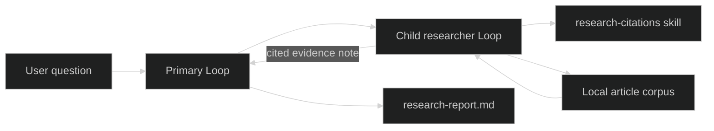

# Research Assistant

Build an application with two different responsibilities. A primary Loop owns the user-facing report. A researcher Loop loads citation instructions, searches a bounded corpus, and returns a cited evidence note. The application writes the primary Loop's final Markdown into its workspace.

## What you will build

The example proves delegation with a real Harness child Loop and `SubmitToLoop`, not a helper function pretending to be another agent. Its local article corpus makes retrieval and citation tests deterministic. The same tool boundary can later adapt an MCP search server.

## Architecture



The Rig applies a delegation depth and quota. Each Loop has its own model, instructions, tool surface, and skill allow-set. The researcher cannot acquire the primary Loop's authority merely because it is a child.

## Project structure

```text
research-assistant/
├── corpus/
│   └── skills.txt
├── skills/
│   └── research-citations/
│       └── SKILL.md
├── go.mod
├── go.sum
├── main.go
└── main_test.go
```

The generated `artifacts/research-report.md` is runtime output and is not part of the source tree.

## Build the researcher

```go
researcher, err := loop.Define(
	loop.WithName("researcher"),
	loop.WithInference(researchClient, researchModel),
	loop.WithSystem("Load research-citations, search the corpus, and return a cited evidence note."),
	loop.WithTools(skillDefinition, searchDefinition),
	loop.WithAccessGate(accessGate),
	loop.WithPolicyRevision("research-worker-v1"),
)
```

`corpus.search` accepts a query and returns an array of `{title, source, text}` records. The embedded skill requires the researcher to search before drafting, keep claims within retrieved evidence, and cite every factual claim.

For project-specific instructions, also call `skill.WithWorkspaceRoot(root)` and advertise metadata from `skill.DiscoverWorkspaceSkills(root)`. Keep workspace skill loading behind the [workspace trust boundary](/docs/guides/harness/skills/workspace-skills).

## Delegate the subtask

```go
primary, err := loop.Define(
	loop.WithName("research-assistant"),
	loop.WithInference(primaryClient, primaryModel),
	loop.WithDelegates("researcher"),
)

runtime, err := rig.Define(
	rig.WithLoops(primary, researcher),
	rig.WithPrimers("research-assistant"),
	rig.WithSessionStore(sessions),
	rig.WithDelegationLimits(rig.DelegationLimits{Depth: 2, Quota: 2}),
)

childID, err := live.NewLoop(
	loop.Provenance{LoopID: live.ActiveLoop().ID()},
	researcher,
)
_, err = live.SubmitToLoop(ctx, childID, []content.Block{
	&content.TextBlock{Text: question},
})
```

The full example waits for the child Loop's `TurnDone`, then submits its evidence note to the primary Loop. See [Delegation](/docs/guides/harness/delegation) for managed delivery, cancellation, restore, and authority limits.

## Save the artifact

```go
if err := os.MkdirAll(workspace, 0o750); err != nil {
	return err
}
if err := os.WriteFile(
	filepath.Join(workspace, "research-report.md"),
	[]byte(report),
	0o600,
); err != nil {
	return err
}
```

The test provides a unique temporary workspace and compares the complete report. A product can instead bind Harness [Workspaces](/docs/guides/harness/workspaces), checkpoint them, and restore both Session and artifact state. Add [Compaction](/docs/guides/harness/compaction) when long research threads approach their context limit.

## Run it

From the standalone example directory:

```sh
GOWORK=off go test -race ./...
GOWORK=off go run .
```

The second command creates `artifacts/research-report.md`. Remove that directory when you no longer need the generated report.

## Expected interaction

```text
Researcher: Skills are loaded on demand and authorized per agent. [1]
Assistant: wrote a cited brief from 1 source.
Saved: research-report.md
```

The report contains the claim, citation `[1]`, and a Sources section naming `skill/skill_loader.go`. The deterministic test rejects any drift in the file.

## Use a live model

Replace the two scripted clients independently. The researcher can use a fast hosted or local model while the primary Loop uses a stronger model for synthesis. To retrieve live sources, replace `corpus.search` with an adapter built on the [MCP module](/docs/modules/mcp), keep its returned source metadata, and require network permission through Gates.

The example intentionally keeps live search optional. CI should continue running the local corpus path so citations and workspace output remain reproducible.

## Try next

1. Add an exact evaluator that rejects uncited factual sentences.
2. Interrupt the researcher after retrieval and resume from persisted Session state.
3. Attach the [TUI](/docs/guides/tui) or [Web UI](/docs/guides/web-ui) to the same Session event and command interfaces.
4. Add a second researcher with a different source catalog and compare evidence before synthesis.

## Source and proof

- [Runnable Research Assistant](https://github.com/looprig/.github/tree/main/examples/go/agents/research-assistant)
- [Harness delegation contracts](https://github.com/looprig/harness/blob/main/pkg/loop/definition.go)
- [Looprig Skill tool](https://github.com/looprig/tools/blob/main/skill/skill.go)
