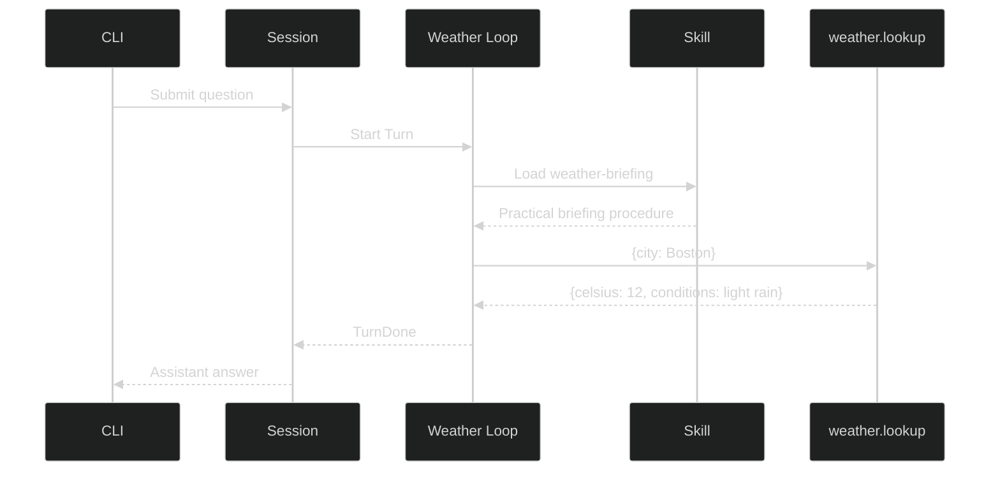

# Weather Assistant

Build a small conversational application that answers a familiar question, but still exercises the same runtime boundaries as a production agent. The default model is scripted and the forecast is an in-memory fixture, so every run is credential-free and deterministic.

## What you will build

The model loads `weather-briefing`, calls `weather.lookup`, reads the JSON observation, and completes the turn with a recommendation. Harness owns tool execution, the event stream, the Session, and shutdown.

> The local allow-all gate exists only to keep this tutorial interactive without an approval UI. Replace it with your application policy before adding tools that read files, access the network, or cause effects.

## Architecture



## Project structure

```text
weather-assistant/
├── go.mod
├── go.sum
├── main.go
├── main_test.go
└── skills/
    └── weather-briefing/
        └── SKILL.md
```

Copy the [complete example source](https://github.com/looprig/.github/tree/docs/rich-developer-guides/examples/go/agents/weather-assistant), or create a directory with the files shown here.

## Define the domain tool

The model sees a name, description, and JSON Schema. The implementation decodes the arguments and returns a Harness `ToolResult`:

```go
type weatherTool struct{}

func (weatherTool) Info(context.Context) (*tool.ToolInfo, error) {
	return &tool.ToolInfo{
		Name: "weather.lookup",
		Desc: "Return the current deterministic forecast for a supported city.",
		Schema: json.RawMessage(`{
			"type":"object",
			"properties":{"city":{"type":"string"}},
			"required":["city"]
		}`),
	}, nil
}

func (weatherTool) PrepareCall(ctx context.Context, id uuid.UUID, argsJSON string) (tool.Request, tool.PreparedArtifact, error) {
	// Decode and validate once, before Harness asks the access gate.
	var args struct{ City string `json:"city"` }
	if err := json.Unmarshal([]byte(argsJSON), &args); err != nil {
		return tool.Request{}, nil, err
	}
	forecast, err := lookupWeather(args.City)
	if err != nil {
		return tool.Request{}, nil, err
	}
	data, err := json.Marshal(forecast)
	return tool.Request{ToolName: "weather.lookup", Summary: "Look up weather for " + forecast.City},
		tool.TokenArtifact{Token: string(data)}, err
}

func (weatherTool) InvokableRun(ctx context.Context, _ string) (*tool.ToolResult, error) {
    // Execute only the artifact approved for this call. Do not reparse raw arguments.
    prepared, ok := loop.PreparedCallFromContext(ctx)
    if !ok {
        return tool.TextResult("error: weather.lookup requires prepared arguments"), nil
    }
    forecast, ok := prepared.Artifact.(tool.TokenArtifact)
    if !ok || forecast.Token == "" {
        return tool.TextResult("error: weather.lookup has no prepared forecast"), nil
    }
    return tool.TextResult(forecast.Token), nil
}
```

This fixture keeps forecast data local. A real implementation can call a weather API here, declare the appropriate prepared network requirement, and route it through [Harness Gates](/docs/guides/harness/gates).

## Embed the skill

```go
//go:embed skills/*/SKILL.md
var skillFiles embed.FS

loader := skill.NewEmbeddedSkillLoader(skillFiles, map[identity.AgentName]map[string]struct{}{
	"weather-assistant": {"weather-briefing": {}},
})
skillTool := skill.NewSkill(loader, "weather-assistant")
```

The SKILL.md body tells the model to look up observations first, report city, temperature, and conditions, then give one practical recommendation. See [Embedded Skills](/docs/guides/harness/skills/embedded-skills) for the authorization rule.

## Assemble the runtime

```go
assistant, err := loop.Define(
	loop.WithName("weather-assistant"),
	loop.WithInference(client, selectedModel),
	loop.WithSystem("Load weather-briefing, then call weather.lookup."),
	loop.WithTools(skillDefinition, weatherDefinition),
	loop.WithAccessGate(accessGate),
	loop.WithPolicyRevision("weather-example-v1"),
)

runtime, err := rig.Define(
	rig.WithLoops(assistant),
	rig.WithPrimers("weather-assistant"),
	rig.WithSessionStore(sessions),
)
live, err := runtime.NewSession(ctx)
defer live.Shutdown(context.Background())
```

Subscribe before submitting so a fast turn cannot finish before the client begins reading [Events](/docs/guides/harness/events). The example waits for `event.TurnDone` and always closes its subscription and Session.

## Run it

From the standalone example directory:

```sh
GOWORK=off go test -race ./...
GOWORK=off go run .
```

`GOWORK=off` tells Go to use this example's released module versions instead of a parent workspace. It is useful when the example lives inside another Go workspace; ordinary consumers outside one can run `go test -race ./...` and `go run .` directly.

## Expected interaction

```text
You: Will I need an umbrella in Boston?
Assistant: Boston: 12°C with light rain. Bring an umbrella.
```

The test also checks an unsupported city returns a bounded error with the available fixture cities.

## Use a live model

Replace only the scripted `inference.Client` and `model.Model` passed to `loop.WithInference`. Keep the tool, skill, Rig, Session, and event code unchanged. Choose a hosted or local model, such as OpenAI, Anthropic, or a model served by Ollama, as long as its adapter supports tool calling. See [Providers](/docs/guides/inference/providers) for authentication, base URLs, API formats, and caching behavior.

Do not call a provider from the weather tool unless you need model inference inside the tool. Weather data belongs behind the domain tool; language-model selection belongs at the Inference boundary.

## Try next

1. Add `weather.alerts` and require approval before network access.
2. Add a `severe-weather` skill available only to an emergency-planning Loop.
3. Replace the fixed question with a terminal input loop or attach the [TUI](/docs/guides/tui).
4. Persist Sessions and restore a previous city conversation.

## Source and proof

- [Runnable Weather Assistant](https://github.com/looprig/.github/tree/docs/rich-developer-guides/examples/go/agents/weather-assistant)
- [Harness Loop definition](https://github.com/looprig/harness/blob/main/pkg/loop/definition.go)
- [Looprig Skill tool](https://github.com/looprig/tools/blob/main/skill/skill.go)
