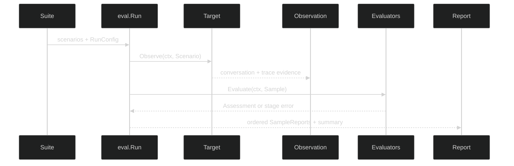

# Evals

Evals turns an interaction into an auditable qualification result. A `Scenario`
describes one case, a `Target` produces an `Observation`, an `Evaluator` turns
that observation into an `Assessment`, and `Run` preserves every result in a
`Report`. The packages under `eval/exact`, `eval/judge`, and
`eval/reportjson` add concrete evaluators, model judges, and a redacted report
sink without changing that core contract.

The useful mental model is a data pipeline, not a callback that returns a
boolean:



Use [Cases and runs](/docs/guides/evals/cases-and-runs) for the case-to-report
lifecycle, [Evaluator contracts](/docs/guides/evals/evaluators) for quality
gates, [Reporting](/docs/guides/evals/reporting) for durable output, and
[Integration](/docs/guides/evals/integration) when an application supplies a
model, agent, or qualification rollup.

## Choose the layer you need

| Need | Start here | Contract to keep in mind |
| --- | --- | --- |
| Describe cases and expected behavior | [Cases and suites](/docs/guides/evals/cases-and-runs/cases-and-suites) | IDs, revisions, typed input, and optional expectations are validated before work starts. |
| Execute cases repeatedly or concurrently | [Runs and results](/docs/guides/evals/cases-and-runs/runs-and-results) | Results stay in scenario-major, trial-minor order. Cancellation returns completed work with its context error. |
| Write a gate or quality check | [Evaluator contracts](/docs/guides/evals/evaluators) | A quality miss is `fail`; evaluator infrastructure trouble is `error`; missing evidence is `unverified`. |
| Match or forbid exact output | [Exact evaluators](/docs/guides/evals/evaluators/exact) | Text checks inspect assistant text blocks only, while tool checks inspect typed tool-use blocks. |
| Score ambiguous behavior | [Model judges](/docs/guides/evals/evaluators/judge) | The judge asks for strict structured output and validates score and quote provenance locally. |
| Persist a safe result | [Reporting](/docs/guides/evals/reporting) | `report/v1` is canonical and redacted; `FileSink` makes the final rename atomic. |
| Feed a live model or agent | [Composition and testing](/docs/guides/evals/integration/composition-and-testing) | Supply an `eval.Target` at the composition boundary, then keep deterministic fixtures beside opt-in live tests. |
| Roll up qualification dimensions | [Pluto tooling](/docs/guides/evals/integration/pluto) | Pluto composes `eval.Run` into capability-aware tables, scorecards, and profile dispositions. |

For model identity and request construction, pair this guide with Inference's
[model selection reference](/docs/guides/inference/requests/model-selection).
When a request uses a schema, the [structured output reference](/docs/guides/inference/structured-output)
explains the provider-facing feature that the Evals target records as evidence.

## A first complete run

The target below is deliberately small. Production targets can wrap an agent,
an HTTP service, a process, or the public
`target/inference.NewTarget` adapter. The evaluator sees only a validated
`Sample`, so the same gate can run against a deterministic fixture and a live
provider.

```go
package evalquickstart_test

import (
	"context"
	"testing"

	"github.com/looprig/core/content"
	"github.com/looprig/eval"
	"github.com/looprig/eval/exact"
)

type fixedTarget struct{}

func (fixedTarget) Name() string { return "capital-answer" }

func (fixedTarget) Observe(_ context.Context, sc eval.Scenario) (eval.Observation, error) {
	// Keep the caller's scenario unchanged and append the target's reply to a
	// fresh conversation slice.
	conversation := append(content.AgenticMessages(nil), sc.Input...)
	conversation = append(conversation, &content.AIMessage{Message: content.Message{
		Role: content.RoleAssistant,
		Blocks: []content.Block{&content.TextBlock{Text: "Paris is the capital of France."}},
	}})
	return eval.Observation{
		Conversation: conversation,
		Scope:        eval.ScopeCase,
		Subject: eval.Subject{
			ID: "fixed-target", Kind: eval.SubjectAgent,
			Name: sc.Name, Revision: sc.Revision,
		},
	}, nil
}

func TestQualification(t *testing.T) {
	suite := eval.Suite{
		Name: "capital-smoke", Revision: "v1",
		Scenarios: []eval.Scenario{{
			ID: "france-capital", Name: "capital-answer", Revision: "v1",
			Input: content.AgenticMessages{&content.UserMessage{Message: content.Message{
				Role: content.RoleUser,
				Blocks: []content.Block{&content.TextBlock{Text: "What is the capital of France?"}},
			}}},
		}},
	}

	report, err := eval.Run(context.Background(), eval.RunConfig{}, suite, fixedTarget{},
		exact.RequiredText("Paris"), exact.ForbiddenText("London"))
	if err != nil {
		t.Fatal(err)
	}
	if report.Summary.Assessments[eval.StatusPass] != 2 {
		t.Fatalf("pass assessments = %d, want 2", report.Summary.Assessments[eval.StatusPass])
	}
}
```

The example has two independent assessments. A report can therefore say that
the answer included the required fact while also recording a separate safety or
operational failure. That separation is why downstream gates should inspect
assessment status and evidence instead of treating a single scalar as the whole
truth.

## Source

The public pipeline is declared in [run.go](https://github.com/looprig/eval/blob/v0.2.2/run.go),
with case identity in [scenario.go](https://github.com/looprig/eval/blob/v0.2.2/scenario.go)
and the exact example in
[examples/exact/example_test.go](https://github.com/looprig/eval/blob/v0.2.2/examples/exact/example_test.go).

## Proof

The pipeline and its invariants are implemented in
[run.go](https://github.com/looprig/eval/blob/v0.2.2/run.go),
[scenario.go](https://github.com/looprig/eval/blob/v0.2.2/scenario.go),
[observation.go](https://github.com/looprig/eval/blob/v0.2.2/observation.go),
[assessment.go](https://github.com/looprig/eval/blob/v0.2.2/assessment.go), and
[report.go](https://github.com/looprig/eval/blob/v0.2.2/report.go). The
deterministic exact gate is exercised by
[examples/exact/example_test.go](https://github.com/looprig/eval/blob/v0.2.2/examples/exact/example_test.go).
