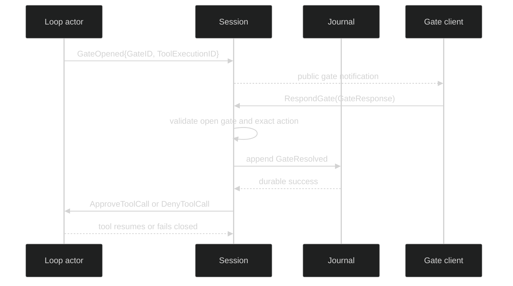

# Approve and deny

Permission responses resume a loop-owned gate that is waiting on a tool call.
They are routed by the target loop and `ToolExecutionID`, not by the active-loop
selection. The public application path is `Session.RespondGate`; the runtime
translates the validated response into `ApproveToolCall` or `DenyToolCall`.
Applications should not try to send those command structs to a loop: the
session owns gate lookup, exactly-once claiming, durable resolution, and command
delivery.

## Exact actions and command shapes

```go
type ApprovalAction string

const (
	ApprovalApprove                ApprovalAction = "Approve"
	ApprovalApproveAlwaysWorkspace ApprovalAction = "Approve always for this workspace"
	ApprovalDeny                   ApprovalAction = "Deny"
)

type ApproveToolCall struct {
	Header
	GateRoute
	Action gate.ApprovalAction `json:"action"`
}

func (c ApproveToolCall) GateToolExecutionID() uuid.UUID

type DenyToolCall struct {
	Header
	GateRoute
}

func (c DenyToolCall) GateToolExecutionID() uuid.UUID
```

`GateRoute` embeds coordinates so `LoopID` selects the actor and
`ToolExecutionID` matches the pending gate. `GateID` is carried in the route
vocabulary, but permission command validation requires the loop and tool
execution IDs. Approval validation accepts only the two approval actions;
`ApprovalDeny` belongs on `DenyToolCall`. Neither command has an `Ack`.

| Action | Effect | Durable grant behavior |
| --- | --- | --- |
| `ApprovalApprove` | approve this call | no reusable workspace rule is written |
| `ApprovalApproveAlwaysWorkspace` | approve this call and persist the displayed reusable candidates | rule persistence is atomic with the decision; fresh execution grants are minted afterward |
| `ApprovalDeny` | fail the pending call closed | no scope or grant material is persisted |

The command wire carries the action string and routing IDs only. It never carries
grant tokens, raw tool arguments, or a permission scope.

## The public response path

```go
type Session interface {
	RespondGate(context.Context, gate.GateResponse) error
}

type GateResponse struct {
	GateID  ID                         `json:"gate_id,omitzero"`
	Action  string                     `json:"action,omitempty"`
	Values  map[string]json.RawMessage `json:"values,omitempty"`
	Source  ResponseSource             `json:"source,omitzero"`
}
```

The caller gets `GateID` and the action from the public `event.GateOpened` or a
gate-facing integration. For a permission decision, `Values` is unused and
`Action` must be one of the exact strings above.

```go
func answerPermission(ctx context.Context, s session.Session, gateID gate.ID, approve bool) error {
	action := gate.ApprovalDeny
	if approve {
		action = gate.ApprovalApprove
	}
	return s.RespondGate(ctx, gate.GateResponse{
		GateID: gateID,
		Action: string(action),
		Source: gate.ResponseSource{Kind: gate.ResponseFromUser},
	})
}
```

This is a consumer example using the public session contract. `RespondGate` is
durable-first: it claims an open gate, appends `event.GateResolved`, removes the
answerable entry, and only then dispatches the translated command. A client
disconnect after the append does not cancel delivery because the runtime uses
the session context for the post-commit dispatch.



## Typed failures and retries

```go
if err := s.RespondGate(ctx, response); err != nil {
	var gateErr *session.GateError
	if errors.As(err, &gateErr) {
		switch gateErr.Kind {
		case session.GateNotFound, session.GateNotReady:
			// The gate was already resolved, closed, or expired. Do not retry
			// with another action.
		case session.GateActionInvalid:
			// The action does not match the gate kind or exact vocabulary.
		case session.GateAppendFailed:
			// The claim was reverted; retry only according to the storage error.
		}
	}
	return err
}
```

`GateNotFound` and `GateNotReady` are expected races for a user interface that
renders stale prompts. `GateAppendFailed` leaves the gate answerable because the
durable close did not commit. A forged public response with
`ResponseFromClassifier` is rejected; classifier provenance is reserved for the
private review adapter.

The authoritative source is [`internal/sessionruntime/gates.go`](https://github.com/looprig/harness/blob/main/internal/sessionruntime/gates.go).
The proof [`internal/sessionruntime/gates_test.go`](https://github.com/looprig/harness/blob/main/internal/sessionruntime/gates_test.go)
checks exact actions, route IDs, durable-first ordering, and fail-closed invalid
responses. The wire shape and absence of grant material are pinned by
[`pkg/command/marshal_test.go`](https://github.com/looprig/harness/blob/main/pkg/command/marshal_test.go).

## Source and proof

- [`RespondGate` and durable gate routing](https://github.com/looprig/harness/blob/main/internal/sessionruntime/gates.go)
- [`policy` runnable fixture](https://github.com/looprig/harness/blob/main/examples/policy/example_test.go)
- [`gate response tests`](https://github.com/looprig/harness/blob/main/internal/sessionruntime/gates_test.go)
