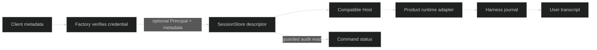

# Attribution and audit

A hosted product can record who submitted each command without asking clients
to assert their own identity. Factory verifies the credential, then optionally
stamps a `sessionwire/v1.Principal` onto the durable command. The product still
decides who may read a session and its audit fields. A model does not see the
principal merely because it is recorded; use a [Message presenter](/docs/guides/harness/commands/message-presenter)
when the agent needs trusted, model-visible sender context.

## Two separate fields

| Field | Source | Purpose |
| --- | --- | --- |
| `Principal{Tenant, Subject, Kind}` | Factory's verified credential after `WithPrincipalStamping` | Recorded sender; `Kind` is `actor` or `service`. Display names are not identity. |
| `MessageMetadata` | Client's create or input request | App-defined string fields, such as a UI surface; not identity or authority. |

The client may send metadata but never a `principal`: Factory refuses a
client-supplied principal on REST and ClientLink, even when stamping is off.
Core permits at most 16 metadata fields, a key of at most 64 bytes beginning
with a lowercase letter and continuing with lowercase letters, digits, or
underscores, a value of at most 1024 UTF-8 bytes, and 4096 bytes for the
canonical object. Keys beginning with `looprig` are reserved. Metadata is
allowed only on create and input, while a stamped principal accompanies every
command kind. The [Core validators](https://github.com/looprig/core/blob/v0.12.0/sessionwire/v1/metadata.go)
enforce these bounds; a valid shape does not make client data trusted.

## Admission and runtime

`factory.WithPrincipalStamping()` is off by default. Enable it only after
upgrading every Host and confirming each advertises Core's exact
`hostlink.attribution.principal` capability token. It is a token read through
the HostLink negotiation reply, not an RPC method. Factory refuses an
attributed command for an incapable resident before any durable write; it
skips incapable placement candidates. An unavailable capability probe is
transient and retryable, not evidence that a Host supports the feature.

The disposition descriptor preserves `Principal` and `Metadata`; SessionStore
validates their shape but does not verify a sender. Host reads them before
dispatch and passes them to the product runtime. A field-by-field adapter to
`runtimecommand.Admitted` must copy both members or attribution disappears
silently. Harness records them on the journal intent and on the applicable
public event. WUI displays an optional sender chip and separates any
model-visible presenter frame from the user's original blocks. Metadata is
not rendered as identity. [The cross-module integration test](https://github.com/looprig/tests/blob/v0.14.0/principal_presenter_integration_test.go)
exercises create, input, interrupt, restore, gate response, replay, and
redelivery through this chain.

## Guarded audit read

`GET /v1/sessions/{sid}/commands/{cid}` returns public command status after
the ordinary session-read authorization. Its `principal` and `metadata`
members are appended only if the supplied Factory authorizer also implements
`AuditAuthorizer` and `AuthorizeAuditRead` grants this principal access to the
session. If that optional interface is absent, denies access, or faults,
Factory still returns status but omits both audit members. This is a separate
grant: being allowed to see command status does not by itself reveal who sent
it or the client's metadata. [Factory's route](https://github.com/looprig/factory/blob/v0.12.0/internal/httpapi/commands.go)
and [authorizer seam](https://github.com/looprig/factory/blob/v0.12.0/server.go)
define the behavior.

## Rollout and recovery

Roll out every Host at v0.11.0 or later first, then Factory v0.12.0, and only
then enable `WithPrincipalStamping`. A retry admitted before stamping is
enabled has different command identity and is refused, so switch during a
quiet period. The [old-Host integration lane](https://github.com/looprig/tests/blob/v0.14.0/old_host_probe_integration_test.go)
checks that an older Host never receives a stamped command.

The data upgrade is one-way. Once a version-3 attributed command is stored,
every Factory and Host sharing it must stay on sessionstore v0.14.0 or later;
older readers refuse that row and can wedge command consumption. Once a
stamped or presented journal record exists, rolling Harness below harness
v0.41.0 is lossy and forbidden: old decoders do not refuse it, but silently
drop the additive attribution or presenter frame on re-offer. The safe
recovery path is to keep the new readers and restore the recorded command,
not to roll back the journal consumer.

## Source

- [Core `Principal`](https://github.com/looprig/core/blob/v0.12.0/sessionwire/v1/principal.go), [metadata rules](https://github.com/looprig/core/blob/v0.12.0/sessionwire/v1/metadata.go), and [HostLink capability](https://github.com/looprig/core/blob/v0.12.0/sessionwire/v1/hostlink_framing.go)
- [Factory stamping option](https://github.com/looprig/factory/blob/v0.12.0/options.go), [authorization seam](https://github.com/looprig/factory/blob/v0.12.0/server.go), and [command status route](https://github.com/looprig/factory/blob/v0.12.0/internal/httpapi/commands.go)
- [SessionStore descriptor](https://github.com/looprig/sessionstore/blob/v0.14.0/disposition_inbox.go), [Host adapter](https://github.com/looprig/host/blob/v0.11.0/internal/harnessadapter/session.go), and [Harness admitted command](https://github.com/looprig/harness/blob/v0.41.0/pkg/runtimecommand/command.go)

## Proof

- [Principal, metadata, presenter, restore, and redelivery](https://github.com/looprig/tests/blob/v0.14.0/principal_presenter_integration_test.go)
- [Incapable old Host stays out of attributed delivery](https://github.com/looprig/tests/blob/v0.14.0/old_host_probe_integration_test.go)
- [Factory audit-member authorization](https://github.com/looprig/factory/blob/v0.12.0/internal/httpapi/commands_test.go)
