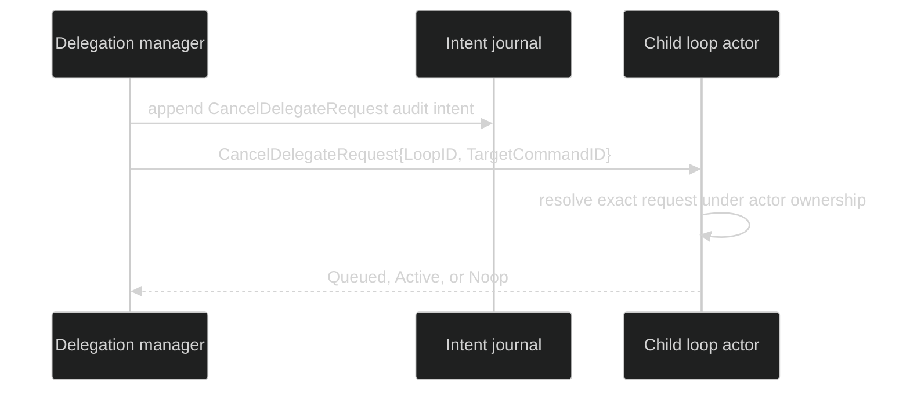

# Cancel delegated work

Managed delegation can cancel one request without interrupting every other
request on the same child loop. The cancel is targeted by the child loop ID and
the original managed request's command ID. The child actor decides atomically
whether that request is queued, active, or already terminal.

## Command and result

```go
const (
	CommandCancelDelegateRequest CommandName  = "CancelDelegateRequest"
	CancelDelegateRequestAck     CommandField = "Ack"
)

type DelegateCancelResult uint8

const (
	DelegateCancelNoop DelegateCancelResult = iota
	DelegateCancelQueued
	DelegateCancelActive
)

type CancelDelegateRequest struct {
	Header
	identity.Coordinates
	TargetCommandID uuid.UUID                   `json:"target_command_id,omitzero"`
	Ack             chan<- DelegateCancelResult `json:"-"`
}

func (c CancelDelegateRequest) Validate() error
```

The result is transient control-plane state. `Queued` means the actor removed a
request from its managed inbox. `Active` means the actor found it in progress
and applied the managed cancellation path. `Noop` means it was already resolved,
unknown, or the session could not target a live loop. The command's `Ack` must be
non-nil and buffered because the actor delivers exactly one direct reply.

```go
// Inside the trusted managed-delegation runtime, IDs and the session command
// path are already available. The runtime validates, journals, dispatches, and
// waits for the result; ordinary callers cannot construct a public Session
// method for this internal command.
ack := make(chan command.DelegateCancelResult, 1)
cancel := command.CancelDelegateRequest{
	Header: command.Header{CommandID: cancelCommandID},
	Coordinates: identity.Coordinates{
		SessionID: sessionID,
		LoopID:    childLoopID,
	},
	TargetCommandID: delegatedCommandID,
	Ack:             ack,
}
if err := cancel.Validate(); err != nil {
	return err
}
result := <-ack // the actor sends exactly one result
switch result {
case command.DelegateCancelQueued, command.DelegateCancelActive,
	command.DelegateCancelNoop:
	return nil
default:
	return fmt.Errorf("unknown delegate cancel result %d", result)
}
```

The command construction above is intentionally scoped to trusted runtime code;
`cancelCommandID`, `sessionID`, `childLoopID`, and `delegatedCommandID` are IDs
already assigned by that runtime. Harness deliberately does not claim a public
constructor or generic session method that the source does not provide. Internal
code appends its audit intent and waits on the buffered result.

## Atomic targeting and teardown

The runtime refuses to append a late cancellation once the session context is
already canceled. During teardown, an unresolved managed request is classified
from the durable request state and the session is releasing its writer lease;
writing a new cancel frame then would race the next lease owner. Unknown loops
return `*session.SessionError{Kind: SessionLoopNotFound}`; exited loops return
`SessionLoopExited`.



No target payload is erased from the journal. The cancel record and its result
make the request transition auditable; the original request ID remains the
correlation key for delegation observers. A restored live channel is created by
the runtime; the serialized command carries no `Ack`.

The source and validation proof are
[`pkg/command/cancel_delegate_request.go`](https://github.com/looprig/harness/blob/main/pkg/command/cancel_delegate_request.go),
[`pkg/command/cancel_delegate_request_test.go`](https://github.com/looprig/harness/blob/main/pkg/command/cancel_delegate_request_test.go),
and the exact-loop runtime proof in
[`internal/sessionruntime/session_test.go`](https://github.com/looprig/harness/blob/main/internal/sessionruntime/session_test.go).

## Source and proof

- [`CancelDelegateRequest`](https://github.com/looprig/harness/blob/main/pkg/command/cancel_delegate_request.go)
- [`cancel delegate command tests`](https://github.com/looprig/harness/blob/main/pkg/command/cancel_delegate_request_test.go)
- [`managed cancellation runtime tests`](https://github.com/looprig/harness/blob/main/internal/sessionruntime/session_test.go)
