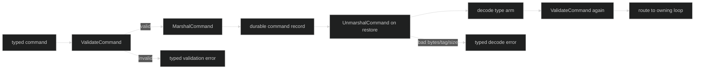

# Command envelope and routing

Every command embeds one [`command.Header`](https://github.com/looprig/harness/blob/main/pkg/command/header.go).
The header is the identity and causation edge; it is not the dispatch route for
every command. `Interrupt` and `Shutdown`, for example, carry no loop ID and are
sent to a loop selected by the session fan-out. Commands that need a target embed
`identity.Coordinates` or `GateRoute` and are checked with
`ValidateCommand` before a restored record is admitted.

## The sealed command surface

These declarations are the package's public shape. The unexported marker means a
consumer can use the concrete Harness types and inspect a `Command`, but cannot
add a command type from another package.

```go
type Command interface {
	isCommand()
	CommandHeader() Header
}

type Header struct {
	CommandID uuid.UUID       `json:"command_id,omitzero"`
	Cause     identity.Cause `json:"cause,omitzero"`
	Agency    identity.Agency `json:"agency,omitzero"`
	CreatedAt time.Time       `json:"created_at,omitzero"`
}

func (h Header) CommandHeader() Header

type GateRoute struct {
	identity.Coordinates
	GateID          uuid.UUID `json:"gate_id,omitzero"`
	ToolExecutionID uuid.UUID `json:"tool_execution_id,omitzero"`
}

func MarshalCommand(cmd Command) ([]byte, error)
func UnmarshalCommand(data []byte) (Command, error)
func ValidateCommand(cmd Command) error
```

`identity.Coordinates` is the four-level location shared by the command and
event packages:

| Field | Meaning in a command |
| --- | --- |
| `SessionID` | session that owns the command; required by exact-target commands such as `Compact` and queue cancellation |
| `LoopID` | loop actor to receive the command; also the gate-reply dispatch target |
| `TurnID` | optional turn-level causation; most command routes leave it zero |
| `StepID` | optional step-level causation; most command routes leave it zero |

`Cause` points backward to the command, event, loop, or tool execution that
caused this command. `AgencyMachine` is the zero value and therefore the safe
default. `AgencyUser` is stamped by the public interactive methods such as
`Session.Submit`, `Session.Interrupt`, and `Session.CompactToLoop`.

## Durable JSON envelope

`MarshalCommand` encodes one JSON object. The type tag and schema version are
siblings of the payload fields, not a wrapper around them. The current version is
`1`. Content blocks in `UserInput` and `SubagentResult` use the core content
codec; all other ordinary fields use `encoding/json`.

```json
{
  "command_id": "11111111-1111-1111-1111-111111111111",
  "agency": 1,
  "loop_id": "33333333-3333-3333-3333-333333333333",
  "tool_execution_id": "77777777-7777-7777-7777-777777777777",
  "action": "Approve",
  "type": "ApproveToolCall",
  "v": 1
}
```

The JSON above illustrates the fields and is not a command to copy into an
application. A journal adapter should call the Go codec. A command's transient
`Ack`, `Accepted`, and `Result` channels and the `UserInput.Admission`
handshake are tagged `json:"-"`; after restore, they are nil and cannot be used as a historical reply path. A restored command
must be given a fresh live delivery path by the owning runtime.



## The validation matrix

`ValidateCommand` always requires a non-zero `Header.CommandID`. It then applies
only the fields relevant to the concrete command. The first violation is returned
as `*CommandValidationError`.

| Command | Required or constrained fields |
| --- | --- |
| `UserInput` | ordinary user input needs only `CommandID`; machine `NoFold`, `BackgroundHandBack`, or a delivery phase requires `TargetLoopID`; machine-only markers reject user agency; the phase must be `intent` or `fallback_queued` |
| `SubagentResult` | parent `LoopID` in embedded coordinates |
| `CancelQueuedInput` | `SessionID`, parent `LoopID`, and `TargetCommandID` |
| `CancelDelegateRequest` | `SessionID`, target `LoopID`, and `TargetCommandID`; its live `Ack` is checked by `Validate` |
| `Compact` | `SessionID`, `LoopID`, and agency equal to `AgencyMachine` or `AgencyUser` |
| `ApproveToolCall` | gate `LoopID`, `ToolExecutionID`, and exactly `ApprovalApprove` or `ApprovalApproveAlwaysWorkspace` |
| `DenyToolCall`, `ProvideUserInput` | gate `LoopID` and `ToolExecutionID` |
| `ProcessNotification` | envelope `CommandID` equals the nested notification ID, then the notification DTO's closed state/reason checks run |
| `Interrupt`, `Shutdown` | no address fields; each command's own `Validate` requires a live ack channel |

The error values are typed. Do not compare error strings:

```go
if err := command.ValidateCommand(cmd); err != nil {
	var invalid *command.CommandValidationError
	if errors.As(err, &invalid) {
		log.Printf("reject %s.%s: %s", invalid.Command, invalid.Field, invalid.Rule)
	}
	return err
}
```

`InvalidCommandError` is a separate type for missing live channel contracts,
while `UnbufferedAckError` identifies a present but unbuffered channel on live
configuration controls. The codec has separate typed wrappers for malformed
JSON, unknown type tags, encode failures, and the input size cap:
`CommandDecodeError`, `UnknownCommandTypeError`, `CommandEncodeError`, and
`CommandLimitError`.

## Routing and idempotency

The durable journal wraps a command with the session and loop target because the
command itself does not uniformly carry a route. For addressed commands, the
embedded coordinates and the journal route must agree. The command ID is the
logical idempotency key; phased machine delegate input uses a typed physical
suffix for its `fallback_queued` record. A retry with the same ID and identical
payload can be deduplicated. A retry that reuses the ID with a different payload
fails closed as a collision.

The source proofs are [`pkg/command/marshal_test.go`](https://github.com/looprig/harness/blob/main/pkg/command/marshal_test.go),
which checks all 11 durable codec arms, envelope keys, transient channel
omission, size limits, and typed decode errors, and
[`pkg/journal/record_test.go`](https://github.com/looprig/harness/blob/main/pkg/journal/record_test.go),
which checks the route cross-check and physical command-record identity. These
are proof tests for the wire and journal contracts, not shell commands to run in
production.

## Source and proof

- [`command` union and header](https://github.com/looprig/harness/blob/main/pkg/command/command.go), [`header`](https://github.com/looprig/harness/blob/main/pkg/command/header.go)
- [`command marshal tests`](https://github.com/looprig/harness/blob/main/pkg/command/marshal_test.go)
- [`journal route and idempotency tests`](https://github.com/looprig/harness/blob/main/pkg/journal/record_test.go)
