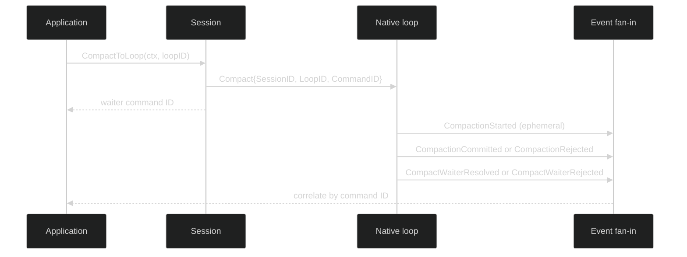

# Compact

Compaction rewrites the active native loop's conversation at a safe boundary so
the next request has room in its context window. The public API requests manual
compaction and returns only a correlation ID. The compactor's summary and
context measurements arrive as events; the call does not block until a summary
is available.

## Public API and command

```go
type Session interface {
	Compact(context.Context) (uuid.UUID, error)
	CompactToLoop(context.Context, uuid.UUID) (uuid.UUID, error)
}

type Compact struct {
	Header
	identity.Coordinates
}
```

`Compact` samples the active loop once. `CompactToLoop` targets one exact live
loop. Both methods stamp user agency, session and loop coordinates, append the
command intent when the journal is configured, and return the command ID after
the command is handed to the actor.

The session rejects an unknown or exited target with `*session.SessionError`
(`SessionLoopNotFound` or `SessionLoopExited`). It also rejects foreign loops
and native loops without a configured compaction policy with
`SessionCompactionUnsupported`. A faulted session admits no new compaction.

## Lifecycle events

The command starts a compaction attempt. The event stream carries the actual
result:

```go
type CompactionStarted struct {
	ephemeral
	loopScoped
	Header
	AttemptID CompactAttemptID `json:"attempt_id"`
	Reason    CompactionReason `json:"reason"`
	Basis     ContextBasis `json:"basis"`
}

type CompactionCommitted struct {
	enduring
	loopScoped
	Header
	AttemptID        CompactAttemptID     `json:"attempt_id"`
	WaiterCommandIDs []uuid.UUID          `json:"waiter_command_ids"`
	Reason           CompactionReason     `json:"reason"`
	Basis            ContextBasis         `json:"basis"`
	Summary          *content.UserMessage `json:"summary"`
	PostContext      ContextMeasurement   `json:"post_context"`
	Duration         time.Duration        `json:"duration,omitzero"`
}

type CompactionRejected struct {
	enduring
	loopScoped
	Header
	AttemptID        CompactAttemptID    `json:"attempt_id"`
	WaiterCommandIDs []uuid.UUID         `json:"waiter_command_ids"`
	Reason           CompactionReason    `json:"reason"`
	Basis            ContextBasis        `json:"basis"`
	RejectReason     CompactRejectReason `json:"reject_reason"`
	Duration         time.Duration       `json:"duration,omitzero"`
}

type CompactWaiterResolved struct {
	enduring
	loopScoped
	Header
	AttemptID        CompactAttemptID `json:"attempt_id"`
	CommittedEventID uuid.UUID        `json:"committed_event_id"`
}

type CompactWaiterRejected struct {
	enduring
	loopScoped
	Header
	AttemptID CompactAttemptID    `json:"attempt_id"`
	Reason    CompactRejectReason `json:"reason"`
}
```

These declarations are the source definitions, including their lifecycle and
scope mixins. `CompactionStarted` is Ephemeral. `CompactionCommitted`,
`CompactionRejected`, and the waiter replies are Enduring. A manual request uses
`CompactionReasonManual`; automatic policy requests use
`CompactionReasonAutomatic`.

| Rejection | Meaning |
| --- | --- |
| `CompactRejectControlLaneFull` | the loop cannot admit another control request |
| `CompactRejectShuttingDown` | teardown has started |
| `CompactRejectInterrupted` / `CompactRejectCanceled` | the attempt was canceled before commit |
| `CompactRejectStaleBasis` | the conversation changed since the attempt basis |
| `CompactRejectUnavailable` | the compaction capability is unavailable |
| `CompactRejectExecutionFailed` | the compactor failed to produce a valid result |
| `CompactRejectInvalidSummary` / `CompactRejectSummaryTooLarge` | the returned summary failed validation |
| `CompactRejectContextCountFailed` / `CompactRejectContextLimitUnknown` | context accounting could not establish a safe limit |
| `CompactRejectProgressPublication` / `CompactRejectInternal` | the durable progress path failed |

## Correlation and safe boundaries

The returned command ID is a waiter correlation key, not the compaction attempt
ID. One compaction attempt can serve multiple waiting command IDs. Match
`event.CompactWaiterResolved` or `event.CompactWaiterRejected` by the command's
causation ID and use `AttemptID` to group the shared attempt.



Compaction runs at an actor-owned boundary. A running turn is not rewritten
underneath its own in-flight request. On a committed result, the summary is the
new durable conversation basis and `PostContext` records the checked result. On
rejection, no partial summary is installed. There is no public
`CompactWithSummary` or generic `RunCompaction` method; callers cannot inject
arbitrary conversation state through this command.

```go
func requestCompaction(ctx context.Context, s session.Session, loopID uuid.UUID) error {
	commandID, err := s.CompactToLoop(ctx, loopID)
	if err != nil {
		var se *session.SessionError
		if errors.As(err, &se) && se.Kind == session.SessionCompactionUnsupported {
			return fmt.Errorf("loop %s has no native compaction: %w", loopID, err)
		}
		return err
	}
	log.Printf("compaction requested as %s", commandID)
	return nil
}
```

The dispatch and unsupported-target proof is
[`internal/sessionruntime/session_compact_test.go`](https://github.com/looprig/harness/blob/main/internal/sessionruntime/session_compact_test.go).
The event validation and waiter shape are covered by
[`pkg/event/compaction.go`](https://github.com/looprig/harness/blob/main/pkg/event/compaction.go)
and its focused tests. Those are executable proofs of behavior, not copy-paste
CLI commands.

## Source and proof

- [`Session.CompactToLoop` and dispatch](https://github.com/looprig/harness/blob/main/internal/sessionruntime/session.go)
- [`compaction event contract`](https://github.com/looprig/harness/blob/main/pkg/event/compaction.go)
- [`manual compaction runtime tests`](https://github.com/looprig/harness/blob/main/internal/sessionruntime/session_compact_test.go)
- [`composition fixture` (compaction/delegation assembly)](https://github.com/looprig/harness/blob/main/examples/composition/example_test.go)
