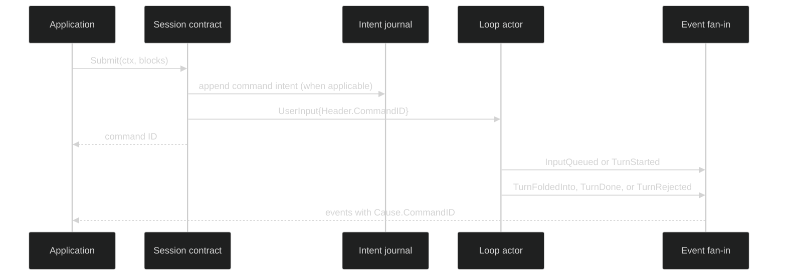

# Overview

Harness commands are small, typed messages that move work or control between a
session and its loop actors. The application-facing contracts live in
[`pkg/session`](https://github.com/looprig/harness/blob/main/pkg/session/session.go)
and [`pkg/loop`](https://github.com/looprig/harness/blob/main/pkg/loop/controller.go).
The sealed [`pkg/command`](https://github.com/looprig/harness/blob/main/pkg/command/command.go)
union is the runtime's transport and journal vocabulary. It is exported so the
runtime, journal, and tests can share exact types, but `pkg/session` deliberately
does not export a command constructor or a command sink. A normal application
calls `Session.Submit`, `Session.Interrupt`, or a loop controller method; the
trusted runtime stamps IDs, agency, timestamps, and routes the command.

## Two command lanes

The durable lane contains intent-log records. `UserInput`, `SubagentResult`,
`CancelQueuedInput`, `CancelDelegateRequest`, gate replies, `Compact`,
`Interrupt`, `Shutdown`, and `ProcessNotification` all have concrete wire
forms. `MarshalCommand` puts a type discriminator and schema version beside the
payload; restore uses `UnmarshalCommand`, then validates the result before it can
be re-enqueued.

The live control lane carries a buffered reply channel and is not encoded by the
command codec. `SetLoopMode`, `ChangeLoopInference`, and
`ReplaceLoopExternalTools` are represented durably by the enduring events they
cause (`LoopModeChanged`, `LoopInferenceChanged`, and
`LoopExternalToolsetChanged`). Their live acknowledgements report the values the
actor committed for the next turn.

| Intent | Command type | Application-facing entry point | Observable result |
| --- | --- | --- | --- |
| Human input | `UserInput` | `Session.Submit`, `SubmitToLoop` | `InputQueued`, `TurnStarted`, `TurnFoldedInto`, `TurnRejected`, or `InputCancelled` on the event fan-in |
| Delegate hand-back | `SubagentResult` | managed delegation runtime | parent-loop resolution event; the child loop ID is carried in `Header.Cause` |
| Permission answer | `ApproveToolCall`, `DenyToolCall` | `Session.RespondGate` | durable `GateResolved`, then gate command delivery |
| Ask-user answer | `ProvideUserInput` | `Session.RespondGate` | durable `GateResolved`, then the parked tool resumes |
| Queue retraction | `CancelQueuedInput` | trusted delegation/runtime path | `InputCancelled{Reason: CancelClientRetracted}` when the item is still queued; otherwise no-op |
| Managed request cancellation | `CancelDelegateRequest` | trusted managed-delegation path | transient `DelegateCancelResult` on its live ack |
| Manual compaction | `Compact` | `Session.Compact`, `CompactToLoop` | compaction events and a waiter reply correlated by command ID |
| Stop active work | `Interrupt` | `Session.Interrupt` or a loop controller | `TurnInterrupted` for work that was running; a fully idle interrupt returns `false` |
| Runtime configuration | `SetLoopMode`, `ChangeLoopInference` | `loop.Controller.SetMode`, `Change` | typed live result plus an enduring next-turn configuration event |
| External tool slot | `ReplaceLoopExternalTools` | optional `loop.ExternalToolInstaller` | typed live result plus `LoopExternalToolsetChanged` |
| Process completion | `ProcessNotification` | `tool.ProcessCompletionNotifier.NotifyProcessCompletion` | accepted, duplicate, collision, or stopped disposition |
| Teardown | `Shutdown` | `SessionController.Shutdown` | all loops drain, then `SessionStopped` |

The command ID is the correlation key. Submit methods return it immediately after
the command is handed to the target loop. They do not return a turn result.
Reply events carry the ID in `Header.Cause.CommandID`, so a subscriber can
follow one input without assuming that it started immediately.



## The public contracts

These are the exact consumer-facing methods. Construction and restoration stay
in `pkg/rig`; an application receives a live implementation through that
composition root.

```go
type Session interface {
	SessionID() uuid.UUID
	ActiveLoop() loop.Handle
	Loop(uuid.UUID) (loop.Handle, bool)
	Submit(context.Context, []content.Block) (uuid.UUID, error)
	SubmitToLoop(context.Context, uuid.UUID, []content.Block) (uuid.UUID, error)
	Compact(context.Context) (uuid.UUID, error)
	CompactToLoop(context.Context, uuid.UUID) (uuid.UUID, error)
	SubscribeEvents(event.EventFilter) (event.Subscription, error)
	RespondGate(context.Context, gate.GateResponse) error
	Interrupt(context.Context) (bool, error)
}

type SessionController interface {
	Session
	SetActiveLoop(context.Context, uuid.UUID) error
	LoopController(uuid.UUID) (loop.Controller, bool)
	CheckpointWorkspace(context.Context) (workspacestore.Ref, error)
	RestoreWorkspace(context.Context, workspacestore.Ref) error
	Shutdown(context.Context) error
}
```

The `SessionID` spelling above is exactly the source method name, even though
the code block omits imports for readability. A compile-realistic submit looks
like this:

```go
func submitQuestion(ctx context.Context, s session.Session) error {
	id, err := s.Submit(ctx, []content.Block{
		&content.TextBlock{Text: "Check the current working tree."},
	})
	if err != nil {
		return err // no command was handed to the loop; id is zero
	}
	// id is the correlation key. Read the subscription returned by
	// SubscribeEvents and match Reply events by EventHeader().Cause.CommandID.
	_ = id
	return nil
}
```

The proof is [`internal/sessionruntime/submit_test.go`](https://github.com/looprig/harness/blob/main/internal/sessionruntime/submit_test.go),
which checks the returned ID and the `command.UserInput` delivered to the actor.
The exhaustive codec proof is [`pkg/command/marshal_test.go`](https://github.com/looprig/harness/blob/main/pkg/command/marshal_test.go),
which round-trips every durable command type and rejects codec drift.

## Host-admitted runtime commands

A Host that serves remote clients admits commands in its own durable store
before any runtime sees them, then must apply each one exactly once, even
across a crash or failover. [`pkg/runtimecommand`](https://github.com/looprig/harness/blob/v0.40.2/pkg/runtimecommand/command.go)
is that seam. It is separate from `pkg/command`: an admitted command names a
retry-stable public `CommandID` (an opaque UTF-8 string of at most 256 bytes)
and the `RuntimeCommandID` UUID the Host allocated once, which Harness stamps on
the command headers and caused events without minting a replacement.

```go
type Provider interface {
	RuntimeCommands() (Applier, bool) // false for a session with no deduplicating journal
}

type Applier interface {
	ApplyRuntimeCommand(context.Context, Admitted) (Disposition, error)
}

type Admitted struct {
	CommandID        CommandID
	RuntimeCommandID uuid.UUID
	Kind             Kind
	LeaseEpoch       uint64 // a superseded epoch is refused
	Blocks           []content.Block
	GateResponse     *gate.GateResponse
	AttemptID        AttemptID
}
```

| Kind | Payload | Applies through |
| --- | --- | --- |
| `input` | `Blocks`, required | the active loop, like `Session.Submit` |
| `interrupt` | none | `Session.Interrupt` |
| `gate_response` | `GateResponse`, required; `AttemptID` required | `Session.RespondGate`, with all of its refusals |
| `create` | `Blocks`, optional first message | the active loop when a message is present; otherwise nothing, because the Host already made the session resident |
| `restore` | none | nothing; residency is the effect |

`ApplyRuntimeCommand` writes a private application record before any effect,
so a redelivery returns the original `Disposition` with `Duplicate` set and
applies nothing. An error does not mean nothing was recorded; redeliver and
read `Duplicate` rather than retrying blindly. When `AttemptID` is set, the
runtime also writes a durable `CommandDisposition` of `applied`, `no_op`, or
`refused`. A successor runtime that holds a strictly later lease uses the
optional `AttemptCloser.CloseAttempt` to record `not_applied` for an attempt its
predecessor never finished. It refuses if any event caused by that command
exists. For a `gate_response`, `GateResolved.Header.Cause.CommandID` is the
admitted `RuntimeCommandID`. An adapter that decodes a payload only for `input`
drops a `create`'s first message and still settles it `applied`, so decode the
create payload too.

## Choosing a page

Start with [Command envelope and routing](/docs/guides/harness/commands/command-envelope-and-routing) when
you are writing a journal adapter or restore reader. Use [Submit input](/docs/guides/harness/commands/submit-input)
for user or delegate payloads, [Approve and deny](/docs/guides/harness/commands/approve-and-deny) and
[Provide requested user input](/docs/guides/harness/commands/provide-user-input) for parked gates, and
[Shutdown](/docs/guides/harness/commands/shutdown) when owning the whole session lifecycle. The remaining
pages document the narrow control paths and their durable boundaries.

## Source and proof

- [`Session.Submit` admission](https://github.com/looprig/harness/blob/main/internal/sessionruntime/submit_test.go)
- [`durable command codec`](https://github.com/looprig/harness/blob/main/pkg/command/marshal_test.go)
- [`lifecycle fixture` (submit, subscription, shutdown, and restore)](https://github.com/looprig/harness/blob/main/examples/lifecycle/example_test.go)
