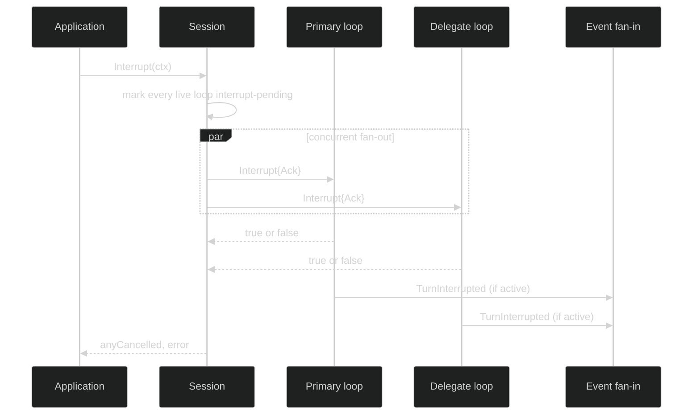

# Interrupt

Interrupt is a cancellation request, not a rollback. A running loop stops at a
safe boundary, publishes its terminal interruption event, and retains the Steps
that were already committed. The public session method fans the request out to
every live loop; a loop controller can scope interruption to one loop and its
delegate subtree.

## Public contracts

```go
type Session interface {
	Interrupt(context.Context) (bool, error)
}

type Controller interface {
	Handle
	SetMode(context.Context, ModeName) error
	Change(context.Context, ...Change) error
	Interrupt(context.Context) error
}
```

`Session.Interrupt` stamps user agency and returns `true` if at least one live
loop reported that it cancelled a running turn. It returns `false` for an idle
session or a session already shutting down. A context or durable-session fault
is returned as a typed `*session.SessionError`; a failed interrupt does not
claim that work was stopped.

The low-level command is intentionally session-wide and carries no coordinates:

```go
const (
	CommandInterrupt CommandName  = "Interrupt"
	InterruptAck     CommandField = "Ack"
)

type Interrupt struct {
	Header
	Ack chan<- bool `json:"-"`
}

func (c Interrupt) Validate() error
```

The actor sends one boolean to the required live channel. The channel must be
non-nil. It is not a durable reply path and is omitted from JSON. A session
runtime keeps the dispatch target alongside the command when it writes an
audit intent record, because the command itself cannot address one loop.



## What interruption preserves

The turn actor owns the commit handshake. If interruption arrives before a Step
commit, that in-flight step is discarded and the terminal event is
`event.TurnInterrupted`. Previously committed `event.StepDone` records remain in
the loop's history. The loop's context cancellation also returns queued input as
`event.InputCancelled` with `CancelTurnInterrupted` or `CancelTurnFailed`, as
appropriate. A no-op interrupt on an idle loop produces no terminal turn event.

The subtree-scoped controller method also prevents a parent delegate wait from
opening a fresh child step while the interrupted subtree drains. This is why a
controller interrupt is not just a convenience wrapper around a single command.

## Error handling

```go
func stopAll(ctx context.Context, s session.Session) error {
	stopped, err := s.Interrupt(ctx)
	if err != nil {
		var se *session.SessionError
		if errors.As(err, &se) {
			log.Printf("interrupt failed at session boundary: %s", se.Kind)
		}
		return err
	}
	if !stopped {
		// The session was idle or already closing. There is no active turn to
		// await, so do not manufacture a success event.
		return nil
	}
	return nil
}
```

`command.InvalidCommandError` identifies a missing low-level `Ack`. It is an
internal construction error, not a normal user cancellation result:

```go
cmd := command.Interrupt{Ack: make(chan bool, 1)}
if err := cmd.Validate(); err != nil {
	var invalid *command.InvalidCommandError
	if errors.As(err, &invalid) {
		// invalid.Field is command.InterruptAck when Ack is nil
	}
}
```

## Durability, shutdown, and proof

Interrupt intent may be appended before best-effort dispatch for audit and
restore classification, but the live `Ack` is never serialized. `Shutdown` has
different ownership and cleanup guarantees; it closes admission and joins all
loops. Use [Shutdown](/docs/guides/harness/commands/shutdown) when the session itself must end.

The public behavior is exercised by
[`internal/sessionruntime/session_test.go`](https://github.com/looprig/harness/blob/main/internal/sessionruntime/session_test.go),
which checks session-wide and exact-loop fan-out. The actor's commit-cancellation
contract is proved by [`pkg/loop/errors.go`](https://github.com/looprig/harness/blob/main/pkg/loop/errors.go)
and the turn tests that assert committed Steps survive interruption. The command
channel and serialization contract is covered by
[`pkg/command/interrupt_test.go`](https://github.com/looprig/harness/blob/main/pkg/command/interrupt_test.go)
and [`pkg/command/marshal_test.go`](https://github.com/looprig/harness/blob/main/pkg/command/marshal_test.go).
