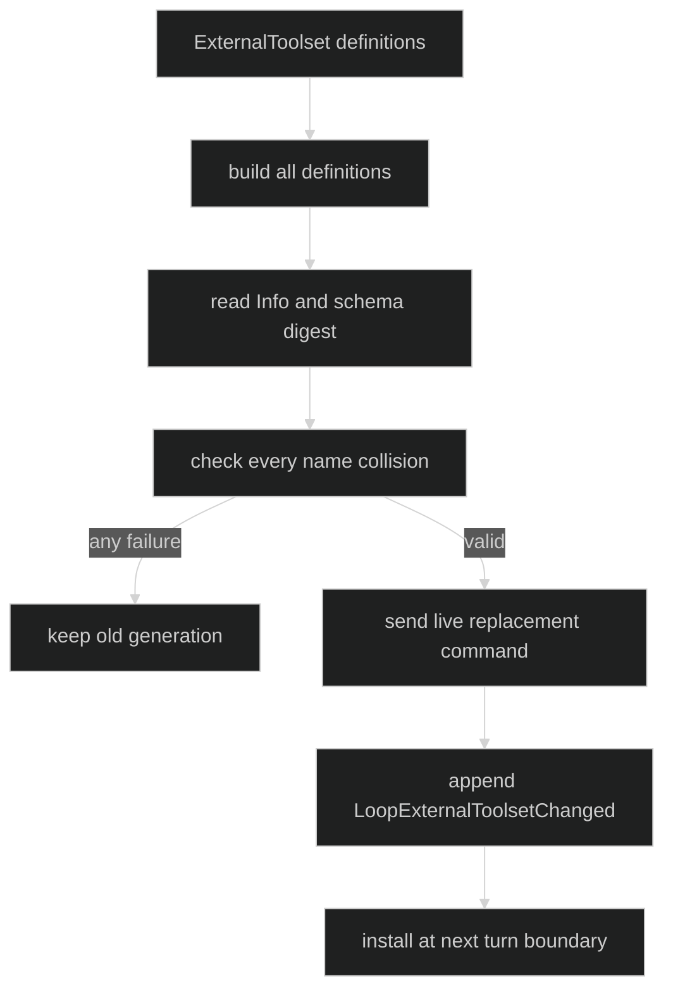

# Install and remove Loop tools

External tools are an optional, caller-owned replacement slot on a native loop.
The slot is namespaced by `Source` and replaced atomically as a whole. Declared
tools in the immutable loop definition are never removed or shadowed. An empty
replacement clears one source's slot.

## Discover the optional capability

`loop.Controller` intentionally stays small. A composition root that supports
external tools exposes this optional interface:

```go
type ExternalToolset struct {
	Source      string
	Generation  string
	Definitions []tool.Definition
}

type ExternalToolInstaller interface {
	ReplaceExternalTools(context.Context, ExternalToolset) error
}
```

```go
func install(ctx context.Context, c loop.Controller, set loop.ExternalToolset) error {
	installer, ok := c.(loop.ExternalToolInstaller)
	if !ok {
		return errors.New("this loop does not support external tools")
	}
	return installer.ReplaceExternalTools(ctx, set)
}
```

This type assertion is the supported discovery mechanism. A foreign loop is
refused because its toolset belongs to the foreign agent and Harness has no
native bindings to install into it.

## The internal command contract

The actor receives already-built live tools and a durable identity projection:

```go
const (
	CommandReplaceLoopExternalTools CommandName  = "ReplaceLoopExternalTools"
	ReplaceLoopExternalToolsAck     CommandField = "Ack"
	ReplaceLoopExternalToolsSource  CommandField = "Source"
	ReplaceLoopExternalToolsTools   CommandField = "Tools"
)

type LoopToolsResult struct {
	Err        error
	Generation string
	Installed  int
}

type ReplaceLoopExternalTools struct {
	Header
	Source     string
	Generation string
	Tools      []tool.InvokableTool
	Identities []event.ExternalToolIdentity
	Ack        chan<- LoopToolsResult
}

func (c ReplaceLoopExternalTools) Validate() error
```

`Ack` must be non-nil and buffered. `Source` must be non-empty. `Tools` and
`Identities` must have identical lengths because the actor installs the live
instances while the journal records only identities. The values themselves and
name collision rules are checked by the session and actor.

`event.ExternalToolIdentity` is the durable projection:

```go
type ExternalToolIdentity struct {
	Name         string `json:"name"`
	SchemaDigest string `json:"schema_digest"`
}

type LoopExternalToolsetChanged struct {
	enduring
	loopScoped
	Header
	Source     string                 `json:"source"`
	Generation string                 `json:"generation"`
	Tools      []ExternalToolIdentity `json:"tools,omitempty"`
}
```

Schemas, factories, tool instances, credentials, and other live resources never
enter the journal. On restore the external slot is empty; the application must
re-install its current generation after the live session is rebuilt.

## Atomic replacement rules

The session builds and describes every definition before it sends the command.
If any build, description, schema digest, or collision check fails, the prior
generation remains installed and no change event is written. The runtime rejects
names that collide with a declared tool in any mode, with another tool in the
replacement, or with another source. This conservative union check prevents a
later mode change from creating a shadowed registry.

| Validation | Typed `loop.ChangeErrorKind` |
| --- | --- |
| empty or over-long source | `ChangeInvalidExternalSource` |
| empty or over-long generation | `ChangeInvalidExternalGeneration` |
| factory/build/info/schema failure | `ChangeExternalBuildFailed` |
| declared, same-batch, or cross-source name collision | `ChangeExternalToolCollision` |
| foreign or unsupported engine | `ChangeExternalToolsUnsupported` |
| loop closing or exited | `ChangeLoopShuttingDown` or `ChangeLoopExited` |
| caller context canceled before commit | `ChangeContextDone` |



The running turn keeps its original tool set. A successful `LoopToolsResult`
reports the generation and count that the next turn will see.

```go
if err := install(ctx, controller, loop.ExternalToolset{
	Source: "mcp",
	Generation: "catalog-2026-08-12",
	Definitions: defs,
}); err != nil {
	var changeErr *loop.ChangeError
	if errors.As(err, &changeErr) && changeErr.Tool != "" {
		log.Printf("tool %q was not installed: %s", changeErr.Tool, changeErr.Kind)
	}
	return err
}
```

The source implementation is [`internal/sessionruntime/loop_tools.go`](https://github.com/looprig/harness/blob/main/internal/sessionruntime/loop_tools.go).
The public optional interface and typed errors are in
[`pkg/loop/controller.go`](https://github.com/looprig/harness/blob/main/pkg/loop/controller.go);
the command shape and buffered-ack checks are in
[`pkg/command/loop_tools.go`](https://github.com/looprig/harness/blob/main/pkg/command/loop_tools.go).
The focused runtime proof is the external-tool test suite referenced by
`loop_tools.go`, including foreign-engine refusal and atomic collision checks.

## Source and proof

- [`LoopTools` runtime operation](https://github.com/looprig/harness/blob/main/internal/sessionruntime/loop_tools.go)
- [`external toolset command shape`](https://github.com/looprig/harness/blob/main/pkg/command/loop_tools.go)
- [`loop controller boundary`](https://github.com/looprig/harness/blob/main/pkg/loop/controller.go)
