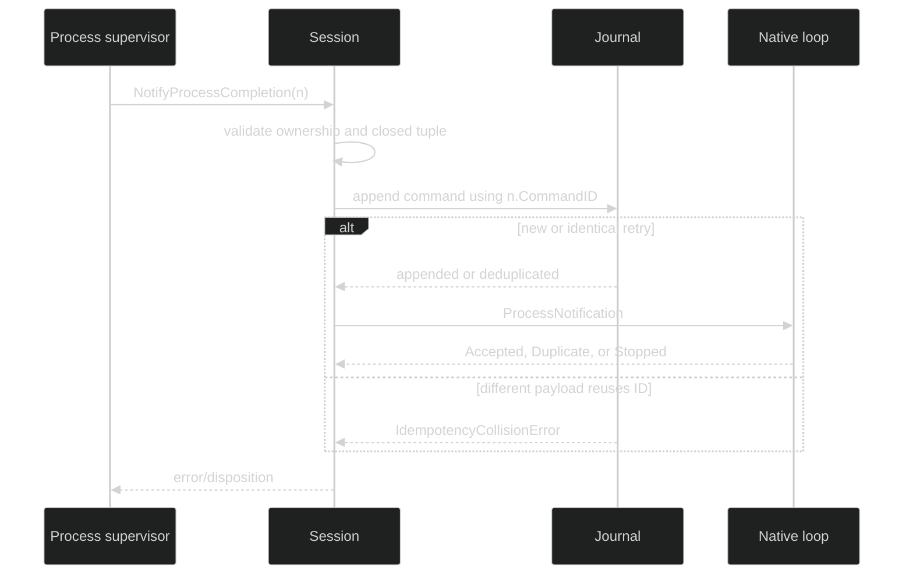

# Process notifications

Process completion is a metadata-only notification from a supervised process
runner back to the owning native loop. It is not a second process API: the
notification contains a stable command ID, session and loop ownership, an
opaque process handle, and a closed terminal state/reason pair. It never carries
the command, output, stdin, environment, host path, or OS PID.

## Public notifier and DTO

Session resources receive this capability through `tool.ProcessCompletionNotifier`:

```go
type ProcessCompletionNotifier interface {
	NotifyProcessCompletion(context.Context, ProcessCompletionNotification) error
}

type ProcessCompletionNotification struct {
	CommandID     uuid.UUID             `json:"command_id,omitzero"`
	SessionID     uuid.UUID             `json:"session_id,omitzero"`
	LoopID        uuid.UUID             `json:"loop_id,omitzero"`
	ProcessHandle string                `json:"process_handle"`
	State         ProcessLifecycleState `json:"state"`
	Reason        ProcessTerminalReason `json:"reason"`
}

func (n ProcessCompletionNotification) Validate() error
```

The process runner allocates `CommandID` before publishing completion. Harness
copies that exact ID to both the nested DTO and the command envelope; it never
mints a replacement. `Validate` requires non-zero command, session, and loop
IDs, a URL-safe handle of at most `MaxProcessHandleBytes`, and one of the closed
terminal state/reason pairs.

The durable command adds only the generic envelope and a transient disposition
channel:

```go
type ProcessNotificationResult uint8

const (
	ProcessNotificationAccepted ProcessNotificationResult = iota + 1
	ProcessNotificationDuplicate
	ProcessNotificationCollision
	ProcessNotificationStopped
)

type ProcessNotification struct {
	Header
	Notification tool.ProcessCompletionNotification `json:"notification"`
	Result       chan<- ProcessNotificationResult   `json:"-"`
}
```

`Header.CommandID == Notification.CommandID` is a hard invariant. The nested
DTO also validates its own lifecycle tuple. The command's live `Result` is nil
when reconstructed from a journal; restore seeds the owning loop directly.

## Delivery dispositions

| Disposition | Meaning | Caller action |
| --- | --- | --- |
| `Accepted` | a new durable frame was appended (or headless mode has no journal) and the loop took ownership | finish the supervisor's notification path |
| `Duplicate` | the same command ID and identical payload were already appended or accepted live | treat as success; do not create a new ID |
| `Collision` | the ID names a different persisted payload | fail closed and investigate ID reuse or forgery |
| `Stopped` | the owner exited, the bounded live set is full, or the loop cannot accept notifications | retry with the same command ID; the durable frame remains authoritative |



The append happens before dispatch. A failed non-collision append is returned
and nothing is sent to the loop. If dispatch is stopped after a successful
append, a retry checks the same idempotency index and does not write a second
frame. The loop also has a bounded live de-dup guard, so a headless session can
recognize an at-least-once retry.

```go
func publishCompletion(ctx context.Context, n tool.ProcessCompletionNotification,
	notifier tool.ProcessCompletionNotifier) error {
	if err := notifier.NotifyProcessCompletion(ctx, n); err != nil {
		var invalid *tool.ProcessLifecycleValidationError
		if errors.As(err, &invalid) {
			return fmt.Errorf("bad process completion field %s: %w", invalid.Field, err)
		}
		return err
	}
	return nil
}
```

For a native session, the concrete error types also distinguish owner mismatch,
unsupported engine, delivery stopped, and journal idempotency collision. The
caller should retry only stopped delivery, and only with the same command ID and
identical DTO.

## Durable lifecycle relationship

`ProcessNotification` is the terminal hand-off to the loop. The process itself
publishes separate enduring lifecycle events (`ProcessStarted`,
`ProcessBackgrounded`, `ProcessCompleted`, `ProcessStopRequested`, and
`ProcessLost`) through the session resource services. Those events contain
bounded metadata and no host secrets. Restore can reconstruct undelivered
notifications but cannot resurrect a process from the notification alone.

The source is [`pkg/command/process_notification.go`](https://github.com/looprig/harness/blob/main/pkg/command/process_notification.go)
and the DTO is [`pkg/tool/process.go`](https://github.com/looprig/harness/blob/main/pkg/tool/process.go).
The checked append and retry behavior is proved by
[`internal/sessionruntime/process_notification_test.go`](https://github.com/looprig/harness/blob/main/internal/sessionruntime/process_notification_test.go),
including duplicate, collision, inbox-full, and foreign-engine cases.

## Source and proof

- [`ProcessNotification` command](https://github.com/looprig/harness/blob/main/pkg/command/process_notification.go)
- [`process DTO`](https://github.com/looprig/harness/blob/main/pkg/tool/process.go)
- [`notification delivery tests`](https://github.com/looprig/harness/blob/main/internal/sessionruntime/process_notification_test.go)
