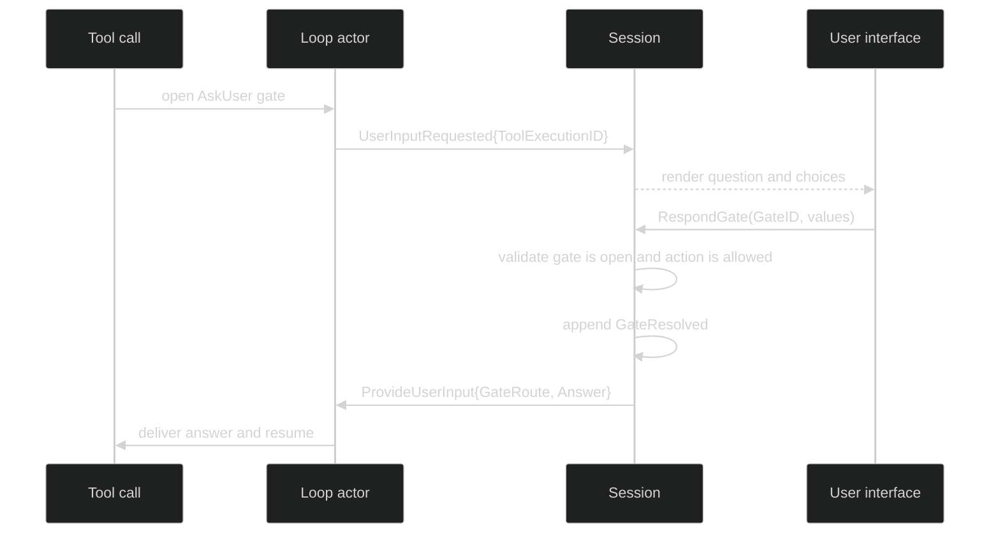

# Provide requested user input

`AskUser` is a loop-owned gate. The model or tool supplies a question, Harness
publishes `event.UserInputRequested`, and the loop parks until a response is
delivered. The response is routed by the owning `LoopID` and the exact
`ToolExecutionID`; it is not sent to whichever loop is currently active.

## Command and public contract

```go
type ProvideUserInput struct {
	Header
	GateRoute
	Answer string `json:"answer,omitempty"`
}

func (c ProvideUserInput) GateToolExecutionID() uuid.UUID

type Session interface {
	RespondGate(context.Context, gate.GateResponse) error
}
```

The public caller supplies a `gate.GateResponse`; the runtime translates it into
the command above after validating the gate kind and response shape. There is no
command-level `Ack`. The waiting tool receives the answer after the durable gate
resolution succeeds.

```go
func answerQuestion(ctx context.Context, s session.Session, gateID gate.ID, answer string) error {
	values, err := json.Marshal(answer)
	if err != nil {
		return err
	}
	return s.RespondGate(ctx, gate.GateResponse{
		GateID: gateID,
		Action: "answer", // the action declared by the AskUser gate's controls
		Values: map[string]json.RawMessage{"answer": values},
		Source: gate.ResponseSource{Kind: gate.ResponseFromUser},
	})
}
```

For a plain AskUser gate, the integration should use the action and value shape
declared by that gate's payload. The exact action constant for a particular gate
is part of the `gate` package contract, not a free-form string invented by the
caller. The low-level command's `Answer` field is the normalized value used by
the loop-owned ask-user route. If the host already receives an answer object
from a gate-specific adapter, pass its validated `GateResponse` directly.

## Request and answer lifecycle

`UserInputRequested` contains the question and optional choices for rendering:

```go
type UserInputRequested struct {
	enduring
	loopScoped
	Header
	ToolExecutionID uuid.UUID `json:"tool_execution_id,omitzero"`
	Question        string    `json:"question,omitempty"`
	Choices         []string  `json:"choices,omitempty"`
}
```

The event identifies the tool execution, while the gate ID is the answer route
held by the session. Keep both IDs in the UI model. `Question` and `Choices` are
rendering data, not proof that the gate is still open.



`RespondGate` is exactly-once at the durable boundary. It claims the gate,
appends `event.GateResolved`, removes the answer slot, and dispatches after the
append. If the append fails, the claim is reverted and the user may retry. If
another client won the race, `*session.GateError` has `GateNotFound` or
`GateNotReady`.

```go
if err := s.RespondGate(ctx, response); err != nil {
	var gateErr *session.GateError
	if errors.As(err, &gateErr) && gateErr.Kind == session.GateActionInvalid {
		// The response does not belong to this gate kind. Do not resend it
		// with a guessed action.
	}
	return err
}
```

The public answer is live form data. The durable record keeps the typed gate
resolution and redaction-aware audit, not an arbitrary host-owned answer map.
For host-owned form gates, use the separate `session.GateHost` contract and its
`AwaitGateAnswer` path; `ProvideUserInput` is specifically for the loop-owned
AskUser route.

The source of the command is [`pkg/command/provide_user_input.go`](https://github.com/looprig/harness/blob/main/pkg/command/provide_user_input.go)
and the event is [`pkg/event/tool.go`](https://github.com/looprig/harness/blob/main/pkg/event/tool.go).
The gate behavior is proved by [`internal/sessionruntime/gates_test.go`](https://github.com/looprig/harness/blob/main/internal/sessionruntime/gates_test.go),
which is a runtime proof of route matching and invalid-action rejection.

## Source and proof

- [`ProvideUserInput` command](https://github.com/looprig/harness/blob/main/pkg/command/provide_user_input.go)
- [`UserInputRequested` and gate events](https://github.com/looprig/harness/blob/main/pkg/event/tool.go)
- [`gate routing and response tests`](https://github.com/looprig/harness/blob/main/internal/sessionruntime/gates_test.go)
