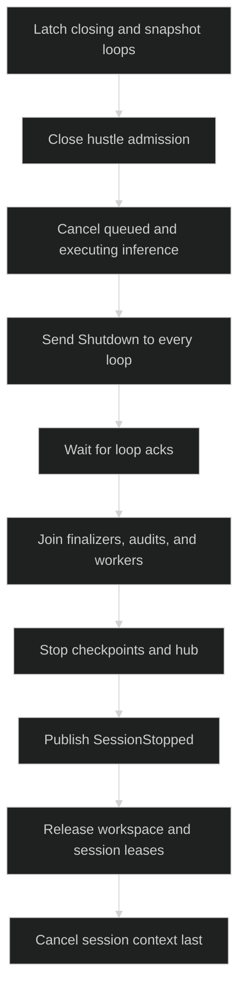

# Shutdown

Shutdown is the session lifecycle boundary. It closes command admission,
cancels active work, sends graceful shutdown to every registered loop, joins
owned workers and finalizers, publishes `event.SessionStopped`, stops the event
hub, releases leases and resources, and only then cancels the session context.
It is stronger than `Interrupt`, which leaves the session alive.

## Public API and low-level command

```go
type SessionController interface {
	Session
	Shutdown(context.Context) error
}

const (
	CommandShutdown CommandName  = "Shutdown"
	ShutdownAck     CommandField = "Ack"
)

type Shutdown struct {
	Header
	Ack chan<- error `json:"-"`
}

func (c Shutdown) Validate() error

type LoopTerminatedError struct{ Cause error }

func (e *LoopTerminatedError) Error() string
func (e *LoopTerminatedError) Unwrap() error
```

Applications call `SessionController.Shutdown`; they do not construct
`command.Shutdown`. The runtime creates one command per live loop with a fresh
command ID and a buffered live ack. The `Ack` is nil on a restored wire command
because live channels never serialize. A clean loop exit sends nil. If its root
context is canceled before cleanup completes, the ack carries
`*command.LoopTerminatedError` wrapping the cancellation cause.

## Teardown order



The close latch and loop snapshot share the same lock used by new-loop
registration. A loop is therefore either in the shutdown snapshot or refused
registration; it cannot appear after the graceful fan-out has started. The
session sends shutdown to primary and sub-loops, not just the active loop.

Caller cancellation is diagnostic, not permission to detach cleanup. Concurrent
or repeated `Shutdown` calls join the existing teardown owner and receive the
same cleanup result, augmented with their own context error after cleanup. A
shutdown call from a session-owned hustle finalizer is rejected as re-entry.

```go
func closeSession(ctx context.Context, c session.SessionController) error {
	if err := c.Shutdown(ctx); err != nil {
		var terminated *command.LoopTerminatedError
		if errors.As(err, &terminated) {
			log.Printf("a loop terminated during cleanup: %v", terminated)
		}
		return err
	}
	return nil
}
```

## Durability and ownership

Shutdown commands can be appended as audit intent with their target loop held by
the journal record, since the command itself is session-wide and has no route.
`SessionStopped` is the durable session terminal event. After the hub is stopped,
new event subscribers and commands are refused by the session's closing/fault
contracts. Session-owned resources receive their own `Shutdown` calls during
teardown; callers retain ownership of resources they supplied outside the
session.

The source lifecycle is [`internal/sessionruntime/session.go`](https://github.com/looprig/harness/blob/main/internal/sessionruntime/session.go),
with resource shutdown in [`internal/sessionruntime/session_resources.go`](https://github.com/looprig/harness/blob/main/internal/sessionruntime/session_resources.go).
The command validation and live-channel contract are proved by
[`pkg/command/shutdown_test.go`](https://github.com/looprig/harness/blob/main/pkg/command/shutdown_test.go).
The session tests prove all-loop teardown, repeated-call joining, and closing
admission. These are runtime proofs rather than a standalone shutdown command.

## Source and proof

- [`Session.Shutdown` lifecycle](https://github.com/looprig/harness/blob/main/internal/sessionruntime/session.go)
- [`shutdown command validation`](https://github.com/looprig/harness/blob/main/pkg/command/shutdown_test.go)
- [`lifecycle fixture` (shutdown and restore)](https://github.com/looprig/harness/blob/main/examples/lifecycle/example_test.go)
