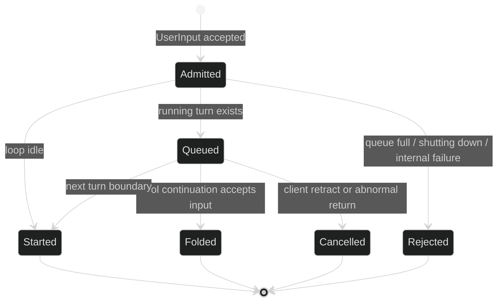

# Submit input

`Session.Submit` is fire-and-forget admission, not a synchronous turn runner. It
returns the fresh command ID once the active loop accepts the command for
delivery. The loop then decides whether the input starts a turn, waits in its
bounded inbox, folds into a tool continuation, or is rejected. Every outcome is
an event on the session fan-in and is correlated by `Header.Cause.CommandID`.

## Public entry points

The data-plane contract exposes both active-loop and exact-loop submission:

```go
type Session interface {
	Submit(context.Context, []content.Block) (uuid.UUID, error)
	SubmitToLoop(context.Context, uuid.UUID, []content.Block) (uuid.UUID, error)
	SubscribeEvents(event.EventFilter) (event.Subscription, error)
}
```

`Submit` samples the active loop once and stamps `AgencyUser`. `SubmitToLoop`
addresses the supplied loop and also represents human-authored input. Neither
method returns `TurnDone` or `TurnFailed`; a non-nil error means the command was
not handed to a loop and the returned ID is the zero UUID. Typical transport
errors are `*session.SessionError` with `SessionLoopNotFound`, `SessionLoopExited`,
`SessionContextDone`, or `SessionFaulted`.

```go
func submit(ctx context.Context, s session.Session) error {
	sub, err := s.SubscribeEvents(event.EventFilter{
		Enduring: event.LoopScope{All: true},
	})
	if err != nil {
		return err
	}
	defer sub.Close()

	commandID, err := s.Submit(ctx, []content.Block{
		&content.TextBlock{Text: "Summarize the latest test failure."},
	})
	if err != nil {
		return err
	}
	for delivery := range sub.Events() {
		if reply, ok := delivery.Event.(event.Reply); ok &&
			reply.ReplyTo() == commandID {
			// InputQueued is provisional. Keep reading until a terminal or
			// resolution event for this command arrives.
			if _, terminal := delivery.Event.(event.TurnRejected); terminal {
				return errors.New("the loop rejected the input")
			}
		}
	}
	return sub.Err()
}
```

This is compile-realistic consumer code: the caller receives a live `session.Session`
from the composition root and does not construct an internal command. The
[`pkg/session/session.go`](https://github.com/looprig/harness/blob/main/pkg/session/session.go)
contract and [`internal/sessionruntime/submit_test.go`](https://github.com/looprig/harness/blob/main/internal/sessionruntime/submit_test.go)
are the relevant source and proof.

## Command shapes

The durable command type for interactive input is:

```go
type UserInput struct {
	Header
	Blocks                []content.Block `json:"blocks,omitempty"`
	NoFold                bool             `json:"no_fold,omitzero"`
	TargetLoopID          uuid.UUID        `json:"target_loop_id,omitzero"`
	BackgroundHandBack    bool             `json:"background_hand_back,omitzero"`
	DelegateDeliveryPhase DelegateDeliveryPhase `json:"delegate_delivery_phase,omitzero"`
	Accepted              chan error       `json:"-"`
}
```

The runtime's machine delegate path also uses this type. The fields have narrow
semantics:

| Field | Meaning and validation |
| --- | --- |
| `Blocks` | sealed core content blocks; they are encoded through the content codec |
| `NoFold` | machine-only request for its own later turn; it can still wait behind a running turn |
| `TargetLoopID` | durable machine dispatch target; required for machine `NoFold`, a background hand-back, or a delivery phase |
| `BackgroundHandBack` | machine marker requesting automatic parent hand-back after a managed child completes |
| `DelegateDeliveryPhase` | machine-only durable phase, either `intent` or `fallback_queued`; ordinary interactive input leaves it empty |
| `Accepted` | transient managed-delegate acceptance channel; never serialized |

```go
type DelegateDeliveryPhase string

const (
	DelegateDeliveryPhaseIntent         DelegateDeliveryPhase = "intent"
	DelegateDeliveryPhaseFallbackQueued DelegateDeliveryPhase = "fallback_queued"
)

func (p DelegateDeliveryPhase) Valid() bool
```

An ordinary interactive `UserInput` has a command ID and blocks. It does not
carry a context. The loop derives the turn context only when it actually starts
the turn, so caller cancellation after admission cannot invalidate a future
queued item.

## What the event stream means

| Event | Class | Meaning |
| --- | --- | --- |
| `event.InputQueued` | Ephemeral reply | admitted to the inbox, but not assigned to a turn yet |
| `event.TurnStarted` | Enduring reply | this command's message became the first message of a new turn |
| `event.TurnFoldedInto` | Enduring reply | this command was folded into a mandatory tool-continuation request |
| `event.TurnRejected` | Enduring reply | queue full, loop shutting down, or transient internal failure |
| `event.InputCancelled` | Enduring event | a queued item was retracted or returned after an abnormal turn end |

`InputQueued` can be dropped by a bounded subscription because the later
resolution is authoritative. `TurnStarted`, `TurnFoldedInto`, `TurnRejected`,
and `InputCancelled` are enduring and journal-backed where applicable. A queue
full rejection is `event.RejectQueueFull`; a retryable internal admission failure
is `event.RejectInternal`.



## Delegate hand-backs

Managed delegation uses a second submit shape:

```go
type SubagentResult struct {
	Header
	identity.Coordinates
	Blocks []content.Block `json:"blocks,omitempty"`
}
```

The embedded coordinates name the parent loop that receives the result. The
child loop that produced it is `Header.Cause.LoopID`; these IDs must not be
swapped. The hand-back is machine agency by default and is never rejected. Its
parent resolution event releases the child wake token even when the parent is
ending. The exact two-ID contract is proved by
[`pkg/command/submit_test.go`](https://github.com/looprig/harness/blob/main/pkg/command/submit_test.go).

## Durability and restore

The runtime appends ordinary submit intent before dispatch when a journal is
configured. A failed audit append does not block a user input from reaching a
healthy loop. Machine delegate requests use their `intent` and
`fallback_queued` phases so restore can distinguish an accepted durable intent
from the one fallback admission that was already journaled. Block payloads and
correlation IDs are restored; `Accepted` is not. On a restore path, the runtime
creates a new live delivery channel and routes the exact command ID, rather than
pretending that an old channel survived the process boundary.

For cancellation of an admitted-but-not-started item, see [Cancel queued input](/docs/guides/harness/commands/cancel-queued-input).
For the gate commands that can interrupt a parked tool step, see [Approve and deny](/docs/guides/harness/commands/approve-and-deny)
and [Provide requested user input](/docs/guides/harness/commands/provide-user-input).

## Source and proof

- [`Session.Submit` and admission](https://github.com/looprig/harness/blob/main/internal/sessionruntime/session.go)
- [`submit command contracts`](https://github.com/looprig/harness/blob/main/pkg/command/submit_test.go)
- [`lifecycle fixture` (submit and enduring events)](https://github.com/looprig/harness/blob/main/examples/lifecycle/example_test.go)
