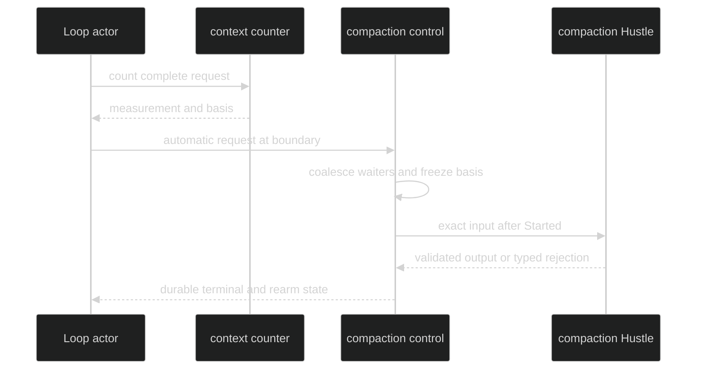

# Automatic Compaction

Automatic compaction is a context-pressure response. The Loop measures the
complete request, records the basis and fingerprint, and coordinates one
automatic attempt only when policy and pressure allow it.

## Trigger sequence

1. Resolve model context limits using `ReservedOutput` and `SafetyMargin`.
2. Count the complete inference request with the policy timeout.
3. Compute occupancy and pressure against `CompactAt` and full scale.
4. If eligible at a safe boundary, coalesce the automatic request with any
   current waiters and publish `CompactionStarted`.
5. Run the registered blocking current-Loop Hustle and validate its result.
6. Append `CompactionCommitted` or `CompactionRejected`, then waiter replies.

`PressureHardLimit` without a new eligible attempt is a typed context-limit
failure. Automatic pressure never bypasses a pending interrupt or shutdown.

Proof: [automatic context tracking](https://github.com/looprig/harness/blob/main/internal/loopruntime/context.go), [control loop](https://github.com/looprig/harness/blob/main/internal/loopruntime/compaction_control.go), and [automatic tests](https://github.com/looprig/harness/blob/main/internal/loopruntime/context_loop_test.go).

## One attempt per basis

The context tracker stores the automatic basis that has already been exhausted.
Repeated measurements at or above `CompactAt` join the pending attempt or wait
until `RearmBelow` is crossed. Manual compaction does not consume this
automatic-basis marker.

Proof: [automatic basis tracking](https://github.com/looprig/harness/blob/main/internal/loopruntime/context.go) and [automatic/manual interaction tests](https://github.com/looprig/harness/blob/main/internal/loopruntime/context_loop_test.go).

## Event observation

Automatic attempts use `event.CompactionReasonAutomatic`. `CompactionStarted` is
public and ephemeral; `CompactionCommitted` or `CompactionRejected` is public
and enduring. A caller waiting on a compact command receives the deterministic
waiter reply after the terminal event is durably appended.

Proof: [compaction events](https://github.com/looprig/harness/blob/main/pkg/event/compaction.go) and [publication tests](https://github.com/looprig/harness/blob/main/internal/loopruntime/compaction_publication_test.go).

## Source and proof

- [Context tracker](https://github.com/looprig/harness/blob/main/internal/loopruntime/context.go)
- [Automatic compaction tests](https://github.com/looprig/harness/blob/main/internal/loopruntime/context_loop_test.go)
- [Compaction publication](https://github.com/looprig/harness/blob/main/internal/loopruntime/compaction_publication.go)
