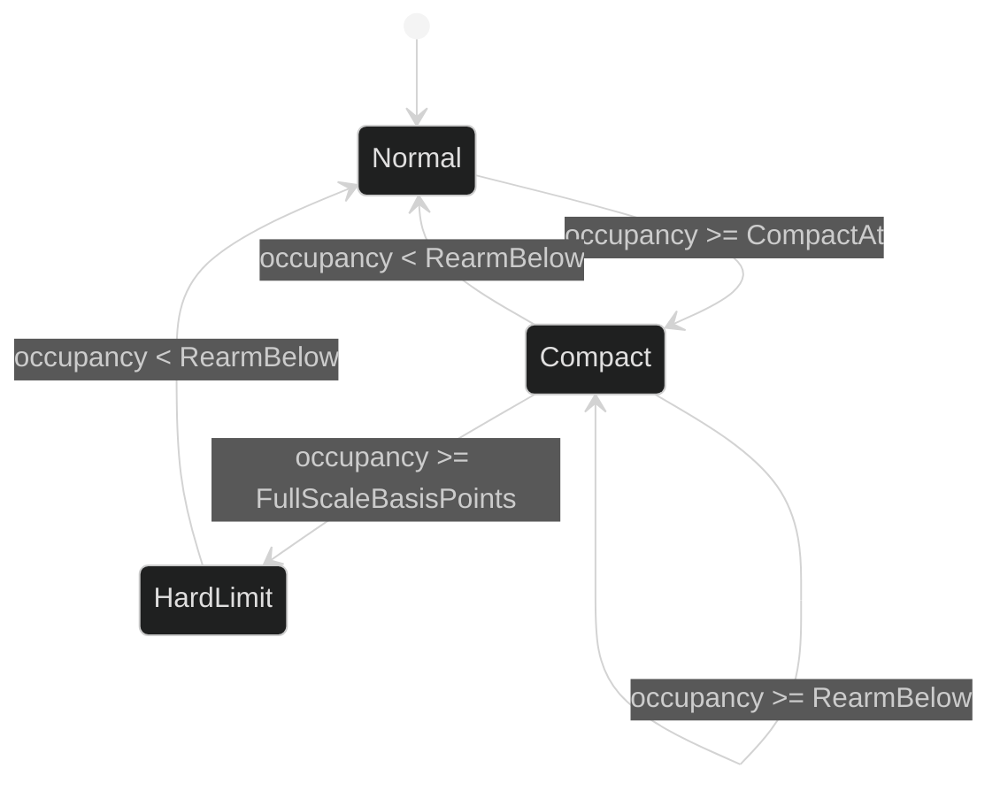

# Context Thresholds

Automatic compaction uses occupancy of the complete counted request, not a
message-length guess. The count comes from the configured [Inference context counter](/docs/guides/inference/context-counting/). Occupancy is compared with explicit policy thresholds
and the context tracker remembers the automatic basis that already triggered.

## Occupancy and pressure

The counter returns `InputTokens`, `InputLimit`, model identity, quality, basis,
and request fingerprint. Harness computes occupancy in basis points. With
automatic mode enabled:

| Occupancy | Pressure |
| --- | --- |
| Below `CompactAt` | `PressureNormal`. |
| At or above `CompactAt`, below full scale | `PressureCompact`. |
| At or above `event.FullScaleBasisPoints` | `PressureHardLimit`. |

At `PressureCompact` or `PressureHardLimit`, a new automatic attempt is
coordinated unless the same context basis already exhausted automatic
compaction. A hard limit with no new eligible attempt returns
`*loop.ContextLimitError`.

Proof: [context tracker](https://github.com/looprig/harness/blob/main/internal/loopruntime/context.go) and [threshold behavior tests](https://github.com/looprig/harness/blob/main/internal/loopruntime/context_loop_test.go).

## Rearming

After an automatic attempt is durably committed or rejected, the tracker marks
that basis as exhausted for automatic triggering. While pressure remains at or
above `RearmBelow`, later measurements do not open another attempt for the same
basis. Once occupancy falls below `RearmBelow`, the pressure returns to normal
and a later rise can trigger a new automatic attempt with a new basis.

Manual attempts do not exhaust the automatic basis. This lets a manual request
finish or reject while an eligible automatic attempt can still be coordinated.

Proof: [rearm and automatic basis](https://github.com/looprig/harness/blob/main/internal/loopruntime/context.go) and [automatic retry tests](https://github.com/looprig/harness/blob/main/internal/loopruntime/context_loop_test.go).

## Counter policy table

| `CounterPolicy` | Quality admitted for automatic mode |
| --- | --- |
| `CounterPolicyRequireExact` | Provider-exact or local-exact only. |
| `CounterPolicyAllowConservative` | Exact or heuristic estimate, with nonzero `SafetyMargin` for heuristic quality. |
| `CounterPolicyUnknown` | Rejected by policy validation. |

`CountTimeout` bounds the context counter call. Timeout, invalid count model,
quality mismatch, and malformed measurement are typed count failures; they do
not silently trigger with a guessed limit.

Proof: [policy validation](https://github.com/looprig/harness/blob/main/pkg/loop/compaction_policy.go) and [context count tests](https://github.com/looprig/harness/blob/main/internal/loopruntime/context_test.go).

## Source and proof

- [Context policy](https://github.com/looprig/harness/blob/main/pkg/loop/compaction_policy.go)
- [Tracker and pressure](https://github.com/looprig/harness/blob/main/internal/loopruntime/context.go)
- [Threshold proof](https://github.com/looprig/harness/blob/main/internal/loopruntime/context_loop_test.go)
