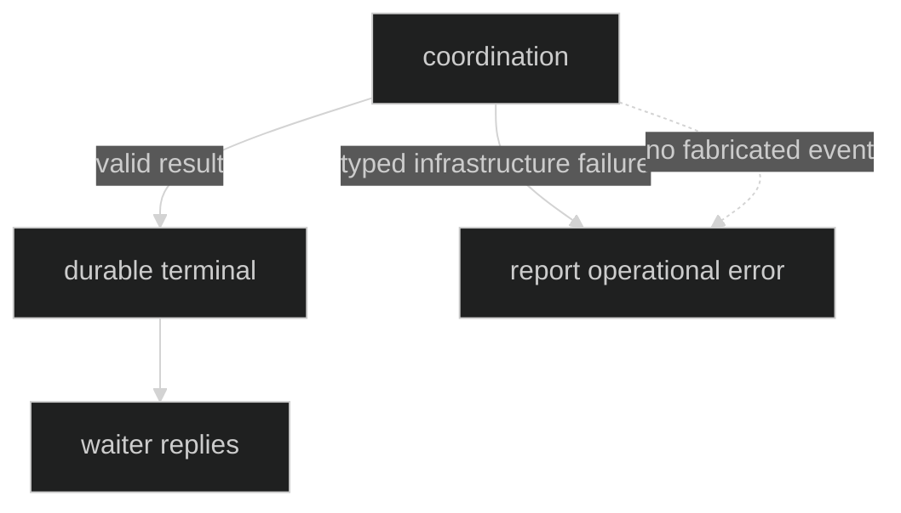

# Errors

Compaction separates a public durable rejection from infrastructure failures.
Only a completed, durable attempt can produce `CompactionRejected` or waiter
rejections. Publication and coordination failures remain typed operational
errors so consumers do not mistake missing evidence for a model rejection.

## Public rejection reasons

| `event.CompactRejectReason` | Meaning |
| --- | --- |
| `CompactRejectControlLaneFull` | The bounded compaction waiter/control lane could not admit the request. |
| `CompactRejectShuttingDown` | Shutdown outranked the pending attempt. |
| `CompactRejectInterrupted` | An interrupt outranked the pending attempt. |
| `CompactRejectCanceled` | The compaction context or execution was canceled. |
| `CompactRejectStaleBasis` | Candidate identity no longer matches actor context. |
| `CompactRejectProgressPublication` | Progress publication prevented a valid terminal operation. |
| `CompactRejectUnavailable` | The configured compactor or facility was unavailable. |
| `CompactRejectExecutionFailed` | The compaction Hustle or count operation failed. |
| `CompactRejectInvalidSummary` | Summary wire, identity, shape, or XML validation failed. |
| `CompactRejectContextCountFailed` | Complete request measurement failed. |
| `CompactRejectSummaryTooLarge` | Post-replacement input still exceeds its context limit. |
| `CompactRejectInternal` | A bounded internal execution failure occurred. |
| `CompactRejectContextLimitUnknown` | Context limit could not be resolved safely. |

Proof: [reject constants](https://github.com/looprig/harness/blob/main/pkg/event/compaction.go) and [reject event validation](https://github.com/looprig/harness/blob/main/pkg/event/compaction_test.go).

## Typed domain failures

`*loop.CompactionPolicyError` names the invalid policy field. `*loop.RequestFingerprintError`
names missing or invalid request identity. `*loop.CompactionInputError` names
`basis`, `model`, `request_fingerprint`, `transcript`, or
`max_summary_tokens`. `*loop.InvalidSummaryError` carries one closed reason.
`*loop.SummaryTooLargeError` carries the post-replacement measurement.

Use `errors.As` and `errors.Is`; do not parse error strings or render causes to
model output.

Proof: [loop compaction errors](https://github.com/looprig/harness/blob/main/pkg/loop/compaction.go), [policy errors](https://github.com/looprig/harness/blob/main/pkg/loop/compaction_policy.go), and [domain tests](https://github.com/looprig/harness/blob/main/pkg/loop/compaction_test.go).

## Coordination and finalization failures

Internal `CompactionCoordinationError` kinds are `attempt_id`, `outcome`, and
`basis`. `CompactionFinalizationError` reports terminal clone, validation,
append, or waiter publication failures. A start publication failure does not
invoke the executor; an append failure never becomes a false rejected event.

Proof: [coordination errors](https://github.com/looprig/harness/blob/main/internal/loopruntime/compaction_control.go), [finalization errors](https://github.com/looprig/harness/blob/main/internal/loopruntime/compaction_finalization.go), and [failure tests](https://github.com/looprig/harness/blob/main/internal/loopruntime/compaction_control_loop_test.go).

## Source and proof

- [Public compaction errors](https://github.com/looprig/harness/blob/main/pkg/loop/compaction.go)
- [Public rejection events](https://github.com/looprig/harness/blob/main/pkg/event/compaction.go)
- [Internal coordination](https://github.com/looprig/harness/blob/main/internal/loopruntime/compaction_control.go)
- [Error proof](https://github.com/looprig/harness/blob/main/internal/loopruntime/compaction_finalization_test.go)
