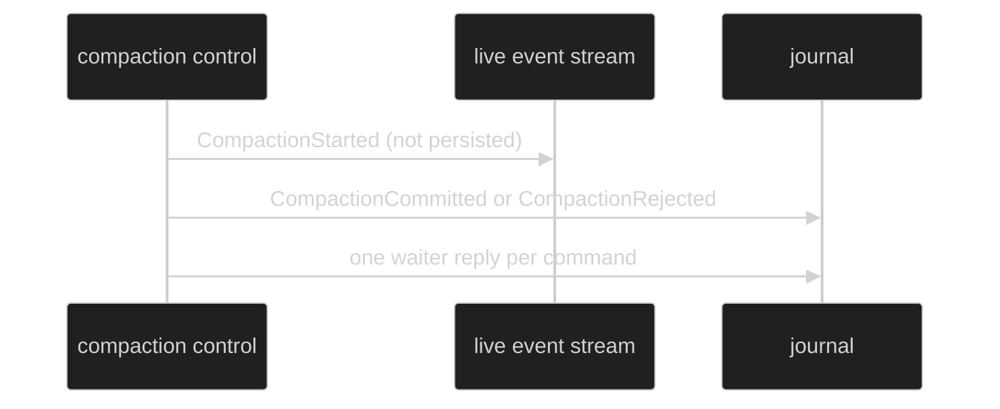

# Events and Waiters

Compaction has one public lifecycle opener, two public terminal outcomes, and
two public waiter replies. The event identity and waiter ordering make terminal
publication idempotent and replayable.

## Lifecycle event types

```go
// package event
type CompactionStarted struct {
	AttemptID CompactAttemptID
	Reason    CompactionReason
	Basis     ContextBasis
}

type CompactionCommitted struct {
	AttemptID        CompactAttemptID
	WaiterCommandIDs []uuid.UUID
	Reason           CompactionReason
	Basis            ContextBasis
	Summary          *content.UserMessage
	Retained         content.AgenticMessages
	PostContext      ContextMeasurement
	Duration         time.Duration
}

type CompactionRejected struct {
	AttemptID        CompactAttemptID
	WaiterCommandIDs []uuid.UUID
	Reason           CompactionReason
	Basis            ContextBasis
	RejectReason     CompactRejectReason
	Duration         time.Duration
}
```

The concrete structs also carry the stamped `event.Header`. Started is
ephemeral and loop-scoped. Committed and Rejected are enduring and
loop-scoped. All three are public. `CompactionCommitted` validates a nonempty
one-user-text summary, the kept `Retained` suffix that follows it, and the
post-context measurement; `CompactionRejected`
validates a closed `CompactRejectReason`.

Proof: [compaction event declarations](https://github.com/looprig/harness/blob/main/pkg/event/compaction.go) and [event validation tests](https://github.com/looprig/harness/blob/main/pkg/event/compaction_test.go).

## Waiter replies

```go
type CompactWaiterResolved struct {
	AttemptID        CompactAttemptID
	CommittedEventID uuid.UUID
}

type CompactWaiterRejected struct {
	AttemptID CompactAttemptID
	Reason    CompactRejectReason
}

func CompactWaiterReplyID(
	attempt CompactAttemptID,
	commandID uuid.UUID,
	resolved bool,
) uuid.UUID
```

The reply `Cause.CommandID` identifies the waiting command. A resolved reply
also names `CommittedEventID`; both reply EventIDs must equal the deterministic
hash returned by `CompactWaiterReplyID`. Waiter IDs in the terminal event are
sorted by creation time and UUID bytes, and duplicates are invalid.

Proof: [waiter reply identity](https://github.com/looprig/harness/blob/main/pkg/event/compaction.go) and [waiter validation tests](https://github.com/looprig/harness/blob/main/pkg/event/compaction_test.go).

## Reasons and rejection vocabulary

`CompactionReasonManual` represents user agency; `CompactionReasonAutomatic`
represents machine pressure. `CompactRejectReason` includes
`CompactRejectControlLaneFull`, `CompactRejectShuttingDown`,
`CompactRejectInterrupted`, `CompactRejectCanceled`, `CompactRejectStaleBasis`,
`CompactRejectProgressPublication`, `CompactRejectUnavailable`,
`CompactRejectExecutionFailed`, `CompactRejectInvalidSummary`,
`CompactRejectContextCountFailed`, `CompactRejectSummaryTooLarge`,
`CompactRejectInternal`, `CompactRejectContextLimitUnknown`, and
`CompactRejectRetainedTailTooLarge`.

Proof: [reason constants](https://github.com/looprig/harness/blob/main/pkg/event/compaction.go) and [reason validation](https://github.com/looprig/harness/blob/main/pkg/event/compaction_test.go).

## Publication order

`CompactionStarted` is published live and never persisted. The finalizer
validates and appends the canonical terminal first, then appends
each deterministic waiter reply. Retrying finalization for the same AttemptID
returns the first terminal identity. A journal failure is a typed
`CompactionFinalizationError`, not a fabricated rejection event.



Proof: [compaction finalizer](https://github.com/looprig/harness/blob/main/internal/loopruntime/compaction_finalization.go) and [finalization tests](https://github.com/looprig/harness/blob/main/internal/loopruntime/compaction_finalization_test.go).

## Source and proof

- [Event contracts](https://github.com/looprig/harness/blob/main/pkg/event/compaction.go)
- [Finalization implementation](https://github.com/looprig/harness/blob/main/internal/loopruntime/compaction_finalization.go)
- [Event proof](https://github.com/looprig/harness/blob/main/pkg/event/compaction_test.go)
