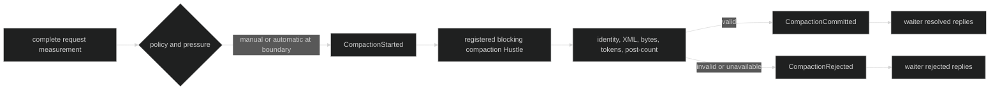

# Compaction

Compaction measures the complete model request and, at a safe Loop boundary,
replaces an older transcript prefix with one validated user-message summary.
The attempt carries a context basis, model identity, and request fingerprint so
the summary cannot be committed against a different conversation.

## How it works

Harness resolves context limits after reserved output and safety margin, counts
the complete request with the configured context counter, and records a
`ContextMeasurement`. `CompactionPolicy` decides whether automatic pressure is
eligible. A registered blocking current-Loop Hustle receives the exact
`loop.CompactionInput`; Harness validates its identity and summary shape before
durably replacing the prefix.



Proof: [context measurement and tracking](https://github.com/looprig/harness/blob/main/internal/loopruntime/context.go) and [live compaction tests](https://github.com/looprig/harness/blob/main/internal/sessionruntime/compaction_live_test.go).

## Configure compaction

```go
assistant, err := loop.Define(
	loop.WithName("assistant"),
	loop.WithInference(client, selectedModel),
	loop.WithContextCounter(counter),
	loop.WithInferenceCapability(capability),
	loop.WithCompaction(loop.CompactionPolicy{
		Automatic:        true,
		CounterPolicy:    loop.CounterPolicyRequireExact,
		CompactAt:        8_000,
		RearmBelow:       6_000,
		ReservedOutput:   4_096,
		MaxSummaryTokens: 2_048,
		CountTimeout:     3 * time.Second,
		Hustle:           hustle.Name("context.compact"),
	}),
)
```

The context counter, inference capability, and policy are validated as one
compatible configuration. Harness supplies no hidden timeout or threshold
defaults. The named Hustle must be registered on the Rig and be blocking with
`ModelSourceCurrentLoop`.

Proof: [Loop compaction definition](https://github.com/looprig/harness/blob/main/pkg/loop/definition.go), [policy validation](https://github.com/looprig/harness/blob/main/pkg/loop/compaction_policy.go), and [Rig validation](https://github.com/looprig/harness/blob/main/pkg/rig/definition.go).

## Run manual compaction

```go
attemptID, err := live.Compact(ctx)
if err != nil {
	return fmt.Errorf("request compaction: %w", err)
}
fmt.Printf("compaction requested: %s\n", attemptID)
```

`CompactToLoop` targets a particular Loop ID. Completion is asynchronous with
respect to the request, so observe `CompactionStarted`,
`CompactionCommitted`, or `CompactionRejected`, along with
`CompactWaiterResolved` or `CompactWaiterRejected` when waiting for a command
outcome. The API accepts no caller-supplied summary.

Proof: [Session compaction methods](https://github.com/looprig/harness/blob/main/pkg/session/session.go) and [compaction event tests](https://github.com/looprig/harness/blob/main/pkg/event/compaction_test.go).

## Safety properties

Compaction never treats arbitrary model text as a replacement transcript. The
output must be one nonempty `UserMessage` text block, match input basis/model/
fingerprint, satisfy the exact summary grammar, stay within byte and token
limits, and leave the complete post-replacement request below the context
limit. Automatic compaction re-arms only after context falls below
`RearmBelow`.

Proof: [compaction replacement](https://github.com/looprig/harness/blob/main/internal/loopruntime/context_replacement.go) and [finalization tests](https://github.com/looprig/harness/blob/main/internal/loopruntime/compaction_finalization_test.go).

## Source and proof

- [Public compaction types](https://github.com/looprig/harness/blob/main/pkg/loop/compaction.go)
- [Compaction events](https://github.com/looprig/harness/blob/main/pkg/event/compaction.go)
- [Compaction actor control](https://github.com/looprig/harness/blob/main/internal/loopruntime/compaction_control.go)
- [Compaction restore](https://github.com/looprig/harness/blob/main/internal/sessionruntime/restore_compaction_test.go)
