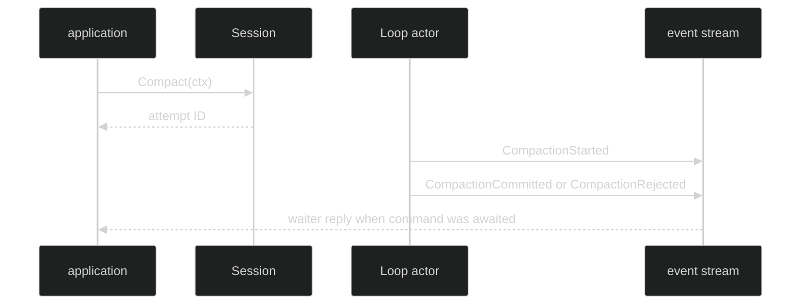

# Manual Compaction

Manual compaction is requested through the public Session data-plane contract.
The request identifies an attempt asynchronously; it never carries a caller
supplied summary or arbitrary Hustle name.

## Session methods

```go
// package session
type Session interface {
	Compact(context.Context) (uuid.UUID, error)
	CompactToLoop(context.Context, uuid.UUID) (uuid.UUID, error)
}

// Compact targets the active Loop.
attemptID, err := live.Compact(ctx)
if err != nil {
	return fmt.Errorf("request manual compaction: %w", err)
}

// CompactToLoop targets a known Loop ID.
targetAttempt, err := live.CompactToLoop(ctx, loopID)
_ = attemptID
_ = targetAttempt
```

`Compact` and `CompactToLoop` return a UUID-shaped request/attempt identity,
not a summary and not a synchronous success claim. Invalid context, closing,
missing Loop, unsupported compaction, or command admission failures are
returned at request time; execution and summary rejection are reported by
events.

Proof: [Session interface](https://github.com/looprig/harness/blob/main/pkg/session/session.go), [session compaction implementation](https://github.com/looprig/harness/blob/main/internal/sessionruntime/session.go), and [manual compaction tests](https://github.com/looprig/harness/blob/main/internal/sessionruntime/compaction_live_test.go).

## Manual reason and waiters

Manual requests use `event.CompactionReasonManual`. Multiple requests coalesce
into one pending attempt up to the control waiter's capacity. The terminal
event carries sorted `WaiterCommandIDs`; each waiting command receives exactly
one `CompactWaiterResolved` or `CompactWaiterRejected` reply.

Proof: [compaction control admission](https://github.com/looprig/harness/blob/main/internal/loopruntime/compaction_control.go) and [control tests](https://github.com/looprig/harness/blob/main/internal/loopruntime/compaction_control_test.go).

## Observe completion

Subscribe to the public event stream and correlate `AttemptID`. A committed
event contains the validated summary and `PostContext`; a rejected event
contains the bounded `CompactRejectReason`. Waiter replies are deterministic
event identities derived by `event.CompactWaiterReplyID`.



Proof: [compaction event contracts](https://github.com/looprig/harness/blob/main/pkg/event/compaction.go) and [waiter event tests](https://github.com/looprig/harness/blob/main/pkg/event/compaction_test.go).

## Source and proof

- [Session public API](https://github.com/looprig/harness/blob/main/pkg/session/session.go)
- [Compaction command](https://github.com/looprig/harness/blob/main/pkg/command/compact.go)
- [Manual/live tests](https://github.com/looprig/harness/blob/main/internal/sessionruntime/compaction_live_test.go)
