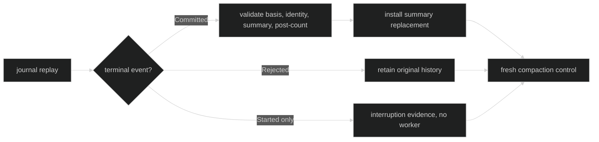

# Restore and Recovery

Restore treats a committed compaction summary as durable context replacement.
It does not recreate a live compaction worker or rerun a Hustle from a partial
attempt.

## Committed history

During replay, `CompactionCommitted` supplies the summary, post-context
measurement, and next basis identity. The restored transcript contains the
summary at the committed replacement point plus the runtime tail after that
point. `CompactionRejected` leaves the original transcript unchanged.

The replacement is applied only after terminal publication is durable. A
summary is marked as derived history so downstream review and evidence logic
does not treat it as a human-authored message.

Proof: [context replacement](https://github.com/looprig/harness/blob/main/internal/loopruntime/context_replacement.go), [restore compaction tests](https://github.com/looprig/harness/blob/main/internal/sessionruntime/restore_compaction_test.go), and [context fold tests](https://github.com/looprig/harness/blob/main/internal/sessionruntime/context_fold_test.go).

## Rejected or interrupted attempt

A rejected terminal records a bounded reason and waiter outcomes. It does not
change transcript history. An unmatched `CompactionStarted` is not replayed as
an active inference. The restored Loop receives a fresh control slot; callers
must request a new manual attempt or wait for a new automatic basis.

Proof: [restore compaction handling](https://github.com/looprig/harness/blob/main/internal/sessionruntime/restore_compaction_test.go) and [live restore tests](https://github.com/looprig/harness/blob/main/internal/sessionruntime/compaction_live_test.go).

## Fail-closed identity

Restore validates basis revision and ThroughEventID, model key, request
fingerprint, summary shape, post-context measurement, and event route. A stale
or contradictory replacement returns a typed restore error and does not apply
partial transcript state. Durable terminal and waiter identities remain the
source of truth for idempotence.

Proof: [stale replacement error](https://github.com/looprig/harness/blob/main/internal/loopruntime/context_replacement.go) and [restore contradiction tests](https://github.com/looprig/harness/blob/main/internal/sessionruntime/restore_compaction_test.go).

## Source and proof

- [Compaction restore tests](https://github.com/looprig/harness/blob/main/internal/sessionruntime/restore_compaction_test.go)
- [Replacement application](https://github.com/looprig/harness/blob/main/internal/loopruntime/context_replacement.go)
- [Context fold proof](https://github.com/looprig/harness/blob/main/internal/sessionruntime/context_fold_test.go)
