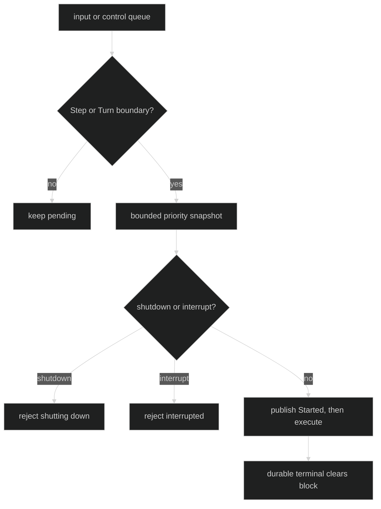

# Safe Boundaries

Compaction changes the actor-owned context only at a safe boundary. A pending
request freezes the current input inbox so a new user message cannot start or
fold while the compaction obligation is unresolved.

## Boundary kinds

The control actor consumes a pending attempt only at `compactionBoundaryStep` or
`compactionBoundaryTurn`. It first applies a bounded snapshot of priority
controls. Shutdown and interrupt signals outrank starting compaction. Once an
attempt is in progress, another boundary does not start a second one.

Proof: [boundary arbitration](https://github.com/looprig/harness/blob/main/internal/loopruntime/compaction_control.go) and [safe-boundary tests](https://github.com/looprig/harness/blob/main/internal/loopruntime/safe_boundary_compaction_test.go).

## Bounded control lanes

One Loop has one coalescing compaction slot and at most 64 waiter commands.
Duplicate command IDs return a duplicate admission. Additional waiters return
lane-full and later receive typed rejection through the control failure path.
The priority control snapshot is capped at 8 commands; the ordinary FIFO input
lane is not unboundedly drained at a boundary.

Compaction control is separate from the ordinary user-input queue. The pending
slot blocks new input until a durable terminal event clears it.

Proof: [control capacities](https://github.com/looprig/harness/blob/main/internal/loopruntime/compaction_control.go) and [capacity tests](https://github.com/looprig/harness/blob/main/internal/loopruntime/compaction_control_loop_test.go).

## Publication boundary

`CompactionStarted` is published before the executor is invoked. If start
publication fails, the executor is not called and the runtime does not invent a
false `CompactionRejected`. Fatal journal or coordination failures travel as
typed infrastructure errors. After successful start publication, exactly one
durable terminal event resolves the attempt.

Proof: [compaction publication ordering](https://github.com/looprig/harness/blob/main/internal/loopruntime/compaction_publication.go) and [start publication tests](https://github.com/looprig/harness/blob/main/internal/loopruntime/compaction_control_loop_test.go).

## Source and proof

- [Compaction control](https://github.com/looprig/harness/blob/main/internal/loopruntime/compaction_control.go)
- [Boundary arbitration proof](https://github.com/looprig/harness/blob/main/internal/loopruntime/safe_boundary_compaction_test.go)
- [Publication proof](https://github.com/looprig/harness/blob/main/internal/loopruntime/compaction_publication_test.go)
