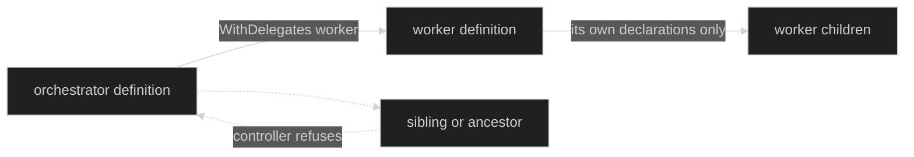

# Declare delegates

Declare a delegate on the parent Loop, then register both definitions with the
Rig. `WithDelegates` is additive and duplicate names are removed when the Loop
definition freezes. `WithDelegation` is a singleton option.

```go
// The definitions are immutable after Define returns.
worker, err := loop.Define(
	loop.WithName("worker"),
	loop.WithInference(client, workerModel),
)
if err != nil {
	return err
}

orchestrator, err := loop.Define(
	loop.WithName("orchestrator"),
	loop.WithInference(client, coordinatorModel),
	loop.WithDelegates("worker"),
	loop.WithDelegation(loop.Delegation{Style: loop.DelegationManaged}),
)
if err != nil {
	return err
}

// store is an initialized session store owned by the application.
runtime, err := rig.Define(
	rig.WithLoops(orchestrator, worker),
	rig.WithPrimers("orchestrator"),
	rig.WithSessionStore(store),
)
if err != nil {
	return err
}
_ = runtime
```

## Loop-level declarations

| API | Exact behavior |
| --- | --- |
| `loop.WithDelegates(names ...identity.AgentName) loop.Option` | Adds allowed target names. The option copies its input; `Define` freezes and deduplicates the result. |
| `loop.WithDelegation(policy loop.Delegation) loop.Option` | Sets one `DelegationStyle`; a second use is rejected. |
| `Definition.Delegates() []identity.AgentName` | Returns a defensive copy of the frozen names. |
| `Definition.Delegation() loop.Delegation` | Returns the frozen style. |

`DelegationSyncOnly` permits only a `DelegateStart` that waits for its
response. `DelegationManaged` permits start, send, interrupt, and status, with
either waiting or background delivery subject to the request and ownership
rules.

Proof: [Loop delegation options and definition freeze](https://github.com/looprig/harness/blob/main/pkg/loop/definition.go) and [definition tests](https://github.com/looprig/harness/blob/main/pkg/loop/definition_test.go).

## Rig graph validation

At `rig.Define`, names are checked across the complete graph:

| Check | Result |
| --- | --- |
| Duplicate or blank Loop name | Rig definition error. |
| Delegate name absent from `WithLoops` | Rig definition error. |
| A Loop unreachable from `WithPrimers` | Rig definition error. |
| Duplicate primer or invalid active primer | Rig definition error. |

The Loop definition's policy revision includes sorted delegate names and the
delegation style, so changing authority changes the definition identity. A
target does not need to be known while the standalone Loop is being defined;
the Rig is the boundary that can validate the target set.

Proof: [Rig definition validation](https://github.com/looprig/harness/blob/main/pkg/rig/definition.go) and [topology reachability tests](https://github.com/looprig/harness/blob/main/pkg/rig/rig_test.go).

## Reachability and authority

The graph is directed. If `orchestrator` declares `worker`, the runtime can
create `worker` as a direct child. `worker` cannot use the orchestrator as a
target unless its own definition declares that name, and a parent controller
cannot address a sibling or ancestor by guessing an ID.



Proof: [scoped controller ownership checks](https://github.com/looprig/harness/blob/main/internal/sessionruntime/delegation.go) and [delegation ownership tests](https://github.com/looprig/harness/blob/main/internal/sessionruntime/delegation_test.go).

## Source and proof

- [Delegation style and policy](https://github.com/looprig/harness/blob/main/pkg/loop/deps.go)
- [Definition options and policy revision](https://github.com/looprig/harness/blob/main/pkg/loop/definition.go)
- [Rig graph checks](https://github.com/looprig/harness/blob/main/pkg/rig/definition.go)
- [Loop definition validation tests](https://github.com/looprig/harness/blob/main/pkg/loop/definition_test.go)
