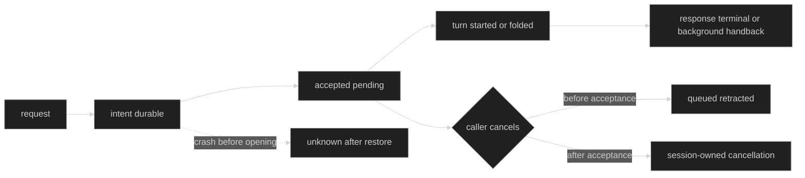

# Delivery and cancellation

Delivery and response are two different observations. A request can be
accepted by the session while the child is still working, and a response can
time out while the child continues. Use the result fields instead of inferring
delivery from the child state.

## Status dimensions

| Dimension | Exact values | Meaning |
| --- | --- | --- |
| `DelegateDeliveryStatus` | `accepted_pending`, `injected`, `queued`, `rejected`, `delivery_unknown`, `delivered_untrackable` | What the session can prove about reaching the target. |
| `DelegateResponseStatus` | `unknown`, `completed`, `interrupted`, `failed`, `timed_out` | What the response observer can prove. |
| `AgentState` | `starting`, `working`, `idle`, `unavailable` | Persistent child lifecycle, not a response terminal. |

`WaitForResponse` controls the caller's observation. A waiting call drains the
correlated response until completion, interruption, failure, or timeout. A
background call returns the correlation identity and leaves the session-owned
handback path responsible for completion.

Proof: [delegate status types](https://github.com/looprig/harness/blob/main/pkg/tool/definition.go) and [delivery tests](https://github.com/looprig/harness/blob/main/internal/sessionruntime/delegation_test.go).

## Acceptance boundary

The runtime reserves and appends a durable delegate intent before dispatching a
native or foreign child. It registers the response tracker before enqueue. A
caller cancellation before actor acceptance may retract queued work. Once the
intent has crossed the acceptance boundary, the session owns it and the caller
context cannot roll it back.

Native child turns may fold busy messages. Foreign or headless delivery uses
`NoFold` and durable delivery phases. A queued result is not proof of a started
turn; `TurnStarted` or `TurnFoldedInto` is the opening evidence used by restore.

Proof: [intent and delivery phases](https://github.com/looprig/harness/blob/main/internal/sessionruntime/delegation.go), [cancel command](https://github.com/looprig/harness/blob/main/pkg/command/cancel_delegate_request.go), and [cancellation tests](https://github.com/looprig/harness/blob/main/internal/loopruntime/cancel_queued_test.go).

## Cancellation command

The durable cancellation envelope is:

```go
// package command
type CancelDelegateRequest struct {
	TargetCommandID uuid.UUID
	Ack             chan<- DelegateCancelResult
}

type DelegateCancelResult uint8

const (
	DelegateCancelNoop DelegateCancelResult = iota
	DelegateCancelQueued
	DelegateCancelActive
)
```

`Validate` requires a nonzero target and an acknowledgement channel. `Noop`
means no cancellable request was found, `Queued` means the queued request was
removed, and `Active` means cancellation reached an already admitted request.
Active work is interrupted through the owning child/session path; cancellation
does not forge a response terminal.

Proof: [cancel command contract](https://github.com/looprig/harness/blob/main/pkg/command/cancel_delegate_request.go) and [cancel command tests](https://github.com/looprig/harness/blob/main/internal/loopruntime/cancel_delegate_request_test.go).

## Durable delivery state

`event.DelegateDeliveryStateChanged` records a request ID, target Loop ID, and
one of these states:

| State | Interpretation |
| --- | --- |
| `steer_attempt_reserved` | The session reserved a delivery attempt. |
| `resolved_unknown` | Restore or runtime could not prove a terminal delivery. |
| `resolved_untrackable` | Delivery crossed a boundary but no response tracker can be retained. |

Terminal delivery states suppress fallback. They survive restore and are
validated against route, session, turn, and cancellation evidence.



Proof: [delivery state event](https://github.com/looprig/harness/blob/main/pkg/event/delegate_delivery.go) and [foreign delivery restore tests](https://github.com/looprig/harness/blob/main/internal/sessionruntime/foreign_delivery_hook_test.go).

## Typed failures

Use `errors.As` for `*session.SessionError` when durable intent or admission
fails. The public kinds include `SessionDelegateIntentAppendFailed`,
`SessionDelegateAdmissionCommitFailed`, `SessionContextDone`, and
`SessionLoopExited`. Controller refusals are `*sessionruntime.DelegateError`
with kinds such as `DelegateInterruptPending`, `DelegateClosed`, and
`DelegateNotOwned`; their model-facing runtime selection message is bounded.

Proof: [session error kinds](https://github.com/looprig/harness/blob/main/pkg/session/errors.go) and [delegate refusal types](https://github.com/looprig/harness/blob/main/internal/sessionruntime/delegation.go).

## Source and proof

- [Delegate lifecycle and cancellation](https://github.com/looprig/harness/blob/main/internal/sessionruntime/delegation.go)
- [Delivery event](https://github.com/looprig/harness/blob/main/pkg/event/delegate_delivery.go)
- [Cancel command](https://github.com/looprig/harness/blob/main/pkg/command/cancel_delegate_request.go)
- [Delivery restore tests](https://github.com/looprig/harness/blob/main/internal/sessionruntime/message_agent_restore_test.go)
