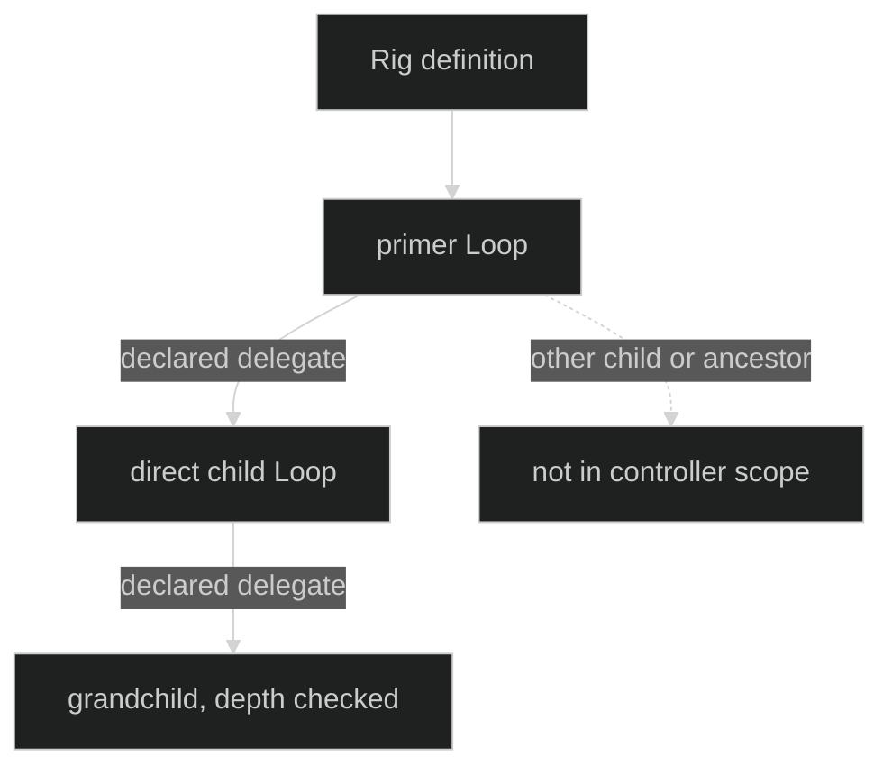

# Overview

Delegation is a capability of a declared Loop topology. A parent Loop can
start, message, interrupt, and inspect only the direct child Loops named by
its immutable definition. The Rig owns the topology and the session runtime
owns admission, delivery, restore, and shutdown.

The public boundary is deliberately small. Application code declares
`loop.WithDelegates` and, when needed, `loop.WithDelegation`, registers the
definitions with `rig.WithLoops`, and uses the Session and Loop contracts. The
runtime injects the parent-scoped `AgentTools` bundle. There is no public
generic hustle execution entry point and a tool never receives a
`SessionController`.

## Topology first

The Rig validates a directed graph from every configured primer. Delegate names
must name registered Loop definitions, and every registered definition must be
reachable from a primer. A Loop definition can be frozen before the Rig checks
its target names; Rig definition is the boundary that makes the complete graph
valid.

Proof: [Rig graph validation](https://github.com/looprig/harness/blob/main/pkg/rig/definition.go) and [topology tests](https://github.com/looprig/harness/blob/main/pkg/rig/rig_test.go).

## One parent-scoped controller

The injected bundle has `ListAgents`, `MessageAgent`, `StartAgent`, and
`StopAgent` operations. Each call reaches a `tool.DelegateController` scoped
to the parent Loop. The controller rechecks the operation, allowed target,
mode, runtime selection, ownership, interrupt barrier, and session health even
when a tool request was already schema-checked.

Proof: [delegate controller construction and scope](https://github.com/looprig/harness/blob/main/internal/sessionruntime/delegation.go) and [tool contract tests](https://github.com/looprig/harness/blob/main/pkg/tool/definition_test.go).

## Durable lifecycle

Starting a child crosses a durable admission barrier before child events or
gates can escape. Messages report delivery separately from the child's response
status. A caller context can retract work before actor acceptance; after
acceptance the session owns the request. Durable intent, delivery phases,
turn terminals, and cancellations let restore decide whether to resolve,
reconcile, or classify work as interrupted.

Proof: [delegation admission and delivery](https://github.com/looprig/harness/blob/main/internal/sessionruntime/delegation.go) and [restore tests](https://github.com/looprig/harness/blob/main/internal/sessionruntime/message_agent_restore_test.go).

## Choose a page

- [Declare delegates](declare-delegates.md) freezes names, styles, and Rig reachability.
- [Start and message delegates](start-and-message.md) documents the exact tool operations and result fields.
- [Delivery and cancellation](delivery-and-cancellation.md) explains acceptance, response observation, and cancellation ownership.
- [Limits and authority](limits-and-authority.md) covers depth, quota, runtime selection, and parent authority.
- [Restore delegated work](restore.md) describes durable reconstruction and shutdown-safe handback.

Proof: [public delegation definitions](https://github.com/looprig/harness/blob/main/pkg/loop/definition.go) and [session contracts](https://github.com/looprig/harness/blob/main/pkg/session/session.go).

## Source and proof

- [Loop delegation types and options](https://github.com/looprig/harness/blob/main/pkg/loop/deps.go)
- [Rig topology and limits](https://github.com/looprig/harness/blob/main/pkg/rig/definition.go)
- [Delegate tool surface](https://github.com/looprig/harness/blob/main/pkg/tool/definition.go)
- [Delegation runtime](https://github.com/looprig/harness/blob/main/internal/sessionruntime/delegation.go)
