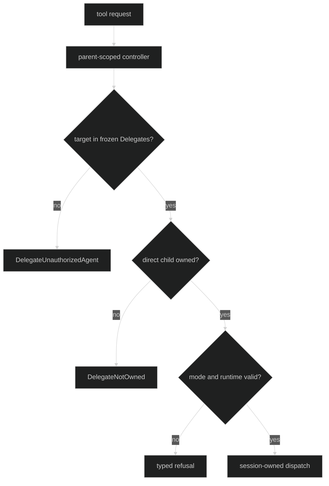

# Limits and authority

Delegation has separate safety caps for nesting and lifetime fan-out. The
controller also enforces parent authority on every operation. These limits are
session-scoped and do not turn a child into a session-wide worker pool.

## Depth and quota

```go
// Zero uses the runtime defaults. Positive values override them.
runtime, err := rig.Define(
	rig.WithLoops(parent, child),
	rig.WithPrimers(parent.Name()),
	rig.WithSessionStore(store),
	rig.WithDelegationLimits(rig.DelegationLimits{Depth: 2, Quota: 8}),
)
```

| API or field | Contract |
| --- | --- |
| `rig.DelegationLimits.Depth` | Maximum spawn-chain nesting. A spawn whose parent chain is already at the cap is refused. |
| `rig.DelegationLimits.Quota` | Maximum total sub-Loops spawned by one session lifetime. The primary Loop is not counted. |
| `rig.WithDelegationLimits` | Rejects negative values with `DefinitionInvalidDelegationLimits`; zero adopts defaults. |
| Default depth | `3`, allowing a primary plus two sub-Loop levels. |
| Default quota | `64` sub-Loops over the session lifetime. |

Quota is reserved transactionally. Invalid target or mode checks happen before
quota consumption, and a failed admission rolls its reservation back. Restore
counts durable non-root `LoopStarted` records so a restart cannot mint a fresh
quota.

Proof: [Rig delegation limits](https://github.com/looprig/harness/blob/main/pkg/rig/options.go), [runtime defaults](https://github.com/looprig/harness/blob/main/internal/sessionruntime/limits.go), and [spawn tests](https://github.com/looprig/harness/blob/main/internal/sessionruntime/delegation_test.go).

## Concurrency and turn ownership

There is no public delegation concurrency field. Depth and quota bound the
tree; each child Loop owns its actor and its turn queue. Native messages may
fold into a busy child turn, while foreign delivery uses no-fold admission.
`QueuedMessages` in `DelegateAgent` reports a bounded snapshot, not a promise
of parallel execution. `DelegateStatus` returns direct children sorted by UUID
and caps the list at 256, setting `Truncated` when more exist.

The separate Hustle blocking/background lanes are not delegation lanes. A
compaction or classifier Hustle consumes `rig.HustleLimits`; a child Loop
consumes delegation depth/quota and its own turn machinery.

Proof: [delegate status and ownership](https://github.com/looprig/harness/blob/main/internal/sessionruntime/delegation.go) and [loop queue tests](https://github.com/looprig/harness/blob/main/internal/loopruntime/nonfold_test.go).

## Parent-scoped authority

The controller is constructed with the parent's frozen `Delegates()` set and
`Delegation().Style`. It checks the target name against that set, validates a
declared target mode, and checks that the child ID is a direct child whose
parent Loop ID matches the controller. Siblings, ancestors, unrelated IDs, and
tombstoned children are refused. Status can inspect a closed direct child;
start, send, and interrupt cannot act on one.

Runtime selection is also parent-scoped. A supplied `tool.DelegateRuntime` is
re-resolved against the parent catalog and must match the declared target
entry. Missing catalog entries and invalid selections both render the bounded
model-facing text `runtime selection is unavailable`.



Proof: [scoped controller checks](https://github.com/looprig/harness/blob/main/internal/sessionruntime/delegation.go) and [authority tests](https://github.com/looprig/harness/blob/main/internal/sessionruntime/delegation_test.go).

## Refusal kinds

`DelegateError.Kind` is the typed refusal surface. Relevant values are
`DelegateActionUnavailable`, `DelegateUnknownAgent`,
`DelegateUnauthorizedAgent`, `DelegateUnknownMode`, `DelegateNotOwned`,
`DelegateSessionUnavailable`, `DelegateMissingDelegateID`,
`DelegateUnknownOperation`, `DelegateInterruptPending`,
`DelegateRuntimeUnavailable`, `DelegateRuntimeInvalid`, and `DelegateClosed`.
Inspect it with `errors.As`; do not parse the message.

Proof: [DelegateError definition and bounded messages](https://github.com/looprig/harness/blob/main/internal/sessionruntime/delegation.go) and [tool authority tests](https://github.com/looprig/harness/blob/main/internal/sessionruntime/delegation_test.go).

## Source and proof

- [Delegation limits option](https://github.com/looprig/harness/blob/main/pkg/rig/options.go)
- [Depth and quota defaults](https://github.com/looprig/harness/blob/main/internal/sessionruntime/limits.go)
- [Controller scope and errors](https://github.com/looprig/harness/blob/main/internal/sessionruntime/delegation.go)
- [Delegation runtime tests](https://github.com/looprig/harness/blob/main/internal/sessionruntime/delegation_test.go)
