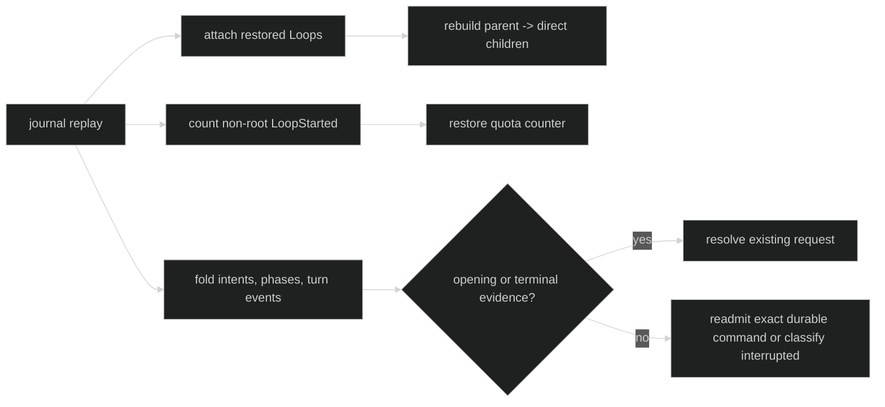

# Restore delegated work

Restore rebuilds delegation from durable Loop parent links, command intent,
delivery phases, and child turn events. It does not pretend that process-local
channels or in-memory response trackers survived a restart.

## What survives

| Durable evidence | Restore use |
| --- | --- |
| Parent coordinates on `LoopStarted` | Rebuild direct-child ownership. |
| Non-root `LoopStarted` count | Re-seed cumulative session spawn quota. |
| Native or foreign delegate intent and phase | Decide whether an admitted request needs reconciliation. |
| `TurnStarted` or `TurnFoldedInto` plus a turn terminal | Resolve a request that crossed the child actor boundary. |
| `DelegateDeliveryStateChanged` terminal | Suppress fallback and preserve unknown or untrackable delivery. |
| Cancellation or rejection evidence | Close a request that never opened a child turn. |

`InputQueued` is ephemeral and is not proof that a request crossed the actor
boundary. A queued request with no opening evidence is never blindly replayed as
if it had started.

Proof: [delegation restore reconstruction](https://github.com/looprig/harness/blob/main/internal/sessionruntime/delegation.go) and [restore tests](https://github.com/looprig/harness/blob/main/internal/sessionruntime/agent_restore_test.go).

## Direct-child ownership and quota

After restored Loops are attached, the manager rebuilds its direct-child index
from durable parent links. The same pass counts durable non-root
`LoopStarted` events to restore the lifetime quota. A restarted process gets
fresh live handles, but it does not get fresh authority or spawn budget.

Proof: [restore constructor and spawn count](https://github.com/looprig/harness/blob/main/internal/sessionruntime/restore.go) and [tombstone ownership tests](https://github.com/looprig/harness/blob/main/internal/sessionruntime/restore_tombstone_test.go).

## Background reconciliation

For a background request whose durable phased command has no opening or
terminal, restore subscribes before dispatch and sends the exact command back
through the child actor. The transient acceptance channel is process-local and
is not journaled. For a completed child response with no prior parent handback,
restore injects one machine `SubagentResult` into the direct parent and restores
wake ownership before dispatch. Existing handback commands are replayed
verbatim.

Processed completion envelopes prevent duplicates. A request with an already
terminal delivery state never receives fallback. Queued work that never
started is classified as interrupted rather than replayed.

Proof: [background planning and reconciliation](https://github.com/looprig/harness/blob/main/internal/sessionruntime/delegation.go), [foreign readmission tests](https://github.com/looprig/harness/blob/main/internal/sessionruntime/foreign_delivery_hook_test.go), and [message restore tests](https://github.com/looprig/harness/blob/main/internal/sessionruntime/message_agent_restore_test.go).

## Fail-closed contradictions

Restore returns a typed contradiction when one request has incompatible routes,
multiple turn openings, duplicate incompatible terminals, a terminal delivery
state without a reservation predecessor, or cancellation that conflicts with a
turn opening or terminal. Session or target Loop mismatches return the route
mismatch error. The runtime does not choose one contradictory history and
continue.

Proof: [contradiction checks](https://github.com/looprig/harness/blob/main/internal/sessionruntime/delegation.go) and [restore contradiction tests](https://github.com/looprig/harness/blob/main/internal/sessionruntime/delegation_test.go).

## Source and proof

- [Delegation restore manager](https://github.com/looprig/harness/blob/main/internal/sessionruntime/delegation.go)
- [Restore constructor](https://github.com/looprig/harness/blob/main/internal/sessionruntime/restore.go)
- [Agent restore proof](https://github.com/looprig/harness/blob/main/internal/sessionruntime/agent_restore_test.go)
- [Foreign delivery proof](https://github.com/looprig/harness/blob/main/internal/sessionruntime/foreign_delivery_hook_test.go)
