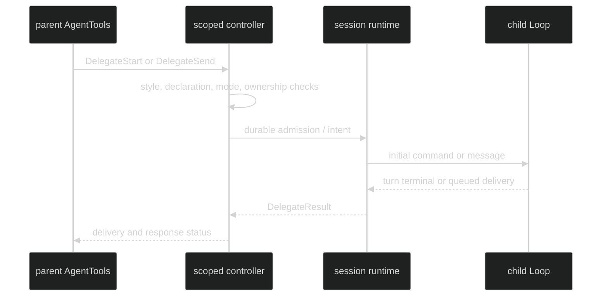

# Start and message delegates

The runtime exposes delegation through one parent-scoped
`tool.DelegateController`. The built internal `AgentTools` bundle is injected
when a Loop has at least one declared delegate. Application code does not add
that bundle by hand and the tool receives no session-wide controller.

```go
// This controller is supplied to the runtime-built AgentTools bundle.
// A normal application invokes Session operations, not this internal binding.
result, err := delegateController.Execute(ctx, tool.DelegateRequest{
	Operation:       tool.DelegateStart,
	AgentType:       "worker",
	Name:            "indexer-1",
	Message:         "Index the files named in the parent request.",
	WaitForResponse: true,
})
if err != nil {
	return fmt.Errorf("start delegate: %w", err)
}
fmt.Println(result.AgentID, result.DeliveryStatus, result.ResponseStatus)
```

## Operations and exact fields

| Operation | Required request fields | Optional request fields | Result focus |
| --- | --- | --- | --- |
| `DelegateStart` | `AgentType`, `Message` | `Name`, `AgentMode`, `WaitForResponse`, `TimeoutSeconds`, `ParentToolUseID`, `Runtime` | New `AgentID`, state, delivery, and optional response. |
| `DelegateSend` | `AgentID`, `Message` | `WaitForResponse`, `TimeoutSeconds`, `ParentToolUseID` | Existing child delivery and optional response. |
| `DelegateInterrupt` | `AgentID` | None | `PreviousState` and `State: AgentStateIdle`. |
| `DelegateStatus` | None, or `AgentID` for one child | None | One child or sorted direct-child snapshots; `Truncated` bounds a list. |

The request type is:

```go
// package tool
type DelegateRequest struct {
	Operation       tool.DelegateOperation
	AgentID         uuid.UUID
	AgentType       string
	Name            string
	AgentMode       string
	Message         string
	WaitForResponse bool
	TimeoutSeconds  *int
	ParentToolUseID string
	Runtime         *tool.DelegateRuntime
}
```

`DelegateResult` contains `AgentID`, `Name`, `State`,
`DeliveryStatus`, `Response`, `ResponseStatus`, `PreviousState`, `Agents`, and
`Truncated`. `CorrelationID` exists for session orchestration and is not
model-facing.

Proof: [public delegate request and result contracts](https://github.com/looprig/harness/blob/main/pkg/tool/definition.go) and [exact field tests](https://github.com/looprig/harness/blob/main/pkg/tool/definition_test.go).

## Tool bundle and modes

The injected bundle is named `AgentTools` and contains exactly
`ListAgents`, `MessageAgent`, `StartAgent`, and `StopAgent`. `StartAgent`
requires `agent_type` and `instructions`; `MessageAgent` requires
`agent_id` and `message`; `ListAgents` can filter by `agent_id`; `StopAgent`
requires `agent_id`. When a runtime catalog is configured, start also exposes
the catalog's harness, source, model, effort, and mode selectors.

`DelegationSyncOnly` forces `wait_for_response` to true and refuses send,
interrupt, status, or a non-waiting start with the typed
`DelegateActionUnavailable` error. Managed style admits all four operations.

Proof: [internal AgentTools schemas](https://github.com/looprig/harness/blob/main/internal/delegationtool/definition.go) and [controller style checks](https://github.com/looprig/harness/blob/main/internal/sessionruntime/delegation.go).

## Start and message flow

Start is transactional: the child handle, backend, initial command, and first
`LoopStarted` record are admitted before child events or gates can cross the
barrier. Message subscribes before enqueue, so `TurnStarted` and
`TurnFoldedInto` cannot race past the response observer.



Proof: [start and send implementation](https://github.com/looprig/harness/blob/main/internal/sessionruntime/delegation.go) and [message delivery tests](https://github.com/looprig/harness/blob/main/internal/sessionruntime/message_agent_native_test.go).

## Delegation failures

An AgentTools preparation failure is rejected before any child starts, and the runner turns it into an error-marked tool result. An AgentTools execution failure happens after preparation, either because the delegate controller refused the operation before any child existed or because a started child reached a failure terminal, and the tool itself returns the error-marked result. Either way a failed AgentTools call reaches model history as an error-marked tool result, a `content.ToolResultMessage` whose `IsError` field is set.

An invalid runtime selector fails preparation with an error that names the rejected field and its value. An unavailable runtime selector fails preparation with an error that names the rejected selector and the value that matched no configured runtime.

A child failure cause survives foreground and background delegation, native and foreign child loops, and session restore, so every reader preserves the same cause. An ACP child is a foreign loop, so it takes the foreign path rather than a separate ACP route. Background delegation is the other shape to know: its hand-back arrives as a user-role message carrying the same cause, so it is not an error-marked tool result and carries no `IsError` field. A tombstoned child is the single documented gap: restore reports it as failed with no cause text.

Each failure detail is bounded and normalized to valid UTF-8 before it is stored. A preparation diagnostic is capped at 1 KiB and its detail at 512 bytes, while a child failure cause and an agent result are each capped at 256 KiB. The detail is preserved regardless of credential or model-facing classification, so no classifier filters it before the model sees it.

## Source and proof

- [DelegateController and data types](https://github.com/looprig/harness/blob/main/pkg/tool/definition.go)
- [Runtime metadata](https://github.com/looprig/harness/blob/main/pkg/tool/delegate_artifact.go)
- [AgentTools bundle](https://github.com/looprig/harness/blob/main/internal/delegationtool/definition.go)
- [Delegation runtime](https://github.com/looprig/harness/blob/main/internal/sessionruntime/delegation.go)
