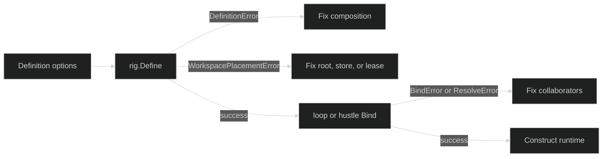

# Configuration errors

Configuration errors are raised while immutable definitions, bindings, or
composition roots are checked. They do not represent a partially running
session. Extract the typed value, fix the named field or kind, and call the
constructor again.

## Rig and loop definitions {#rig-and-loop}

`rig.DefinitionError` has `Kind`, `Name`, and an optional wrapped `Cause`.
Its exact kinds cover the composition graph:

| Group | `DefinitionErrorKind` values |
| --- | --- |
| Definition shape | `nil_option`, `missing_loop`, `invalid_loop`, `duplicate_loop`, `missing_primer`, `invalid_primer`, `invalid_active_primer`, `missing_session_store`, `invalid_session_store`, `duplicate_option` |
| Runtime collaborators | `invalid_delegation_limits`, `invalid_foreign_builders`, `invalid_gate_caps`, `invalid_restore_decider`, `invalid_runtime_restore_resolver`, `invalid_restore_failure_policy`, `invalid_hooks`, `missing_resource_storage`, `invalid_resource_storage` |
| Tool-result capture | `invalid_tool_result_capture` (`Name` is the field label `objects` or `spill_base`, never the value), `tool_result_spill_overlaps_workspace`, `tool_result_reader_without_objects` |
| Hustle and compaction | `invalid_hustle`, `duplicate_hustle`, `missing_hustle_limits`, `unused_hustle_limits`, `invalid_hustle_limits`, `missing_compaction_hustle`, `incompatible_compaction_hustle` |
| Permission review | `invalid_permission_classifiers`, `invalid_permission_review_policy`, `incomplete_permission_review`, `unused_permission_review_limits`, `invalid_permission_review_evidence`, `missing_permission_review_evidence`, `unused_permission_review_evidence`, `invalid_permission_review_security_ceiling`, `missing_permission_review_security_ceiling`, `unused_permission_review_security_ceiling`, `invalid_permission_review_observations`, `unused_permission_review_observations` |

`loop.DefinitionError` has `Kind`, `Field`, `Value`, and `Cause`. Its exact
definition kinds include `missing_name`, `invalid_client`, `invalid_model`,
`nil_option`, `duplicate_option`, `invalid_tool`, `invalid_tool_limits`,
`invalid_drain_timeout`, `invalid_middleware`, `invalid_access_gate`,
`invalid_engine`, `invalid_runtime_context`, `invalid_delegate`,
`invalid_delegation`, `invalid_mode`, `duplicate_mode`,
`missing_initial_mode`, `invalid_initial_mode`, `missing_policy_revision`,
`invalid_policy_revision`, `missing_context_counter`,
`invalid_context_counter`, `missing_inference_capability`,
`invalid_inference_capability`, `incompatible_context_counter`,
`missing_context_policy`, `conflicting_context_policy`,
`invalid_context_observation`, `invalid_compaction`, `invalid_mode_binding`,
`invalid_output_schema`, `reserved_tool_name`,
`duplicate_context_transport`, and `invalid_context_transport`.

`loop.BindError` is the next boundary. Its kinds are
`invalid_definition`, `invalid_context`, `duplicate_definition_name`,
`duplicate_tool_name`, `invalid_tool_info`, `invalid_access_gate`,
`invalid_runtime`, `invalid_session_id`, and `invalid_loop_id`.

## Hustles, gates, and hooks {#hustles-gates-and-hooks}

`hustle.DefinitionError` uses `Kind`, `Field`, and `Cause`. Its exact kinds are
`missing_name`, `reserved_name`, `nil_option`, `duplicate_option`,
`invalid_participation`, `invalid_model_source`, `missing_model_source`,
`invalid_client`, `invalid_model`, `invalid_timeout`, `invalid_limits`,
`invalid_system_prompt`, `invalid_prompt_revision`,
`missing_policy_revision`, `invalid_policy_revision`,
`invalid_output_schema`, `invalid_evidence_tools`, and
`invalid_retry_policy`. Binding and resolution use `hustle.BindError` kinds
`invalid_definition`, `invalid_context`, `missing_model_resolver`, and
`invalid_evidence_tools`, followed by `hustle.ResolveError` kinds
`invalid_context`, `invalid_loop_id`, `model_failed`, and `invalid_binding`.

Gate construction has two distinct typed families. `gate.GateValidationError`
uses `restorable_not_allowed` and `origin_invalid`. Runtime evaluation uses
`gate.EvaluationError` kinds `rule_match_failed`, `denied`, `action_invalid`,
`approver_missing`, `approval_required`, `approval_failed`, `writer_missing`,
`write_failed`, `issuer_missing`, `grant_version_unsupported`, and
`grant_failed`. Payload decoding additionally has typed unknown, nil, encode,
decode, and request-decode errors.

`hook.ConfigError` distinguishes `unknown_operation`,
`operation_not_guardable`, `nil_guard`, `nil_around`, `missing_policy_revision`,
`unexpected_policy_revision`, `invalid_policy_revision`, and
`invalid_denial`. An intentional guard refusal is `*hook.Denial`, not a
configuration error; classify it with `hook.AsDenial`.

## Bindings and tools {#bindings-and-tools}

Tool definition and preparation errors are also configuration boundaries:

| Type | Exact classifications or fields |
| --- | --- |
| `tool.InvalidDefinitionError` | `Field` identifies the invalid definition field. |
| `tool.InvalidBindingsError` | `Field` plus wrapped `Cause`. |
| `tool.MissingBindingError` | Missing `Requirement`. |
| `tool.RequestValidationError` | `invalid_field`, `duplicate_requirement`, `duplicate_candidate`, `duplicate_grant_pair`, `invalid_command_grant`, `missing_grant_binding`; `Field` identifies the location. |
| `tool.ProcessLifecycleValidationError` | Invalid process lifecycle declaration. |
| `hustleruntime.ConfigError` | `invalid_context`, `invalid_concurrent`, `invalid_queued`, `capacity_overflow`, `invalid_session_id`, `invalid_definitions`, `invalid_timeout`, `missing_collaborator`; `Field` identifies the scheduler field. |
| `hustleruntime.ConfigEvidenceKindError` | A registered evidence requirement kind is absent from the runtime allowlist. |

Rig workspace placement has its own typed boundary. `WorkspacePlacementError`
kinds are `multiple_placements`, `nil_store`, `nil_leaser`, `empty_root`,
`canonicalize_failed`, `lease_name_invalid`, and
`workspace_tool_without_placement`. `PersistenceOverlapError` reports the
canonical persistence path and workspace root. Per-call `NewSession` options
use `SessionOptionError` kinds `nil_option`, `duplicate_seed`, `empty_seed`,
`duplicate_session_id`, and `zero_session_id`.

## Recovery boundary {#recovery-boundary}

These errors occur before durable session construction succeeds. Do not call
`RestoreSession` for an invalid immutable definition and do not create a
replacement merely because a `Define` or `Bind` call failed. Correct the
configuration, then rebuild the Rig or binding.

```go
configured, err := definition.Bind(ctx, bindContext)
if err != nil {
	var bindErr *loop.BindError
	if errors.As(err, &bindErr) {
		log.Printf("loop bind kind=%s name=%s", bindErr.Kind, bindErr.Name)
	}
	return err
}
_ = configured
```

For a workspace placement failure, inspect `WorkspacePlacementError.Kind` and
its optional cause. A canonicalization failure can wrap an OS error; the
placement error remains the stable branch. A persistence overlap is a direct
topology violation and does not wrap a cause.



## Source and runnable proof {#source-and-runnable-proof}

Rig definition and lifecycle types are in
[`pkg/rig/errors.go`](https://github.com/looprig/harness/blob/main/pkg/rig/errors.go),
[`pkg/rig/workspace_errors.go`](https://github.com/looprig/harness/blob/main/pkg/rig/workspace_errors.go),
and [`pkg/rig/session_options.go`](https://github.com/looprig/harness/blob/main/pkg/rig/session_options.go).
Loop and hustle definitions are in
[`pkg/loop/definition_errors.go`](https://github.com/looprig/harness/blob/main/pkg/loop/definition_errors.go)
and [`pkg/hustle/definition_errors.go`](https://github.com/looprig/harness/blob/main/pkg/hustle/definition_errors.go).
Gate, hook, and tool boundaries are defined in
[`pkg/gate/validate.go`](https://github.com/looprig/harness/blob/main/pkg/gate/validate.go),
[`pkg/gate/evaluator.go`](https://github.com/looprig/harness/blob/main/pkg/gate/evaluator.go),
[`pkg/hook/errors.go`](https://github.com/looprig/harness/blob/main/pkg/hook/errors.go),
[`pkg/tool/definition.go`](https://github.com/looprig/harness/blob/main/pkg/tool/definition.go),
and [`pkg/tool/preparation.go`](https://github.com/looprig/harness/blob/main/pkg/tool/preparation.go).
The configuration and workspace error chains are exercised in
[`pkg/rig/rig_test.go`](https://github.com/looprig/harness/blob/main/pkg/rig/rig_test.go),
[`pkg/rig/workspace_test.go`](https://github.com/looprig/harness/blob/main/pkg/rig/workspace_test.go),
[`pkg/loop/definition_test.go`](https://github.com/looprig/harness/blob/main/pkg/loop/definition_test.go),
and [`pkg/tool/definition_test.go`](https://github.com/looprig/harness/blob/main/pkg/tool/definition_test.go).
