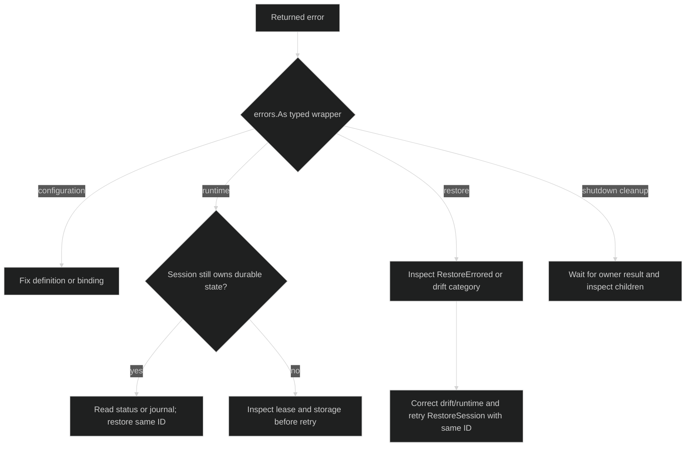

# Overview

Harness errors preserve enough typed information to distinguish invalid
configuration, a live runtime failure, and a lifecycle or restore failure.
Recovery starts by inspecting the chain, then deciding whether the durable
journal contains progress that should be restored rather than recreated.

## Classify errors by boundary {#classify-errors}

Use the package that owns the failed boundary. The public packages expose
stable type and kind fields; internal runtime packages add ownership and
cleanup context without putting provider payloads in error text.

| Boundary | Primary types | First action |
| --- | --- | --- |
| Rig definition and session setup | `rig.DefinitionError`, `rig.LifecycleError`, `rig.SessionOptionError`, `rig.WorkspacePlacementError` | Fix composition inputs; do not retry unchanged configuration. |
| Loop definition or bind | `loop.DefinitionError`, `loop.BindError`, `loop.ConfigError`, `loop.CommitError` | Inspect `Kind`, `Field`, or `Reason`; rebuild the immutable definition. |
| Hustle definition or model binding | `hustle.DefinitionError`, `hustle.BindError`, `hustle.ResolveError`, `hustle.RevisionError` | Correct the declared model, limits, policy, or evidence contract. |
| Gate evaluation and response | `gate.GateValidationError`, `gate.EvaluationError`, payload/form errors, `session.GateError` | Treat semantic rejection differently from capacity or append failure. |
| Hook and tool boundaries | `hook.ConfigError`, `hook.CallError`, `hook.GuardError`, tool validation errors | Fix declaration or request shape; preserve intentional `hook.Denial`. |
| Live session and turns | `session.SessionError`, `session.TurnRejectedError`, `session.InputRejectedError` | Determine whether the session is closing, faulted, or temporarily full. |
| Journal and storage | `journal.AppendError`, `journal.AmbiguousAckError`, `sessionstore.Replay*Error` | Stop writes on ambiguous acknowledgement and inspect durable state. |
| Restore | `session.RestoreError`, `RestoreRejectedError`, `RestoreRuntimeMismatchError`, discovery errors | Keep the original session ID and correct drift or runtime availability. |
| Owned hustle execution | `hustleruntime.RunError`, `QueueFailureError`, `FinalizerError`, `CloseError` | Handle the primary run failure and separately inspect cleanup children. |

## Inspect the error chain {#error-chain}

Harness uses both single-error and multi-error unwrapping. Public wrappers such
as `session.SessionError`, `session.RestoreError`, `rig.LifecycleError`, and
`journal.AppendError` implement `Unwrap() error`. Owned runtime failures such as
`hustleruntime.RunError`, `QueueFailureError`, and `CloseError` implement
`Unwrap() []error` so `errors.As` and `errors.Is` can see the primary cause and
cleanup failures.

```go
var restoreErr *session.RestoreError
if errors.As(err, &restoreErr) {
	log.Printf("restore stage=%s", restoreErr.Kind)
}

var mismatch *session.RestoreRuntimeMismatchError
if errors.As(err, &mismatch) {
	// Choose a configured runtime or report the category to the operator.
	log.Printf("restore runtime category=%s", mismatch.Kind)
}

if errors.Is(err, context.DeadlineExceeded) {
	// A wrapped deadline is still machine-detectable.
}
```

Do not branch on `Error()` strings. Error text intentionally omits credentials,
model responses, raw tool arguments, and other provider-controlled values.

## Durable progress changes recovery {#durable-progress}

A returned error does not imply that no state was written. Session construction
and restore use leases and journal lifecycle events. A restore that has opened
the journal and appended `RestoreStarted` records `RestoreErrored` on later
failure, releases its lease, and leaves the original stream available for a
later retry. A failed setup before `RestoreStarted` has no restore error event,
but it still releases the acquired lease.

Live runtime failures can also be durable. A session may enter the
`SessionFaulted` state after a persistence or workspace-integrity failure, and
shutdown still owns cleanup and lease release. A persistence fault is permanent
for that process: observe it with the optional
`session.PersistenceFaultReporter` capability, and to keep the session
restorable release it with `session.ResidencyAbandoner` rather than `Shutdown`,
which would append `SessionStopped` and end it. See
[session shutdown](/docs/guides/harness/session-runtime/shutdown). Treat the
session ID and journal as the source of truth before deciding to create a
replacement session.



## Choose a recovery action {#choose-recovery}

Use this order when handling a failure:

1. Extract the outer typed kind with `errors.As`.
2. Follow `Unwrap` to distinguish the primary cause from cleanup or caller
   cancellation.
3. Read the session status or journal when a session ID exists.
4. Retry only after correcting a transient condition such as capacity,
   availability, or a released lease.
5. Preserve the original ID for restore. Create a new session only when the
   application intentionally discards the durable history.

The focused pages cover the details:
[`configuration`](./configuration.md), [`runtime`](./runtime.md),
[`restore`](./restore.md), and [`shutdown`](./shutdown.md).

## Source and runnable proof {#source-and-runnable-proof}

The public error types are defined in
[`pkg/session/errors.go`](https://github.com/looprig/harness/blob/main/pkg/session/errors.go),
[`pkg/rig/errors.go`](https://github.com/looprig/harness/blob/main/pkg/rig/errors.go),
[`pkg/loop/errors.go`](https://github.com/looprig/harness/blob/main/pkg/loop/errors.go),
[`pkg/hustle/definition_errors.go`](https://github.com/looprig/harness/blob/main/pkg/hustle/definition_errors.go),
[`pkg/gate/validate.go`](https://github.com/looprig/harness/blob/main/pkg/gate/validate.go),
[`pkg/hook/errors.go`](https://github.com/looprig/harness/blob/main/pkg/hook/errors.go),
[`pkg/journal/errors.go`](https://github.com/looprig/harness/blob/main/pkg/journal/errors.go),
and [`pkg/sessionstore/replay.go`](https://github.com/looprig/harness/blob/main/pkg/sessionstore/replay.go).
Owned-run and cleanup chains are in
[`internal/hustleruntime/errors.go`](https://github.com/looprig/harness/blob/main/internal/hustleruntime/errors.go).
Representative chain assertions are in
[`pkg/session/errors_test.go`](https://github.com/looprig/harness/blob/main/pkg/session/errors_test.go),
[`internal/hustleruntime/cleanup_test.go`](https://github.com/looprig/harness/blob/main/internal/hustleruntime/cleanup_test.go),
and [`internal/sessionruntime/session_hub_test.go`](https://github.com/looprig/harness/blob/main/internal/sessionruntime/session_hub_test.go).
