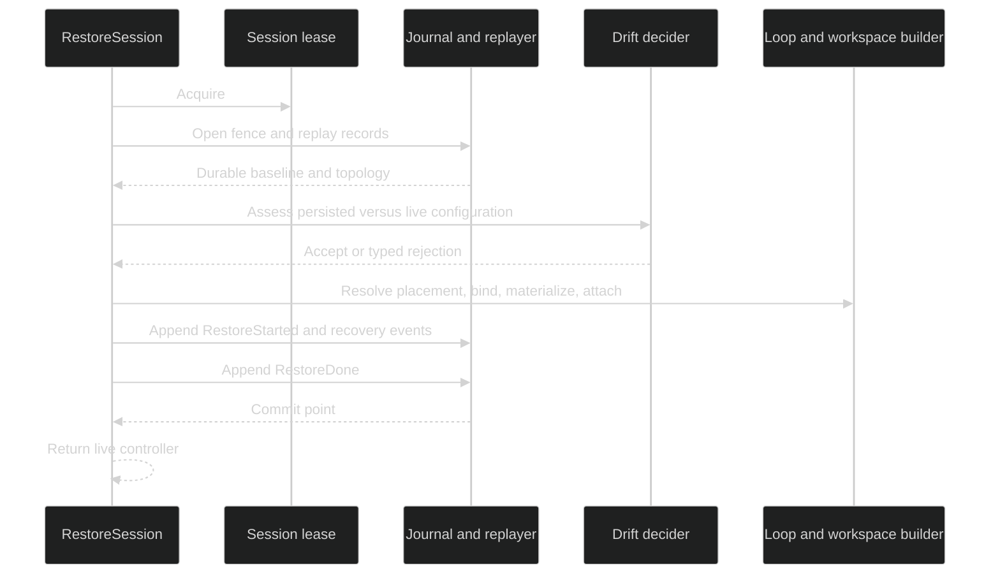
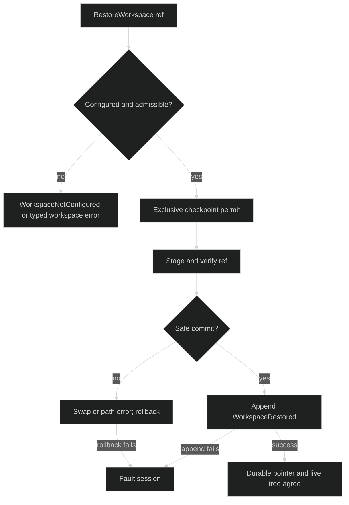

# Restore errors

`Rig.RestoreSession(ctx, id)` reconstructs the original session from its
durable ledger. Restore is fail-closed: it does not return a live controller
until the replay, drift decision, loop binding, workspace materialization, and
`RestoreDone` append have all succeeded.

## Restore order {#restore-order}

The restore constructor uses one writer lease and an ordered journal boundary:

| Stage | Work | Failure family |
| --- | --- | --- |
| 1 | Acquire the session lease, open the journal with its opening `LeaseFence`, and open the internal record replayer. A fence that loses a handover race is retried under a fresh lease at a higher epoch. | `RestoreLeaseFailed` (including a failed re-claim), `RestoreJournalFailed`, or `RestoreReplayFailed`; the lease is released. |
| 2 | Replay the full record stream and discover the persisted session, root loop, open turns, workspace pointer, and gate state. | `RestoreReplayFailed`, `RestoreDiscoveryError`, or a wrapped fold error. |
| 3 | Compare the persisted baseline with the live fingerprint or configuration manifest and ask the restore decider. | `ConfigMismatchError`, `RestoreRejectedError`, or `RestoreRuntimeMismatchError`. |
| 4 | Resolve workspace placement and bind every declared durable loop. | `RestoreLeaseFailed` for placement contention, `RestoreLoopFailed`, or `RestoreForeignBuilderMissing`. |
| 5 | Append `RestoreStarted`, durable adoption when required, crash-seam `TurnInterrupted` events, and any recovery closures. A turn the active primer can resume at an open gate is not interrupted. | `RestoreAppendFailed` or `RestoreAdoptionInvalid`. |
| 6 | Materialize the workspace, build and attach loops, activate session resources, and validate the active loop. | `RestoreMaterializeFailed` or `RestoreLoopFailed`. |
| 7 | Append `RestoreDone`. Then resume a parked turn, if any, and replay Host-admitted inputs recorded `applied` whose effect never reached the journal. Only then is the restored controller returned and its lease retained. | `RestoreAppendFailed`, or `RestoreLoopFailed` if the parked turn cannot start. |



## Drift and runtime mismatches {#drift-and-runtime}

The public session package exposes these exact restore classifications:

| Type or kind | Fields or values | Interpretation |
| --- | --- | --- |
| `session.ConfigMismatchError` | `Persisted`, `Live` `event.ConfigFingerprint` | Legacy fingerprint path; the error names changed categories such as topology, model, prompt, workspace, adapter, and policy. |
| `session.RestoreRejectedError` | `Assessment`, `Source`, optional `Cause` | Manifest drift was rejected by the configured decider. A decider failure or timeout wraps its cause; a policy rejection has no cause. |
| `session.AgentNameMismatchError` | `Persisted`, `Configured` agent names | Legacy name mismatch that can be overridden by the configured mismatch option. |
| `session.RestoreRuntimeMismatchError` | `Kind`, optional `Cause` | Adapter restore cannot safely resume the runtime. |
| `session.RestoreDiscoveryError` | `Kind`, `SessionID` | `no_session_started` or `no_primer_loop` in the durable stream. |

Runtime mismatch kinds are exactly `missing_runtime`, `runtime_unavailable`,
`target_mismatch`, `credential_mismatch`, and `effort_mismatch`. The public
error text contains only the category. Provider selectors, credentials, and
model-specific details remain in the wrapped cause for trusted diagnostics.

A per-session workspace placement (`WithSessionWorkspaces`) whose base
directory is at a different path on the restoring host is not drift: the two
placements compare by mode alone and no `ConfigurationAdopted` is recorded. A
changed placement mode, a different exclusive or shared root, or an added or
removed placement is still workspace drift. If the new base already holds a
tree that does not match the checkpoint, restore fails with
`RestoreMaterializeFailed` wrapping `*workspacestore.DestNotEmptyError` and does
not clear the directory.

The general `session.RestoreError` wrapper has these exact `Kind` values:
`lease_failed`, `journal_failed`, `replay_failed`, `append_failed`,
`adoption_invalid`, `loop_failed`, `context_done`, `id_generation_failed`,
`foreign_sid_missing`, `foreign_builder_missing`, and `materialize_failed`.
It unwraps the cause, so callers can classify both the stage and the underlying
storage, context, or builder error.

## Durable failure record {#durable-failure-record}

Once the journal and replayer are available, every failed restore exits through
a bounded cleanup owner. It best-effort appends `event.RestoreErrored`, releases
any resolved workspace root lease, releases the session writer lease, and
returns the original typed error. A failure to append the failure record does
not replace the original cause. No failed path appends `RestoreDone`, and no
live session is returned.

There is one setup distinction. If lease acquisition, journal opening, the
opening fence, or replayer opening fails before the restore lifecycle can be
recorded, the constructor releases the lease and returns its typed setup error
without pretending that a restore mutation was committed. After the journal
and replayer are ready, replay, drift, binding, crash closure, materialization,
and final-append failures use the `RestoreErrored` path.

An accepted restore that later fails while the live session is being built uses
the same failure record and calls the session construction-abort cleanup. The
session context, loops, resources, root lease, and writer lease are not left
running behind a `nil` controller.

## Retry and recovery {#retry-recovery}

Retry with the same session UUID after correcting the cause:

```go
restored, err := rig.RestoreSession(ctx, sessionID)
if err != nil {
	var rejected *session.RestoreRejectedError
	var runtimeMismatch *session.RestoreRuntimeMismatchError
	var restoreErr *session.RestoreError
	if errors.As(err, &rejected) {
		log.Printf("restore drift changes=%d", len(rejected.Assessment.Changes))
	}
	if errors.As(err, &runtimeMismatch) {
		log.Printf("restore runtime category=%s", runtimeMismatch.Kind)
	}
	if errors.As(err, &restoreErr) {
		log.Printf("restore stage=%s", restoreErr.Kind)
	}
	return err
}
defer restored.Shutdown(context.Background())
```

For a drift rejection, change the live definition or configure the intended
restore decision, then retry the original ID. For a missing or unavailable
foreign runtime, register the matching restored builder before retrying. For a
replay or append failure, inspect the ledger and lease state first. A failed
restore releases the lease so a corrected attempt can acquire it immediately.

## Workspace rewind {#workspace-rewind}

`SessionController.RestoreWorkspace(ctx, ref)` is a separate idle control-plane
operation. It acquires an exclusive checkpoint permit, stages and verifies the
target reference, commits a safe root swap or fixed-root replacement, and only
then publishes `event.WorkspaceRestored`.

Its internal `WorkspaceRestoreError` kinds are `context_done`, `faulted`,
`closing`, `permit_failed`, `lease_unhealthy`, `symlink_root`,
`symlink_component`, `path_escape`, `swap_failed`, `rollback_failed`, and
`append_failed`. If rollback itself fails, the session faults because the live
tree may differ from the durable pointer. If the filesystem commit succeeds
but `WorkspaceRestored` cannot be appended, the session also faults rather than
claiming that the durable pointer advanced.



## Source and runnable proof {#source-and-runnable-proof}

Restore error types and drift fields are defined in
[`pkg/session/errors.go`](https://github.com/looprig/harness/blob/main/pkg/session/errors.go).
The ordered constructor and durable failure cleanup are in
[`internal/sessionruntime/restore_constructor.go`](https://github.com/looprig/harness/blob/main/internal/sessionruntime/restore_constructor.go)
and [`internal/sessionruntime/lifecycle.go`](https://github.com/looprig/harness/blob/main/internal/sessionruntime/lifecycle.go).
Workspace rewind is implemented in
[`internal/sessionruntime/workspace_restore.go`](https://github.com/looprig/harness/blob/main/internal/sessionruntime/workspace_restore.go)
and exposed by [`pkg/session/session.go`](https://github.com/looprig/harness/blob/main/pkg/session/session.go).
Restore, drift, runtime, workspace, and cleanup behavior are covered by
[`internal/sessionruntime/restore_constructor_test.go`](https://github.com/looprig/harness/blob/main/internal/sessionruntime/restore_constructor_test.go),
[`internal/sessionruntime/restore_roundtrip_test.go`](https://github.com/looprig/harness/blob/main/internal/sessionruntime/restore_roundtrip_test.go),
[`internal/sessionruntime/restore_adoption_test.go`](https://github.com/looprig/harness/blob/main/internal/sessionruntime/restore_adoption_test.go),
[`internal/sessionruntime/restore_runtime_test.go`](https://github.com/looprig/harness/blob/main/internal/sessionruntime/restore_runtime_test.go),
and [`internal/sessionruntime/restore_workspace_test.go`](https://github.com/looprig/harness/blob/main/internal/sessionruntime/restore_workspace_test.go).
