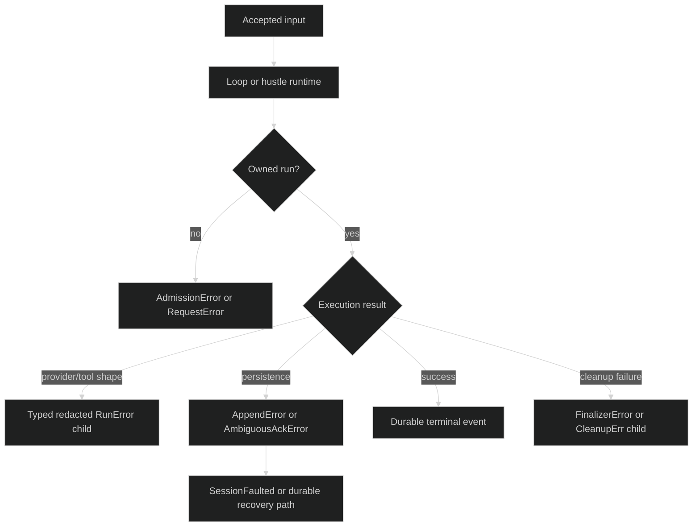

# Runtime errors

Runtime errors occur after definitions have passed their construction boundary.
The session, loop, journal, and owned-run types preserve the distinction
between admission, execution, persistence, and cleanup.

## Session and turn errors {#session-and-turn}

`session.SessionError` carries a `Kind` and optional `Cause`, and unwraps the
cause. The exact kinds are:

| Kind | Meaning |
| --- | --- |
| `id_generation_failed` | Session ID could not be minted. |
| `loop_id_generation_failed` | Loop ID could not be minted. |
| `loop_exited` | The target loop actor has exited. |
| `loop_not_found` | The requested loop is not present. |
| `event_channel_closed` | The event channel closed without a terminal event. |
| `context_done` | The session or caller context ended. |
| `session_closing` | Admission is closed during teardown. |
| `session_faulted` | A durable persistence or workspace-integrity fault is latched. |
| `loop_depth_exceeded` | A nested loop exceeded the configured depth. |
| `loop_quota_exceeded` | A loop spawn quota was exceeded. |
| `foreign_builder_missing` | A restored foreign engine has no builder. |
| `compaction_unsupported` | The selected loop does not support native compaction. |
| `delegate_intent_append_failed` | Required durable delegation intent append failed. |
| `delegate_admission_commit_failed` | Delegate admission commit failed after durable intent. |

`session.TurnRejectedError` carries `event.RejectReason`; the current reasons
include queue full, shutting down, and transient internal failure. A rejection
is not the same as an execution failure: the corresponding `TurnRejected`
event is the durable reply for the submit. `loop.InputRejectedError` is the
point-to-point admission error for a managed delegate input and also preserves
its reason and cause.

`loop.CommitError` carries `Reason` and `Cause`. Its current
`CommitCancelReason` value is `turn cancelled`. A committed step remains in the
loop state; an uncommitted step is discarded when the handshake is cancelled.

## Hustle and tool runs {#hustle-and-tool-runs}

Before a run owns capacity, `internal/hustleruntime` returns
`AdmissionError` or `RequestError`. Their exact reason sets are:

| Type | Reasons |
| --- | --- |
| `AdmissionError` | `invalid_context`, `invalid_participation`, `nil_finalizer`, `run_id`, `full`, `closed`, `poisoned` |
| `RequestError` | `invalid_context`, `runtime_unavailable`, `unknown_definition`, `invalid_cause`, `invalid_input`, `input_too_large`, `nil_validator` |
| `QueueFailureError` | `canceled`, `timeout`, `closed`, `poisoned` while waiting for a lane |

Once admitted, an owned run returns `*hustleruntime.RunError` with
`Name`, `RunID`, `Stage`, `ReasonCode`, `Cause`, `TerminalErr`,
`FinalizerErr`, and `CleanupErr`. It implements `Unwrap() []error`, so a
caller can inspect the primary execution cause and any finalizer or cleanup
failure without flattening them into one string. Queue failures expose the
same primary-versus-cleanup fields through `QueueFailureError`.

The runtime also uses redacted typed classifications for unsafe provider or
tool results: `OutputError`, `ToolResponseError`, and `EvidenceError` carry
closed reason values and do not retain provider content. Worker and callback
panics become `WorkerPanicError`, `EvidenceWorkerPanicError`, or
`CallbackPanicError`; a poisoned worker is `WorkerPoisonError` with an
inspectable cause.

Tool request validation uses `tool.RequestValidationError` with exact kinds
`invalid_field`, `duplicate_requirement`, `duplicate_candidate`,
`duplicate_grant_pair`, `invalid_command_grant`, and
`missing_grant_binding`. The `Field` identifies the checked request location;
the error does not carry raw tool arguments.

## Durable failure boundary {#durable-failure-boundary}

Journal failures must not be treated as an ordinary provider failure. The
journal types expose the fencing context:

| Type | Durable meaning |
| --- | --- |
| `journal.JournalNotReadyError` | The opening `LeaseFence` has not been acknowledged. |
| `journal.JournalLeaseLostError` | The session no longer owns its writer lease; it unwraps to `LeaseLostError`. |
| `journal.AppendError` | Persistence definitely failed; `Subject`, `MsgID`, and `Expected` identify the attempted append. |
| `journal.AmbiguousAckError` | The backend outcome is unresolved after bounded verification. The fence remains unadvanced, so do not assume success or blindly duplicate the record. |
| `journal.RecordTooLargeError` | Inline persistence exceeded the threshold and blob offload failed. |
| `sessionstore.BlobIntegrityError` | Fetched offloaded bytes do not match the pointer hash. |
| `sessionstore.BlobUnavailableError` | An offloaded blob cannot be read; it unwraps the storage cause. |
| `sessionstore.ReplayDecodeError` or `ReplayReadError` | Replay cannot safely decode or advance the ledger cursor. |

When a journal append fails, the session can latch `SessionFaulted` and reject
new work. An ambiguous acknowledgement is intentionally not converted into a
successful event. Read the durable ledger with the session ID before choosing
to retry a side effect or construct a replacement.



## Runtime command errors {#runtime-command-errors}

A Host that applies admitted commands through `runtimecommand.Applier` (obtained
from `runtimecommand.Provider`) gets typed refusals from `pkg/runtimecommand`.
The application prefix is written before the effect, so an error from
`ApplyRuntimeCommand` does not mean nothing was recorded: re-deliver and read
`Disposition.Duplicate` instead of assuming a clean retry.

| Type | Meaning | Response |
| --- | --- | --- |
| `ValidationError` | `Field` and `Reason` of a malformed admitted record | Fix the record; it cannot apply. |
| `MappingConflictError` | The public `CommandID` is durable under another runtime ID or kind; a zero `DurableRuntimeID` means the prefix was unreadable | Fail closed; never treat as a duplicate. |
| `StaleLeaseEpochError` | `Admitted` epoch is not the applier's `Current` epoch | The admission belongs to another lease epoch; do not apply it here. |
| `LeaseLostError` | The session lease is gone | Nothing may apply under this runtime; a successor restores the session. |
| `CapabilityUnavailableError` | The session has no durable application-prefix log | Use `Provider.RuntimeCommands` to check first. |
| `DispositionUnsupportedError` | An attempt-bearing command reached a log that cannot record a disposition; nothing durable was written | The command may be offered to another runtime. |
| `ClosureNotAuthorizedError` | `CloseAttempt` without a strictly later grant (`Held` false means no live grant) | Close from a successor holding a later lease. |
| `EnduringEffectError` | The predecessor's effect committed, so the attempt cannot be closed `not_applied` | Settle from the effect, never tombstone it. |

After `AbandonResidency` seals the session, `ApplyRuntimeCommand` and
`CloseAttempt` are refused with `session.SessionError{Kind: SessionClosing}`
and write nothing.

## Inspect primary and cleanup causes {#errors-as}

Use `errors.As` repeatedly. A multi-error wrapper is not a signal to choose
the last child as the primary failure. `RunError.Cause` and `TerminalErr`
describe the execution boundary; `FinalizerErr` and `CleanupErr` describe
follow-up ownership work.

```go
var runErr *hustleruntime.RunError
if errors.As(err, &runErr) {
	log.Printf("run=%s stage=%s reason=%s", runErr.RunID,
		runErr.Stage, runErr.ReasonCode)
	if runErr.FinalizerErr != nil || runErr.CleanupErr != nil {
		log.Printf("run cleanup also failed")
	}
}

var ambiguous *journal.AmbiguousAckError
if errors.As(err, &ambiguous) {
	// Inspect the ledger before deciding whether an application retry is safe.
	log.Printf("ambiguous subject=%s expected=%d", ambiguous.Subject, ambiguous.Expected)
}
```

## Source and runnable proof {#source-and-runnable-proof}

Session and loop runtime errors are defined in
[`pkg/session/errors.go`](https://github.com/looprig/harness/blob/main/pkg/session/errors.go)
and [`pkg/loop/errors.go`](https://github.com/looprig/harness/blob/main/pkg/loop/errors.go).
Owned-run classifications and multi-error unwrapping are in
[`internal/hustleruntime/errors.go`](https://github.com/looprig/harness/blob/main/internal/hustleruntime/errors.go).
Runtime command errors are in
[`pkg/runtimecommand/command.go`](https://github.com/looprig/harness/blob/main/pkg/runtimecommand/command.go)
and [`pkg/runtimecommand/disposition.go`](https://github.com/looprig/harness/blob/main/pkg/runtimecommand/disposition.go).
Journal and replay errors are in
[`pkg/journal/errors.go`](https://github.com/looprig/harness/blob/main/pkg/journal/errors.go)
and [`pkg/sessionstore/replay.go`](https://github.com/looprig/harness/blob/main/pkg/sessionstore/replay.go).
The behavior is covered by
[`pkg/loop/errors_test.go`](https://github.com/looprig/harness/blob/main/pkg/loop/errors_test.go),
[`internal/hustleruntime/failure_test.go`](https://github.com/looprig/harness/blob/main/internal/hustleruntime/failure_test.go),
[`internal/hustleruntime/cleanup_test.go`](https://github.com/looprig/harness/blob/main/internal/hustleruntime/cleanup_test.go),
[`pkg/journal/appender_test.go`](https://github.com/looprig/harness/blob/main/pkg/journal/appender_test.go),
and [`internal/sessionruntime/fault_test.go`](https://github.com/looprig/harness/blob/main/internal/sessionruntime/fault_test.go).
