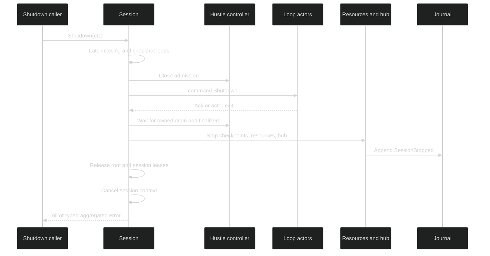

# Shutdown errors

`SessionController.Shutdown(ctx)` owns the entire teardown. The caller's
context can report cancellation, but it does not detach loops, hustles,
resources, or leases from their cleanup owner.

## Teardown order {#teardown-order}

The public contract is:

```go
Shutdown(context.Context) error
```

The implementation takes one teardown owner and follows this order:

1. Latch `closing` and snapshot every registered loop under the loop mutex.
2. Close hustle admission and cancel queued or executing inference.
3. Send `command.Shutdown` to every snapshotted loop, then wait for its ack or
   actor exit.
4. Join hustle audit, finalizers, and blocking-activity drain.
5. Stop collaboration, remove the tool-result capture spill directory, then
   stop checkpoints, session resources, and the hub. The hub
   publishes `SessionStopped` while the session is still able to reach its
   durable append.
6. Release the workspace root lease and session writer lease.
7. Cancel the session context last.



`SessionStopped` is terminal in the hub. A late event cannot reopen the phase,
and a later `WaitIdle` returns `hub.ErrSessionStopped`.

## Timeout and aggregation {#timeout-and-aggregation}

Loop, checkpoint, collaboration, session-resource, and hub phases receive
private deadlines derived from validated component bounds. The exact internal
`ShutdownCleanupPhase` values are:

| Phase | Value |
| --- | --- |
| Loop shutdown send | `loop_send` |
| Loop shutdown drain | `loop_drain` |
| Checkpoint drain | `checkpoint_drain` |
| Residency anchor checkpoint (`ReleaseResidency` only) | `residency_anchor` |
| Collaboration broker | `collab_broker` |
| Session resources | `session_resources` |
| Hub stop | `hub_stop` |

If a phase exceeds its private deadline, the returned
`*sessionruntime.ShutdownCleanupTimeoutError` carries `Phase`, `Timeout`, and
`Cause`. It unwraps to `context.DeadlineExceeded`. Later phases still receive
fresh deadlines, so a wedged loop or checkpoint cannot suppress `SessionStopped`
or lease release.

Multiple cleanup failures are combined by an internal
`shutdownErrorSet` implementing `Unwrap() []error`. A single failure is
returned directly. The caller can use `errors.As` to find a timeout, loop
termination, resource error, or other child without parsing aggregate text.

## Primary versus cleanup {#primary-vs-cleanup}

Shutdown does not replace an owned run's primary error with a finalizer error.
`hustleruntime.RunError` keeps `Cause` and `TerminalErr` alongside
`FinalizerErr` and `CleanupErr`, and its `Unwrap() []error` exposes all of them.
`QueueFailureError` and `FinalizerError` use the same multi-error pattern.

The session shutdown result adds caller context only after owned cleanup has
finished. When cleanup or caller cancellation is present, the outer value is
`*session.SessionError{Kind: session.SessionContextDone, Cause: ...}`. Its
`Unwrap` chain still reaches a `ShutdownCleanupTimeoutError`, loop termination,
`context.Canceled`, or `context.DeadlineExceeded`.

```go
err := controller.Shutdown(ctx)
var sessionErr *session.SessionError
var timeoutErr *sessionruntime.ShutdownCleanupTimeoutError
if errors.As(err, &sessionErr) && sessionErr.Kind == session.SessionContextDone {
	if errors.As(err, &timeoutErr) {
		log.Printf("cleanup phase=%s timeout=%s", timeoutErr.Phase, timeoutErr.Timeout)
	}
	if errors.Is(err, context.Canceled) {
		// This may be the caller's cancellation, reported after teardown.
	}
}
```

An already-cancelled caller context therefore does not make Shutdown return
before an owned finalizer or lease cleanup completes.

## Repeat and observe {#repeat-and-observe}

Concurrent and repeated calls join the same teardown owner. Only one caller
sends loop shutdown commands or invokes resource shutdown. Each caller receives
the shared cleanup result, augmented with that caller's own context error.

After the call returns, observe the terminal state with `WaitIdle` on the live
session or by reading the public event stream. A successful shutdown produces
`SessionStopped`; a stopped hub returns `hub.ErrSessionStopped` rather than
silently reporting idle.

`WaitIdle` is not a method on the public `SessionController` interface. Reach
it through the optional `session.IdleWaiter` capability, or consume the
`SessionStopped` event through `SubscribeEvents`. The optional
`session.Liveness` capability's `Done()` channel closes when teardown begins, so
a receive from it does not mean teardown has finished.

## Source and runnable proof {#source-and-runnable-proof}

The public lifecycle method is declared in
[`pkg/session/session.go`](https://github.com/looprig/harness/blob/main/pkg/session/session.go).
Teardown ownership, order, error aggregation, and caller-context handling are
implemented in [`internal/sessionruntime/session.go`](https://github.com/looprig/harness/blob/main/internal/sessionruntime/session.go)
and [`internal/sessionruntime/shutdown_cleanup.go`](https://github.com/looprig/harness/blob/main/internal/sessionruntime/shutdown_cleanup.go).
Owned-run primary and cleanup chains are in
[`internal/hustleruntime/errors.go`](https://github.com/looprig/harness/blob/main/internal/hustleruntime/errors.go),
and the terminal hub sentinel is in
[`pkg/hub/state.go`](https://github.com/looprig/harness/blob/main/pkg/hub/state.go).
The teardown contract is exercised by
[`internal/sessionruntime/hustle_shutdown_test.go`](https://github.com/looprig/harness/blob/main/internal/sessionruntime/hustle_shutdown_test.go),
[`internal/sessionruntime/session_hub_test.go`](https://github.com/looprig/harness/blob/main/internal/sessionruntime/session_hub_test.go),
and [`internal/sessionruntime/lifecycle_test.go`](https://github.com/looprig/harness/blob/main/internal/sessionruntime/lifecycle_test.go).
