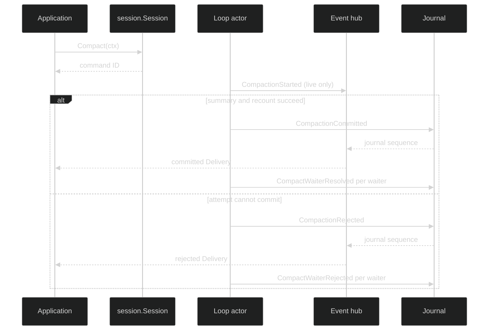

# Context and compaction events

Context events make model-request sizing and pressure observable. Compaction
events record an attempt and its authoritative result. The shared basis ties
both to a loop-local committed context revision and the exact event through
which that context was built.

## Context contracts

```go
type ContextRevision uint64

type ContextBasis struct {
	Revision ContextRevision `json:"revision"`
	ThroughEventID uuid.UUID `json:"through_event_id"`
}

type ContextMeasurement struct {
	Basis ContextBasis `json:"basis"`
	Model model.ModelKey `json:"model"`
	RequestFingerprint [32]byte `json:"request_fingerprint"`
	InputTokens content.TokenCount `json:"input_tokens"`
	InputLimit content.TokenCount `json:"input_limit"`
	Quality contextcount.CountQuality `json:"quality"`
}

type ContextMeasured struct {
	enduring
	loopScoped
	Header
	Measurement ContextMeasurement `json:"measurement"`
}

type ContextPressure struct {
	ephemeral
	loopScoped
	Header
	Measurement ContextMeasurement `json:"measurement"`
	Occupancy BasisPoints `json:"occupancy"`
	Previous PressureLevel `json:"previous"`
	Current PressureLevel `json:"current"`
}
```

`ContextMeasured` is the latest authoritative complete-request measurement and
is durable. `ContextPressure` is a Public Ephemeral level-change signal. The
pressure value is `BasisPoints` from 0 through `FullScaleBasisPoints` (10,000),
and `PressureLevel` transitions from `PressureNormal`, `PressureCompact`, or
`PressureHardLimit`; `PressureUnknown` is allowed only as the previous value.
The current level must be valid and must differ from the previous level.

`ContextMeasurement.Validate` requires a non-zero revision, through-event ID,
valid model key, non-zero request fingerprint, non-zero input limit, and one of
the exact count quality values. A measured input count above the model limit is
not malformed; it is retained as audit evidence for pressure handling.

## Compaction contracts

```go
type CompactionStarted struct {
	ephemeral
	loopScoped
	Header
	AttemptID CompactAttemptID `json:"attempt_id"`
	Reason CompactionReason `json:"reason"`
	Basis ContextBasis `json:"basis"`
}

type CompactionCommitted struct {
	enduring
	loopScoped
	Header
	AttemptID CompactAttemptID `json:"attempt_id"`
	WaiterCommandIDs []uuid.UUID `json:"waiter_command_ids"`
	Reason CompactionReason `json:"reason"`
	Basis ContextBasis `json:"basis"`
	Summary *content.UserMessage `json:"summary"`
	PostContext ContextMeasurement `json:"post_context"`
	Duration time.Duration `json:"duration,omitzero"`
}

type CompactionRejected struct {
	enduring
	loopScoped
	Header
	AttemptID CompactAttemptID `json:"attempt_id"`
	WaiterCommandIDs []uuid.UUID `json:"waiter_command_ids"`
	Reason CompactionReason `json:"reason"`
	Basis ContextBasis `json:"basis"`
	RejectReason CompactRejectReason `json:"reject_reason"`
	Duration time.Duration `json:"duration,omitzero"`
}

type CompactWaiterResolved struct {
	enduring
	loopScoped
	Header
	AttemptID CompactAttemptID `json:"attempt_id"`
	CommittedEventID uuid.UUID `json:"committed_event_id"`
}

type CompactWaiterRejected struct {
	enduring
	loopScoped
	Header
	AttemptID CompactAttemptID `json:"attempt_id"`
	Reason CompactRejectReason `json:"reason"`
}
```

`CompactionStarted` is live progress and is not a durable record. The committed
and rejected values are the authoritative outcome. Waiter values are Enduring
Replies: their `Header.Cause.CommandID` names the caller's compaction command,
and `CompactWaiterReplyID(attempt, commandID, resolved)` derives a deterministic
event ID for idempotent per-command resolution.

| Event | Class | Durable | Lifecycle |
| --- | --- | --- | --- |
| `ContextMeasured` | Enduring | Yes | Latest complete-request measurement |
| `ContextPressure` | Ephemeral | No | Pressure level change for a live consumer |
| `CompactionStarted` | Ephemeral | No | Attempt accepted and running |
| `CompactionCommitted` | Enduring | Yes | Summary and post-compaction context become authoritative |
| `CompactionRejected` | Enduring | Yes | Attempt ended without changing context |
| `CompactWaiterResolved` | Enduring | Yes | One command resolves to a committed event |
| `CompactWaiterRejected` | Enduring | Yes | One command resolves with a typed reject reason |

## Attempt sequence



`CompactionCommitted.Summary` must be a non-nil user-role message with exactly
one non-blank text block. `WaiterCommandIDs` must be non-empty and contain no
zero or duplicate IDs. `PostContext` must pass the same structural measurement
validation as `ContextMeasured`. Negative durations and unknown enum values are
invalid.

The rejection vocabulary is closed. It includes control-lane full,
shutting-down, interrupted, canceled, stale basis, progress publication,
unavailable, execution failed, invalid summary, context-count failed, summary
too large, internal, and context-limit unknown. The zero
`CompactRejectUnspecified` is a sentinel and is never a valid rejection.

## Observe pressure and durable outcomes

```go
func watchCompaction(ctx context.Context, live session.Session) error {
	sub, err := live.SubscribeEvents(event.EventFilter{
		Ephemeral: event.LoopScope{All: true},
		Enduring: event.LoopScope{All: true},
	})
	if err != nil {
		return err
	}
	defer sub.Close()

	for {
		select {
		case <-ctx.Done():
			return ctx.Err()
		case delivery, ok := <-sub.Events():
			if !ok {
				return sub.Err()
			}
			switch e := delivery.Event.(type) {
			case event.ContextPressure:
				log.Printf("loop %s context pressure %d/%d", e.LoopID, e.Occupancy, event.FullScaleBasisPoints)
			case event.CompactionCommitted:
				log.Printf("compaction %s committed at %d", e.AttemptID, delivery.JournalSeq)
			case event.CompactionRejected:
				log.Printf("compaction %s rejected: %d", e.AttemptID, e.RejectReason)
			case event.CompactWaiterResolved, event.CompactWaiterRejected:
				log.Printf("compaction command %s resolved as %T", e.EventHeader().Cause.CommandID, e)
			}
		}
	}
}
```

The code intentionally handles the pressure signal as optional. A reconnecting
consumer should derive the current durable context from `ContextMeasured` and
the committed compaction record, not from the last pressure notification it
happened to receive. An Enduring delivery has a non-zero journal sequence; an
Ephemeral pressure or start signal always has zero.

## Restore and typed errors

Replay uses `ContextBasis.ThroughEventID` and the revision to prove which
committed context a measurement describes. A stale basis is a typed
`CompactRejectStaleBasis` outcome, not a silently applied summary. Invalid
records return `*event.InvalidEventError` with fields such as `AttemptID`,
`WaiterCommandIDs`, `Summary`, `PostContext`, `Reason`, or `RejectReason`.
The event codec also rejects an Ephemeral value with
`*event.EphemeralNotPersistableError`; do not try to journal
`CompactionStarted` as a progress record.

## Source and proofs

- [`ContextBasis`, measurement, and pressure events`](https://github.com/looprig/harness/blob/main/pkg/event/context.go)
- [`Compaction events, enums, and deterministic waiter IDs`](https://github.com/looprig/harness/blob/main/pkg/event/compaction.go)
- [`context and compaction validation`](https://github.com/looprig/harness/blob/main/pkg/event/validate.go)
- [`Session compact methods`](https://github.com/looprig/harness/blob/main/pkg/session/session.go)
- [`context tests`](https://github.com/looprig/harness/blob/main/pkg/event/context_test.go), [`compaction tests`](https://github.com/looprig/harness/blob/main/pkg/event/compaction_test.go), and [`hub durable delivery tests`](https://github.com/looprig/harness/blob/main/pkg/hub/durable_tap_test.go)

Compaction belongs inside a [turn and Step stream](/docs/guides/harness/events/turn-and-step); use the [event envelope](/docs/guides/harness/events/event-envelope) when persisting or correlating its replies.
