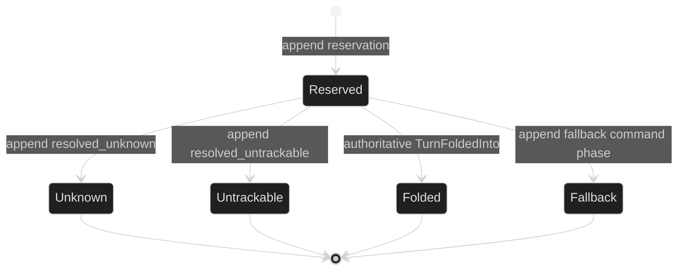

# Delegation events

Delegation creates a durable loop tree and sends work between parent and child
loops. The event stream records the points that must survive a restart: child
creation and foreign-session bindings, actor-side request acceptance, parent
turn admission, and ambiguous foreign-delivery adjudication. The live tool
result has more detail than the event payload and is not a substitute for
these durable records.

## Loop and request events

```go
type LoopStarted struct {
	enduring
	loopScoped
	Header
	Runtime ModelRuntime `json:"runtime,omitzero"`
	AgentRuntime *AgentRuntime `json:"agent_runtime,omitempty"`
	ParentToolUseID string `json:"parent_tool_use_id,omitzero"`
	ForeignSID string `json:"foreign_sid,omitzero"`
	InitialMode string `json:"initial_mode,omitzero"`
	InitialRequestID uuid.UUID `json:"initial_request_id,omitzero"`
	DisplayName string `json:"display_name,omitzero"`
	Description string `json:"description,omitzero"`
}

type DelegateRequestAccepted struct {
	enduring
	loopScoped
	Header // Cause.CommandID is the request ID
}

type DelegateDeliveryStateChanged struct {
	enduring
	sessionScoped
	Header
	RequestID uuid.UUID `json:"request_id"`
	TargetLoopID uuid.UUID `json:"target_loop_id"`
	State DelegateDeliveryState `json:"state"`
}

type ForeignSessionBound struct {
	enduring
	loopScoped
	Header
	ForeignSID string `json:"foreign_sid"`
}

type LoopAgentSessionBound struct {
	enduring
	loopScoped
	Header
	ACPSessionID string `json:"acp_session_id"`
}
```

`LoopStarted.Header.Coordinates` names the new loop. The spawning loop, turn,
and step, when any, are in `Header.Cause.Coordinates`; the root has a zero
cause location. `ParentToolUseID` is the provider tool-use ID that spawned the
child, `InitialRequestID` proves the prepared delegate request was accepted,
and `ForeignSID` or `ACPSessionID` preserves an adapter session binding for
restore. These are identities, not credentials or broker tokens. The public
body a session viewer reads omits `runtime.base_url`, which is Host
configuration; restore reads it from the native body.

| Event | Class | Scope | Visibility | Durable meaning |
| --- | --- | --- | --- | --- |
| `LoopStarted` | Enduring | Loop | Public | New loop registry entry and resolved runtime identity |
| `DelegateRequestAccepted` | Enduring | Loop | Public | Target actor accepted a machine follow-up before queue/start |
| `ForeignSessionBound` | Enduring | Loop | Public | Late-bound foreign agent session ID |
| `LoopAgentSessionBound` | Enduring | Loop | Public | Durable ACP agent-session binding |
| `DelegateDeliveryStateChanged` | Enduring | Session | Public | Session-owned delivery reservation or terminal adjudication |
| `TurnStarted`, `TurnFoldedInto`, `InputCancelled`, `TurnRejected` | Enduring except `InputQueued` | Target Loop | Public | Parent-loop resolution of the request ID in `Header.Cause.CommandID` |

`DelegateDeliveryStateChanged` is session-scoped even though it names a target
loop explicitly. The session owns the reservation and judges adapter delivery;
the target loop did not produce that fact.

## Foreign delivery state machine

The closed state vocabulary is deliberately smaller than the tool result
vocabulary:

| State | Meaning | Terminal? |
| --- | --- | --- |
| `DelegateDeliverySteerAttemptReserved` | Reservation is durable before a foreign adapter admits the steering request | No |
| `DelegateDeliveryResolvedUnknown` | Delivery result is ambiguous; the request may have reached the adapter | Yes |
| `DelegateDeliveryResolvedUntrackable` | Adapter delivered outside the host-owned turn contract | Yes |

Successful injected delivery is represented by the authoritative
`TurnFoldedInto` event, not by a synthetic `DelegateDeliveryStateChanged`.
Fallback is a phased durable command record that must follow the same request's
intent record. It is not a second request ID and is not a delivery-state event.



The state event requires non-zero `RequestID`, non-zero `TargetLoopID`, and one
of those three closed states. Its wire payload intentionally excludes user
input, broker tokens, and origin session or loop identities. `ValidateEvent`
returns a typed `*event.InvalidEventError` for a missing address or an unknown
state.

## Admission, reply, and cancellation correlation

The parent-scoped delegate controller creates or sends a request. The request
ID is carried in the command record and then in `Header.Cause.CommandID` on the
target loop's resolution event. A child result is a `command.SubagentResult`
handed back to the parent. If it starts work immediately, the parent receives
`TurnStarted`; if it folds into a tool continuation, it receives
`TurnFoldedInto`; if it leaves the queue without committing, it receives
`InputCancelled`. A refused human input can produce `TurnRejected`, but a
`SubagentResult` is designed to queue rather than be rejected.

Cancellation is a control command (`CancelDelegateRequest` for managed
delegation or the loop interrupt path), not an invented cancellation event.
Observe the resulting `InputCancelled` or `TurnInterrupted` and correlate by
`Cause.CommandID` and coordinates. Do not treat a tool result timeout as proof
that the foreign adapter did not receive the request: the durable unknown
state exists specifically to prevent an unsafe automatic fallback.

## Restore behavior

Restore folds `LoopStarted` values into the durable topology, revalidates each
runtime against the current catalog, and preserves a child as a tombstone when
the runtime cannot be re-authorized. Foreign session bindings are restored
before the adapter is asked to resume the child.

For delivery states, restore enforces these invariants:

- A terminal state must have a prior reservation for the same request.
- A terminal state cannot regress to reservation or change terminal kind.
- `TargetLoopID` must match the durable phased command's target.
- An intent-only reservation with no authoritative turn, cancellation, or
  fallback evidence is repaired by appending `ResolvedUnknown` before
  `RestoreDone`.
- A reservation that already has `TurnStarted`, `TurnFoldedInto`,
  `InputCancelled`, or a valid fallback is not repaired as unknown.

Contradictory transitions fail closed with typed restore or journal route
errors. A restored unknown or untrackable state yields one parent-visible
categorical result, and restore does not synthesize a turn or automatically
retry the adapter.

## Observe delegation from `session.Session`

```go
func watchDelegation(ctx context.Context, live session.Session) error {
	sub, err := live.SubscribeEvents(event.EventFilter{
		Enduring: event.LoopScope{All: true},
	})
	if err != nil {
		return err
	}
	defer sub.Close()

	for {
		select {
		case <-ctx.Done():
			return ctx.Err()
		case delivery, ok := <-sub.Events():
			if !ok {
				return sub.Err()
			}
			switch e := delivery.Event.(type) {
			case event.LoopStarted:
				log.Printf("loop %s started as %q", e.LoopID, e.AgentName)
			case event.DelegateRequestAccepted:
				log.Printf("delegate request %s accepted for loop %s", e.Cause.CommandID, e.LoopID)
			case event.DelegateDeliveryStateChanged:
				log.Printf("delivery %s for loop %s: %s", e.RequestID, e.TargetLoopID, e.State)
			case event.TurnStarted, event.TurnFoldedInto, event.InputCancelled, event.TurnRejected:
				log.Printf("delegate request %s resolved as %T", e.EventHeader().Cause.CommandID, e)
			}
		}
	}
}
```

The session filter includes session-scoped delivery-state events even when
`Enduring.Loops` is empty. Add the target child IDs to the Enduring loop scope
when the consumer only needs child-loop records; keep the session events in
the stream to correlate delivery adjudication.

## Source and proofs

- [`LoopStarted` and delegation event types](https://github.com/looprig/harness/blob/main/pkg/event/event.go)
- [`DelegateDeliveryStateChanged` and its closed states](https://github.com/looprig/harness/blob/main/pkg/event/delegate_delivery.go)
- [`delegate delivery validation`](https://github.com/looprig/harness/blob/main/pkg/event/validate.go)
- [`delegate request and result vocabulary`](https://github.com/looprig/harness/blob/main/pkg/tool/definition.go)
- [`delegate delivery state tests`](https://github.com/looprig/harness/blob/main/pkg/event/delegate_delivery_test.go), [`restore transition tests`](https://github.com/looprig/harness/blob/main/internal/sessionruntime/foreign_restore_transition_test.go), and [`delegation runtime tests`](https://github.com/looprig/harness/blob/main/internal/sessionruntime/delegation_test.go)

Read [session lifecycle events](/docs/guides/harness/events/session-lifecycle) before restoring a parent or child, then use [filtering and subscriptions](/docs/guides/harness/events/filtering-and-subscriptions) to observe the selected loop tree.
