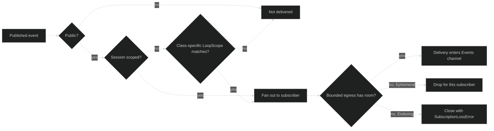

# Filtering and subscriptions

`Session.SubscribeEvents` returns the session's event fan-in. Filtering is
declared once at registration and evaluated for each event before the bounded
subscriber buffer. It is separate from backpressure: an event outside the
filter never consumes egress capacity, while an event inside the filter can
still be dropped or fail the subscription if the consumer is too slow.

## The filter contract

```go
type EventFilter struct {
	Ephemeral LoopScope
	Enduring  LoopScope
}

type LoopScope struct {
	All   bool
	Loops map[uuid.UUID]struct{}
}

func (s LoopScope) Matches(loopID uuid.UUID) bool {
	if s.All {
		return true
	}
	_, ok := s.Loops[loopID]
	return ok
}

func ShouldDeliver(filter EventFilter, ev Event) bool {
	if ev == nil || ev.Visibility() != Public {
		return false
	}
	if ev.Scope() == ScopeSession {
		return true
	}
	scope := filter.Enduring
	if ev.Class() == Ephemeral {
		scope = filter.Ephemeral
	}
	return scope.Matches(ev.EventHeader().LoopID)
}
```

The zero filter matches no loop-scoped values but still receives all Public
session-scoped values. Set `All: true` for every loop, or provide an explicit
`Loops` set. `EventFilter.Ephemeral` and `EventFilter.Enduring` are independent:
a UI can watch all durable state while accepting streaming deltas only from the
active loop.

| Event | Filter branch | Loop selection |
| --- | --- | --- |
| `SessionStarted`, `SessionIdle`, `WorkflowActivity`, `IntegrationStatus` | bypasses both branches | always delivered when Public |
| `TurnDone`, `StepDone`, `GateOpened` | `Enduring` | `Enduring.All` or the event's `Header.LoopID` in `Enduring.Loops` |
| `TokenDelta`, `ToolCallStarted`, `ContextPressure` | `Ephemeral` | `Ephemeral.All` or the event's `Header.LoopID` in `Ephemeral.Loops` |
| Internal hustle/review events | neither | never delivered by ordinary subscriptions |

Session-scoped does not mean durable. `IntegrationStatus` is session-scoped
and Ephemeral, so it bypasses loop selection but still has `JournalSeq == 0`
and can be dropped under pressure.

## Subscription lifecycle

The public handle is intentionally small:

```go
type Subscription interface {
	Events() <-chan Delivery
	Close() error
	Err() error
}
```

The concrete hub implementation uses a bounded egress channel with capacity
256. The hub is the sole sender and sends without blocking. `Close` is
idempotent and records no error. The channel also closes when the hub tears
down or fails the subscription. `Err` is nil while live and after intentional
close; a hub-forced termination stores the typed loss cause.



An Ephemeral overflow is expected loss. The next authoritative event is the
recovery point. An Enduring overflow is different: dropping it would hide a
state transition, so the hub closes that subscriber with
`*hub.SubscriptionLossError{DroppedClass: event.Enduring}`. The subscriber must
resubscribe and use the durable event replay surface to recover the missing
history. The error's optional `Cause` is available through `errors.Unwrap`. A
nil cause means egress overflow. On the committed public stream described in
the [events overview](/docs/guides/harness/events), a cause of
`hub.ErrCommittedBodyMissing` or `hub.ErrCommitEventMismatch` is a broken
invariant rather than congestion, so check `errors.Is` before resubscribing.

## A consumer with class-aware interest

The example uses only `session.Session`, not the concrete hub. It keeps all
Enduring events for every loop and streaming values for one loop.

```go
func watchActiveLoop(ctx context.Context, live session.Session, active uuid.UUID) error {
	sub, err := live.SubscribeEvents(event.EventFilter{
		Ephemeral: event.LoopScope{
			Loops: map[uuid.UUID]struct{}{active: struct{}{}},
		},
		Enduring: event.LoopScope{All: true},
	})
	if err != nil {
		return fmt.Errorf("subscribe events: %w", err)
	}
	defer sub.Close()

	for {
		select {
		case <-ctx.Done():
			return ctx.Err()
		case delivery, ok := <-sub.Events():
			if !ok {
				if err := sub.Err(); err != nil {
					var lost *hub.SubscriptionLossError
					if errors.As(err, &lost) {
						return fmt.Errorf("resync from durable history: %w", err)
					}
					return err
				}
				return nil
			}
			if delivery.Event.Class() == event.Ephemeral {
				log.Printf("live-only %T", delivery.Event)
				continue
			}
			log.Printf("authoritative %T at journal %d", delivery.Event, delivery.JournalSeq)
		}
	}
}
```

When resynchronizing, treat the last successfully handled Enduring
`JournalSeq` as a cursor position, not an event ID. Event IDs are useful for
causal identity and idempotency, but the durable journal sequence is the live
ordering number carried by `Delivery`. A newly opened event replayer can start
at an inclusive sequence; replay itself does not support a live `Follow` mode.

## What is and is not a stream terminator

`SessionStopped` is an Enduring session event. It is delivered in order and
does not close subscriptions. A subscriber can observe it, finish its own
drain, and call `Close`. A stream can close before `SessionStopped` if the hub
loses the subscription to Enduring overflow, if the session construction is
aborted, or if this process gives up the session with `ReleaseResidency` or
`AbandonResidency`. The last case closes with `Err() == hub.ErrResidencyReleased`:
the session is not stopped and can be restored elsewhere. After `Events()`
closes, always inspect `Err` before deciding whether the stream ended
intentionally.

Internal values never enter this path. `HustleStarted`, `HustleCompleted`,
`HustleFailed`, `PermissionReviewStarted`, and `PermissionReviewCompleted` are
durable audit records written through the privileged hub method, and
`ShouldDeliver` returns false for them even if a caller asks for all loops.

## Source and proofs

- [`EventFilter`, `LoopScope`, and `ShouldDeliver`](https://github.com/looprig/harness/blob/main/pkg/event/filter.go)
- [`Subscription` and `Delivery`](https://github.com/looprig/harness/blob/main/pkg/event/event.go)
- [`EventSubscription` and `SubscriptionLossError`](https://github.com/looprig/harness/blob/main/pkg/hub/subscription.go)
- [`Session.SubscribeEvents`](https://github.com/looprig/harness/blob/main/pkg/session/session.go)
- [`Hub` fan-out and overflow policy](https://github.com/looprig/harness/blob/main/pkg/hub/hub.go)
- [`filter` behavior tests](https://github.com/looprig/harness/blob/main/pkg/event/filter_test.go), [`hub subscription tests`](https://github.com/looprig/harness/blob/main/pkg/hub/subscription_test.go), and [`overflow/order tests`](https://github.com/looprig/harness/blob/main/pkg/hub/hub_test.go)

For the event meanings behind a filtered stream, see [session lifecycle](/docs/guides/harness/events/session-lifecycle), [turn and Step](/docs/guides/harness/events/turn-and-step), and [tool events](/docs/guides/harness/events/tool-events).
