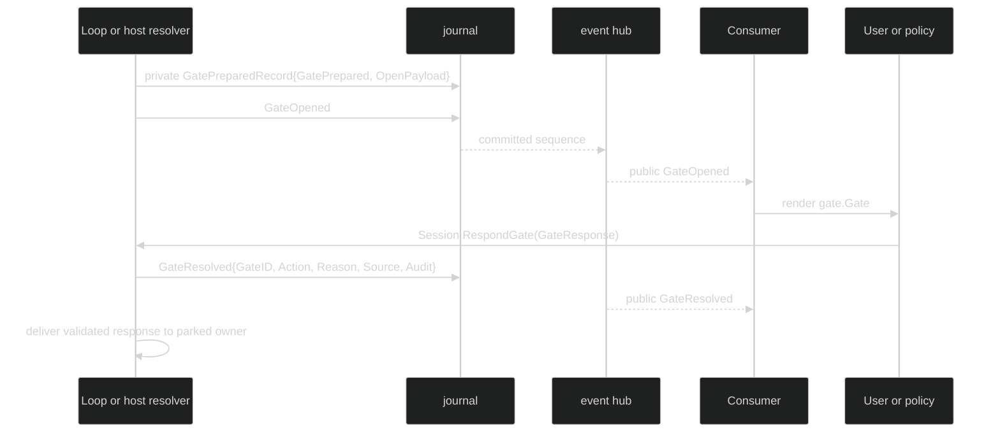

# Gate and permission-review events

Gates are durable questions or control boundaries. A gate event tells a
consumer what became answerable and how it closed; it does not expose every
private payload used to construct the question. Permission review events are a
separate Internal audit trail for automated classifiers reviewing an already
open permission gate.

## Gate lifecycle

```go
type GatePrepared struct {
	enduring
	loopScoped
	Header
	Gate   gate.Gate       `json:"gate,omitzero"`
	Resume *ToolStepResume `json:"resume,omitempty"`
}

type ToolStepResume struct {
	StepIndex uint64             `json:"step_index"`
	Message   *content.AIMessage `json:"message"`
	ToolUseID string             `json:"tool_use_id"`
}

type GateOpened struct {
	enduring
	loopScoped
	Header
	Gate gate.Gate `json:"gate,omitzero"`
}

type GateResolved struct {
	enduring
	loopScoped
	Header
	GateID gate.ID `json:"gate_id,omitzero"`
	Resolver gate.ResolverKind `json:"resolver,omitempty"`
	Reason gate.CloseReason `json:"reason,omitempty"`
	Action string `json:"action,omitempty"`
	Source gate.ResponseSource `json:"source,omitzero"`
	Audit gate.ResponseAudit `json:"-"`
}
```

`GatePrepared` is the private prepare projection. The journal stores it only
inside `journal.GatePreparedRecord`, together with the typed `gate.OpenPayload`.
It is not a normal `EventRecord`, is not sent by `Hub.PublishEvent`, and is
filtered from product event replay. `GateOpened` is the Public activation
projection. It carries the pure `gate.Gate` envelope and no private payload; it
is the event that makes the gate listable and answerable. `GateResolved` is the
single Enduring close-with-answer record.

| Event | Class | Scope | Visibility | Durable purpose |
| --- | --- | --- | --- | --- |
| `GatePrepared` | Enduring | `ScopeLoop` method, resolver-dependent coordinates | Private journal record | Validate the later open and preserve the typed open payload for restore |
| `GateOpened` | Enduring | `ScopeLoop` method, resolver-dependent coordinates | Public | Announce the answerable gate envelope |
| `GateResolved` | Enduring | `ScopeLoop` method, resolver-dependent coordinates | Public | Atomically record answered, abandoned, owner-closed, or restore-unavailable state |

The event method returns `ScopeLoop` for all three gate types because gates are
part of the event union's loop delivery path. A host-owned gate can be
session-only, loop-attributed, or turn-attributed in its coordinates; a
loop-owned permission or ask-user gate must carry the full step quartet.
`GateResolved.Resolver` is retained on the record so a decoder can choose the
same identity profile without the prepared payload.

`GatePrepared.Resume` lets a restored session continue the parked tool step
instead of interrupting its turn. The loop sets it for a permission gate, and
for an ask-user gate raised by a tool that declares `tool.UserInputReplaySafe`.
It holds the step's assistant message as `StepDone` will commit it, including
raw tool arguments, which is why it lives only in the private prepared record.
On restore, an open permission gate is reinstalled as answerable. An open
ask-user gate stays open only when its `Resume` is valid (`Valid()` requires
the message to carry exactly one call with `ToolUseID`). Every other open gate
is closed with `CloseRestoreUnavailable`.

## Open, answer, resolve



For a permission gate, `Action` is one of the exact
`gate.ApprovalAction` values: `Approve`, `Approve always for this workspace`,
or `Deny`. A non-answer close such as `CloseAbandoned` or
`CloseOwnerClosed` has an empty action and a non-empty `Reason`. `Audit` is
projected through the typed gate audit codec into the native journal body. It
can retain redaction-aware requirement, candidate, form, or answer summaries,
but never grant tokens, raw tool arguments, or an open-url action target. The
public body that session viewers read omits `audit` entirely, because it may
contain raw form answers.

`Header.Cause.CommandID` on `GateResolved` is zero for an answer given through
`Session.RespondGate`. When a Host applies the answer as an admitted
`gate_response` runtime command, it carries that command's `RuntimeCommandID`,
so the answer and its settlement stay correlated across a crash. See
[Host-admitted runtime commands](/docs/guides/harness/commands#host-admitted-runtime-commands).

## Host-owned versus loop-owned identity

`gate.ResolverSession` is used for host-owned form and open-url gates. Only a
SessionID is required, though a loop or turn may be included when the host
attributes the elicitation to one. `gate.ResolverLoop` is used for permission
and ask-user gates parked in a loop; SessionID, LoopID, TurnID, and StepID are
all required. An empty or unknown resolver on a decoded `GateResolved` uses the
strict loop profile, preserving the fail-closed behavior of older records.

This distinction is enforced by `event.ValidateEvent`, which returns
`*event.InvalidEventError` with `FieldSessionID`, `FieldTurnID`, or
`FieldStepID` rather than allowing a malformed gate to reach restore.

## Permission review audit

```go
type PermissionReviewStarted struct {
	enduring
	loopScoped
	Header
	GateID gate.ID `json:"gate_id,omitzero"`
	ToolExecutionID uuid.UUID `json:"tool_execution_id,omitzero"`
	Classifier hustle.Name `json:"classifier,omitzero"`
	ClassifierRevision string `json:"classifier_revision,omitzero"`
}

type PermissionReviewCompleted struct {
	enduring
	loopScoped
	Header
	GateID gate.ID `json:"gate_id,omitzero"`
	ToolExecutionID uuid.UUID `json:"tool_execution_id,omitzero"`
	Classifier hustle.Name `json:"classifier,omitzero"`
	ClassifierRevision string `json:"classifier_revision,omitzero"`
	Status gate.ReviewStatus `json:"status,omitzero"`
	Risk gate.ReviewRisk `json:"risk,omitzero"`
	Authorization gate.ReviewAuthorization `json:"authorization,omitzero"`
	Categories []gate.ReviewRiskCategory `json:"categories,omitzero"`
	AutoApproved bool `json:"auto_approved,omitzero"`
}
```

Both review values are Enduring, loop-scoped, and Internal. They require a
gate ID, a tool execution ID, a valid classifier name, and a bounded non-blank
classifier revision. The completion status is one of `allowed`, `needs_human`,
`not_applicable`, `timed_out`, `failed`, `cancelled`, or `stale`.

For `allowed` and `needs_human`, risk, authorization, and distinct known
categories are required; `allowed` cannot carry critical risk, and
`AutoApproved` must agree with the status. For the other terminal statuses,
risk, authorization, categories, and `AutoApproved` must all be empty or
false. The durable review events deliberately omit classifier prompt,
evidence, model output, rationale, and gate candidate data.

## Consume and answer a public gate

```go
func answerPermission(ctx context.Context, live session.Session) error {
	sub, err := live.SubscribeEvents(event.EventFilter{
		Enduring: event.LoopScope{All: true},
	})
	if err != nil {
		return err
	}
	defer sub.Close()

	for {
		select {
		case <-ctx.Done():
			return ctx.Err()
		case delivery, ok := <-sub.Events():
			if !ok {
				return sub.Err()
			}
			switch e := delivery.Event.(type) {
			case event.GateOpened:
				if e.Gate.Kind != gate.KindPermission {
					continue
				}
				return live.RespondGate(ctx, gate.GateResponse{
					GateID: gate.ID(e.Gate.ID),
					Action: string(gate.ApprovalDeny),
					Source: gate.ResponseSource{Kind: gate.ResponseFromUser},
				})
			case event.GateResolved:
				log.Printf("gate %s resolved with %q at journal %d", e.GateID, e.Action, delivery.JournalSeq)
			}
		}
	}
}
```

The example answers only a Public gate. It cannot see the Internal review
events through this subscription, even with `Enduring.All`; classifier audit
records are available only to privileged restore or audit consumers. A host
that opens a form or open-url gate uses the separate `session.GateHost` contract
and receives its live `gate.Answer`; the durable public record is still
`GateOpened` followed by `GateResolved`.

## Source and proofs

- [`GatePrepared`, `GateOpened`, and `GateResolved`](https://github.com/looprig/harness/blob/main/pkg/event/gate.go)
- [`PermissionReviewStarted` and `PermissionReviewCompleted`](https://github.com/looprig/harness/blob/main/pkg/event/permission_review.go)
- [`gate` envelope, resolver, and close vocabularies](https://github.com/looprig/harness/blob/main/pkg/gate/gate.go), [`responses`](https://github.com/looprig/harness/blob/main/pkg/gate/response.go), and [`review domains`](https://github.com/looprig/harness/blob/main/pkg/gate/review.go)
- [`gate identity validation`](https://github.com/looprig/harness/blob/main/pkg/event/validate.go) and [`event wire projection`](https://github.com/looprig/harness/blob/main/pkg/event/marshal.go)
- [`gate event round-trip and private payload tests`](https://github.com/looprig/harness/blob/main/pkg/event/gate_test.go), [`permission review tests`](https://github.com/looprig/harness/blob/main/pkg/event/permission_review_test.go), and [`privileged publication tests`](https://github.com/looprig/harness/blob/main/pkg/hub/permission_review_publish_test.go)

The gate is part of a [turn and Step sequence](/docs/guides/harness/events/turn-and-step); the surrounding [tool events](/docs/guides/harness/events/tool-events) explain which tool request caused it.
