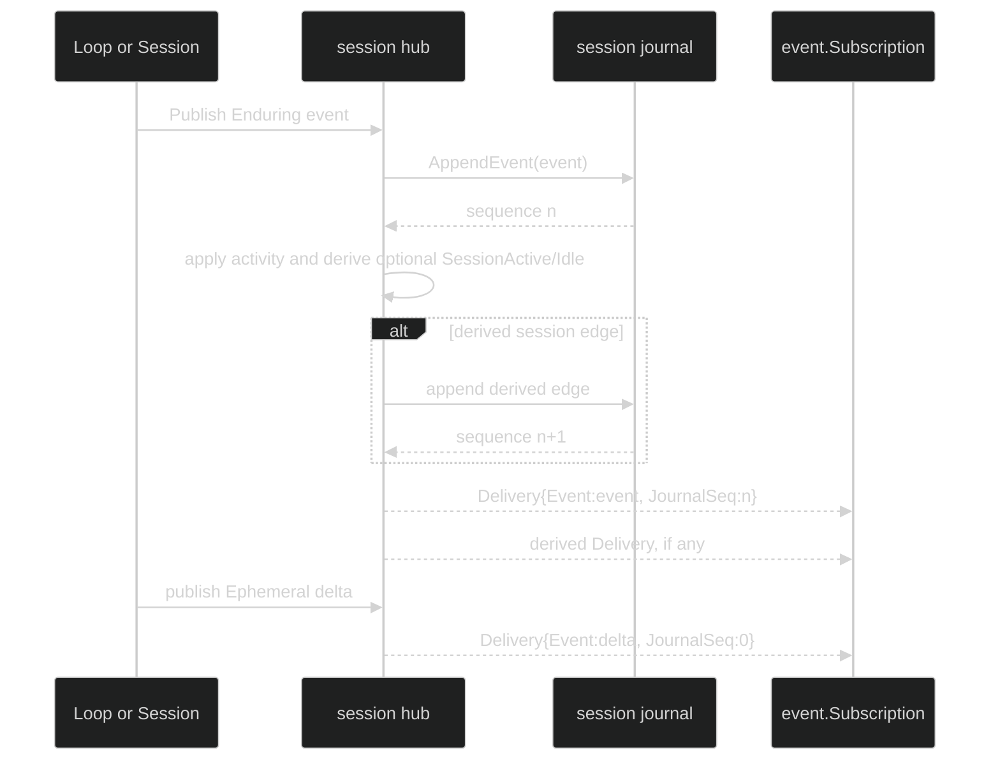

# Overview

Harness events are the typed observation surface of a live `Session`. A loop
publishes values from the sealed `event.Event` union; the session hub filters
them, assigns a journal sequence to durable values, and delivers
`event.Delivery` values to subscribers. The event itself is the payload and
identity. There is no second transport envelope that a consumer must decode.

## The contracts

These are the public contracts a consumer uses. The unexported lifecycle and
scope mixins shown below are part of the source design: every concrete event
embeds exactly one of each, which makes `Class`, `Scope`, and `EndsTurn`
compile-time properties rather than conventions.

```go
type Event interface {
	isEvent()
	Class() Class
	Scope() Scope
	EndsTurn() bool
	EventHeader() Header
	Visibility() EventVisibility
}

type Reply interface {
	Event
	isReply()
	ReplyTo() uuid.UUID // Header.Cause.CommandID
}

type Header struct {
	identity.Coordinates // SessionID, LoopID, TurnID, StepID
	AgentName identity.AgentName `json:"agent_name,omitzero"`
	EventID uuid.UUID `json:"event_id,omitzero"`
	CreatedAt time.Time `json:"created_at,omitzero"`
	Cause identity.Cause `json:"cause,omitzero"`
	EventVisibility EventVisibility `json:"visibility,omitzero"`
}

type Subscription interface {
	Events() <-chan Delivery
	Close() error
	Err() error
}

type Delivery struct {
	Event Event
	JournalSeq uint64 // 0 for Ephemeral; append sequence for Enduring
}
```

`Event` is sealed by the unexported `isEvent` method, so a downstream package
cannot add a type that bypasses validation or the durable codec. The concrete
values are normally delivered as values, not pointers. `ReplyTo` is not a
point-to-point channel: it is the command ID in `Header.Cause.CommandID`, and
the reply still travels through the ordinary class-aware fan-in.

| Property | Values | Consumer meaning |
| --- | --- | --- |
| Class | `Ephemeral`, `Enduring` | Ephemeral values may be dropped and are never journaled. Enduring values are authoritative and must be appended before live delivery. |
| Scope | `ScopeSession`, `ScopeLoop` | Session events are visible to every subscriber. Loop events are selected by the class-specific `LoopScope`. |
| Visibility | `Public`, `Internal` | Only Public values enter ordinary subscriptions and product event replay. Internal values are privileged audit records. |
| Lifecycle | `EndsTurn() == false`, `true` | Only `TurnDone`, `TurnFailed`, and `TurnInterrupted` are terminal. There is no `TurnCompleted` or `TurnCanceled` event. |

## Event families

The table names the complete public union by family. Every name in a row has
the listed class, scope, and visibility unless the row calls out an exception.
`Terminal` means `EndsTurn() == true`; `Mid-stream` means false.

| Family | Concrete events | Class | Scope | Visibility | Lifecycle |
| --- | --- | --- | --- | --- | --- |
| Session lifecycle | `SessionStarted`, `SessionActive`, `SessionIdle`, `SessionStopped`, `RestoreStarted`, `RestoreDone`, `RestoreErrored` | Enduring | Session | Public | Mid-stream |
| Restore and workspace | `ConfigurationAdopted`, `WorkspaceCheckpointed`, `WorkspaceRestored`, `ActiveLoopChanged`, `DelegateDeliveryStateChanged`, `WorkflowActivity` | Enduring | Session | Public | Mid-stream |
| Hustle audit | `HustleStarted`, `HustleCompleted`, `HustleFailed` | Enduring | Session | Internal | Mid-stream |
| Loop lifecycle | `LoopStarted`, `LoopIdle`, `LoopRestoreTombstoned`, `ForeignSessionBound`, `LoopAgentSessionBound`, `DelegateRequestAccepted` | Enduring | Loop | Public | Mid-stream |
| Loop configuration | `LoopInferenceChanged`, `LoopModeChanged`, `LoopExternalToolsetChanged` | Enduring | Loop | Public | Mid-stream |
| Context and compaction | `ContextMeasured`, `CompactionCommitted`, `CompactionRejected`, `CompactWaiterResolved`, `CompactWaiterRejected` | Enduring | Loop | Public | Mid-stream |
| Context signals | `ContextPressure`, `CompactionStarted` | Ephemeral | Loop | Public | Mid-stream |
| Input admission | `InputQueued` | Ephemeral | Loop | Public | Mid-stream |
| Turn admission and terminal | `TurnStarted`, `TurnFoldedInto`, `InputCancelled`, `TurnRejected`, `TurnDone`, `TurnFailed`, `TurnInterrupted` | Enduring except `InputQueued`; terminal rows are Enduring | Loop | Public | `TurnDone`, `TurnFailed`, `TurnInterrupted` are terminal |
| Streaming and tool lifecycle | `TokenDelta`, `ToolCallStarted`, `ToolCallCompleted` | Ephemeral | Loop | Public | Mid-stream |
| Tool interaction | `PermissionRequested`, `PermissionDecided`, `UserInputRequested` | Enduring | Loop | Public | Mid-stream |
| Gates | `GatePrepared`, `GateOpened`, `GateResolved` | Enduring | Loop-shaped coordinates | `GatePrepared` is private journal state; the opened/resolved projections are Public | Mid-stream |
| Permission review | `PermissionReviewStarted`, `PermissionReviewCompleted` | Enduring | Loop | Internal | Mid-stream |
| Processes | `ProcessStarted`, `ProcessBackgrounded`, `ProcessCompleted`, `ProcessStopRequested`, `ProcessLost` | Enduring | Loop | Public | Mid-stream |
| Integration status | `IntegrationStatus` | Ephemeral | Session | Public | Mid-stream |

`GatePrepared` is an event type for the private `journal.GatePreparedRecord`
that also carries the typed open payload. It must not be sent through
`Session.SubscribeEvents`, `Hub.PublishEvent`, or a normal `EventRecord`.
`GateOpened` is the public envelope and intentionally has no private payload.

## Durable append and live delivery

For an Enduring value the hub runs the durable tap before applying activity state
or delivering to subscribers. A derived `SessionActive` or `SessionIdle` edge
is stamped, appended, and delivered after the triggering event. An Ephemeral
value skips the journal and goes directly to fan-out with `JournalSeq == 0`.



The durable append is fail-secure. If an Enduring append fails, the hub reports
a `*hub.SessionPersistenceFault`, applies no event-derived activity transition,
and delivers nothing for that publication. A duplicate idempotent append is
also not broadcast a second time. `SessionStopped` is a durable event and does
not close a subscription by itself; the consumer closes it, the hub tears it
down, or an Enduring overflow fails it.

## Subscribe from `session.Session`

Use the public session contract. The subscription is bounded and non-blocking
from the publisher's perspective, so a consumer must read promptly and must
always close its handle.

```go
func observe(ctx context.Context, live session.Session, loopID uuid.UUID) error {
	sub, err := live.SubscribeEvents(event.EventFilter{
		Ephemeral: event.LoopScope{
			Loops: map[uuid.UUID]struct{}{loopID: struct{}{}},
		},
		Enduring: event.LoopScope{All: true},
	})
	if err != nil {
		return fmt.Errorf("subscribe: %w", err)
	}
	defer sub.Close()

	for {
		select {
		case <-ctx.Done():
			return ctx.Err()
		case delivery, ok := <-sub.Events():
			if !ok {
				if err := sub.Err(); err != nil {
					return fmt.Errorf("event stream: %w", err)
				}
				return nil
			}
			if delivery.JournalSeq != 0 && delivery.Event.Class() != event.Enduring {
				return fmt.Errorf("invalid sequence on ephemeral event")
			}
			switch e := delivery.Event.(type) {
			case event.TurnStarted:
				log.Printf("turn %v started at journal %d", e.TurnID, delivery.JournalSeq)
			case event.TurnDone, event.TurnFailed, event.TurnInterrupted:
				log.Printf("turn terminal: %T", e)
			}
		}
	}
}
```

When the channel closes, `Subscription.Err()` is nil after intentional
`Close`, and is a `*hub.SubscriptionLossError` when the hub failed the stream
because an Enduring delivery found a full egress buffer. Re-subscribe and
replay from the last processed journal sequence when that happens; an
Ephemeral gap is expected, while an Enduring gap is not silently acceptable.

## Correlation and terminal handling

Coordinates locate a value in the `Session -> Loop -> Turn -> Step` hierarchy.
`Header.Cause` explains the direct causal edge. For the input resolution events
`TurnStarted`, `TurnFoldedInto`, `InputCancelled`, `InputQueued`, and
`TurnRejected`, `Cause.CommandID` is the submit command ID. The three resolution
events that are `Reply` values are `TurnStarted`, `TurnFoldedInto`, and
`InputCancelled`; `InputQueued` and `TurnRejected` are also Reply values even
though the first is Ephemeral and the second is Enduring. Compaction waiter
events are Replies too. Match by `ReplyTo()` or `EventHeader().Cause.CommandID`,
not by arrival order.

Within a turn, `TurnStarted` is followed by zero or more `StepDone` records and
the corresponding Ephemeral token/tool values. The final authoritative value is
exactly one of `TurnDone`, `TurnFailed`, or `TurnInterrupted`.

## Source and proofs

- [`event.Event`, `Header`, `Subscription`, and `Delivery`](https://github.com/looprig/harness/blob/main/pkg/event/event.go)
- [`EventFilter` and `ShouldDeliver`](https://github.com/looprig/harness/blob/main/pkg/event/filter.go)
- [`ValidateEvent` and the identity matrix](https://github.com/looprig/harness/blob/main/pkg/event/validate.go)
- [`Hub.PublishEvent` durable tap](https://github.com/looprig/harness/blob/main/pkg/hub/hub.go)
- [`EventSubscription` and loss error](https://github.com/looprig/harness/blob/main/pkg/hub/subscription.go)
- [`Session` contract](https://github.com/looprig/harness/blob/main/pkg/session/session.go)
- [`event` header/class/terminal tests](https://github.com/looprig/harness/blob/main/pkg/event/header_test.go), [`hub` ordering and overflow tests](https://github.com/looprig/harness/blob/main/pkg/hub/hub_test.go), and [`durable tap tests`](https://github.com/looprig/harness/blob/main/pkg/hub/durable_tap_test.go)

Continue with the [event envelope](/docs/guides/harness/events/event-envelope), [filtering and subscriptions](/docs/guides/harness/events/filtering-and-subscriptions), or the [turn and Step guide](/docs/guides/harness/events/turn-and-step).
