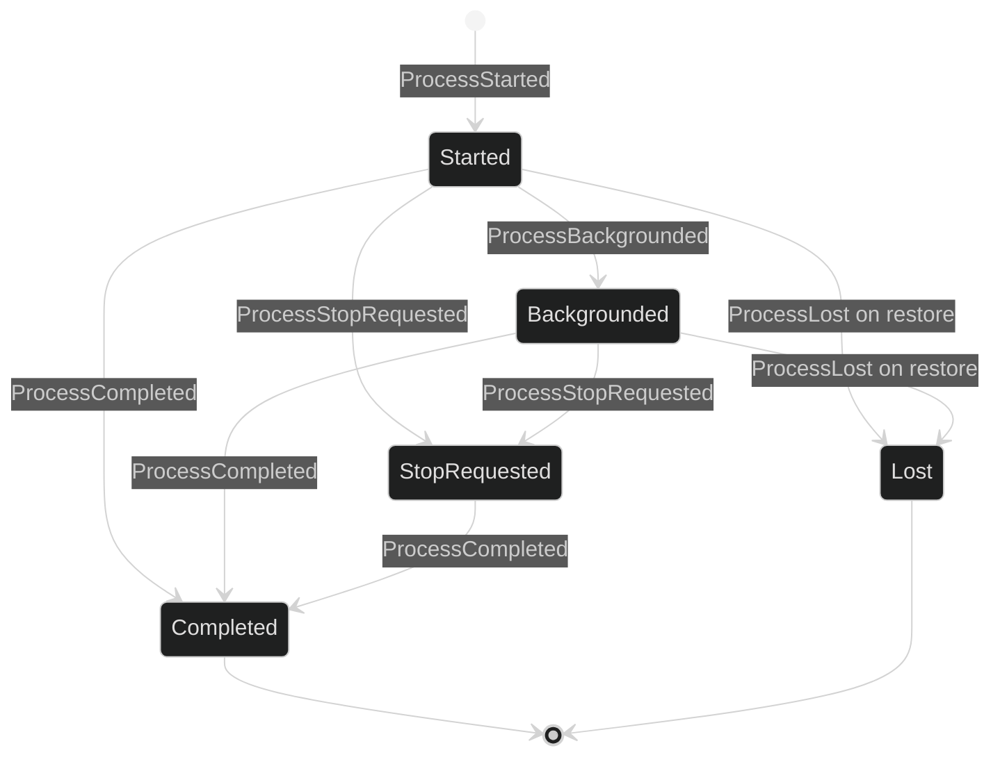

# Process and workflow events

Process and workflow events are durable, metadata-only progress records. A
process event describes a supervised asynchronous process without copying its
command, output, environment, host paths, spool paths, or OS process ID. A
workflow activity describes safe user-facing milestones without exposing Flow
checkpoint state or model content.

## Supervised process events

```go
type ProcessStarted struct {
	enduring
	loopScoped
	Header
	Process tool.ProcessLifecycleMetadata `json:"process"`
}

type ProcessBackgrounded struct {
	enduring
	loopScoped
	Header
	Process tool.ProcessLifecycleMetadata `json:"process"`
}

type ProcessCompleted struct {
	enduring
	loopScoped
	Header
	Process tool.ProcessLifecycleMetadata `json:"process"`
}

type ProcessStopRequested struct {
	enduring
	loopScoped
	Header
	Process tool.ProcessLifecycleMetadata `json:"process"`
}

type ProcessLost struct {
	enduring
	loopScoped
	Header
	Process tool.ProcessLifecycleMetadata `json:"process"`
}

type ProcessLifecycleMetadata struct {
	EventID uuid.UUID `json:"event_id,omitzero"`
	Kind ProcessLifecycleKind `json:"kind"`
	SessionID uuid.UUID `json:"session_id,omitzero"`
	LoopID uuid.UUID `json:"loop_id,omitzero"`
	ProcessHandle string `json:"process_handle"`
	OriginExecutionID uuid.UUID `json:"origin_execution_id,omitzero"`
	State ProcessLifecycleState `json:"state"`
	ProcessCreatedAt time.Time `json:"process_created_at"`
	ProcessStartedAt time.Time `json:"process_started_at,omitzero"`
	ProcessFinishedAt time.Time `json:"process_finished_at,omitzero"`
	HasExitCode bool `json:"has_exit_code,omitzero"`
	ExitCode int32 `json:"exit_code,omitzero"`
	Reason ProcessTerminalReason `json:"reason,omitzero"`
	Diagnostic string `json:"diagnostic,omitzero"`
}
```

All five event values are Enduring, loop-scoped, Public, and non-terminal at
the Turn level. Their nested metadata has a separate process lifecycle kind:
`Started`, `Backgrounded`, `Completed`, `StopRequested`, or `Lost`.

| Event | Process transition | Restore meaning |
| --- | --- | --- |
| `ProcessStarted` | Process reached running | A nonterminal process is tracked |
| `ProcessBackgrounded` | Foreground tool handoff became a session-owned background process | The process remains part of the session's durable resource view |
| `ProcessStopRequested` | Portable stop request was issued | The process is still nonterminal until a completion record arrives |
| `ProcessCompleted` | Exited, failed, timed out, interrupted, terminated, or killed | Terminal metadata is authoritative |
| `ProcessLost` | A previously nonterminal process could not be reattached after restore | Terminal `LostOnRestore` outcome; no OS process identity is guessed |

The metadata validator requires stable event/session/loop IDs, an opaque URL-safe
process handle no longer than `MaxProcessHandleBytes`, a non-zero origin
execution ID, valid timestamps in creation/start/finish order, and a valid
kind/state/reason tuple. Diagnostic text is bounded and is allowed only on a
failed completion or a lost record. Exit-code presence is explicit through
`HasExitCode`.

## Workflow activity

```go
type WorkflowActivityKind string
const (
	WorkflowActivityRunStarted WorkflowActivityKind = "run_started"
	WorkflowActivityVertexCompleted WorkflowActivityKind = "vertex_completed"
	WorkflowActivityRunInterrupted WorkflowActivityKind = "run_interrupted"
	WorkflowActivityRunResumed WorkflowActivityKind = "run_resumed"
	WorkflowActivityRunCompleted WorkflowActivityKind = "run_completed"
	WorkflowActivityRunCancelled WorkflowActivityKind = "run_cancelled"
	WorkflowActivityRunFailed WorkflowActivityKind = "run_failed"
)

type WorkflowRunStatus string
const (
	WorkflowRunStatusRunning WorkflowRunStatus = "running"
	WorkflowRunStatusInterrupted WorkflowRunStatus = "interrupted"
	WorkflowRunStatusCompleted WorkflowRunStatus = "completed"
	WorkflowRunStatusCancelled WorkflowRunStatus = "cancelled"
	WorkflowRunStatusFailed WorkflowRunStatus = "failed"
)

type WorkflowActivity struct {
	enduring
	sessionScoped
	Header
	RunID uuid.UUID `json:"run_id"`
	WorkflowName string `json:"workflow_name"`
	WorkflowVersion string `json:"workflow_version"`
	Kind WorkflowActivityKind `json:"kind"`
	Status WorkflowRunStatus `json:"status"`
	VertexID uuid.UUID `json:"vertex_id,omitzero"`
	VertexLabel string `json:"vertex_label,omitempty"`
	CompletedVertices uint32 `json:"completed_vertices,omitzero"`
	TotalVertices uint32 `json:"total_vertices,omitzero"`
	Message string `json:"message,omitempty"`
	OccurredAt time.Time `json:"occurred_at"`
}
```

`WorkflowActivity` is session-scoped, Enduring, Public, and always delivered to
every Public subscription regardless of loop filters. The activity kind is a
closed set. Names are lowercase identifiers up to 64 bytes; versions are
bounded non-blank identifiers without whitespace, slashes, or control
characters; labels and messages have independent byte caps. Progress cannot
exceed one million or have completed vertices greater than total vertices.
`VertexLabel` requires a non-zero `VertexID`, and `OccurredAt` is required.

The normal factory stamps a fresh event ID. The specialized
`Factory.StampWorkflowActivity` preserves a deterministic source activity ID,
which makes retrying the same source transition idempotent without changing
ordinary event construction.

## Lifecycle and restore



Workflow activity is a separate session timeline and may contain run-start,
vertex-completed, resumed, interrupted, canceled, completed, or failed
milestones. It does not replace process records and does not carry Flow's
internal checkpoint shape. The public event replay path returns workflow
activity in journal order and excludes commands, fences, private gate records,
and Internal audit values.

## Observe process and workflow activity

```go
func watchOperations(ctx context.Context, live session.Session) error {
	sub, err := live.SubscribeEvents(event.EventFilter{
		Enduring: event.LoopScope{All: true},
	})
	if err != nil {
		return err
	}
	defer sub.Close()

	for {
		select {
		case <-ctx.Done():
			return ctx.Err()
		case delivery, ok := <-sub.Events():
			if !ok {
				return sub.Err()
			}
			switch e := delivery.Event.(type) {
			case event.ProcessStarted, event.ProcessBackgrounded, event.ProcessStopRequested:
				log.Printf("process lifecycle %T at journal %d", e, delivery.JournalSeq)
			case event.ProcessCompleted:
				log.Printf("process %s completed with state %d", e.Process.ProcessHandle, e.Process.State)
			case event.ProcessLost:
				log.Printf("process %s was lost during restore", e.Process.ProcessHandle)
			case event.WorkflowActivity:
				log.Printf("workflow %s: %s", e.WorkflowName, e.Kind)
			}
		}
	}
}
```

The process handle is a correlation token within the trusted process metadata,
not an OS PID and not a command to execute. Treat `Diagnostic` and workflow
`Message` as bounded display text. Neither is an instruction or a replacement
for the closed state/kind enums.

## Typed validation failures

Process metadata returns `*tool.ProcessLifecycleValidationError` with a field
name. The event wrapper converts a nested metadata failure into
`*event.InvalidEventError{Field: event.FieldProcess}` and also checks that the
nested event, session, and loop IDs exactly match the outer `Header`. Workflow
malformed names, statuses, progress, timestamps, or text return
`*event.InvalidEventError` with the corresponding field. Unknown wire fields
and trailing JSON fail through the typed event decode error.

## Source and proofs

- [`Process event types`](https://github.com/looprig/harness/blob/main/pkg/event/process.go)
- [`Process lifecycle metadata and validation`](https://github.com/looprig/harness/blob/main/pkg/tool/process.go)
- [`WorkflowActivity and closed domains`](https://github.com/looprig/harness/blob/main/pkg/event/workflow.go)
- [`event validation and identity matching`](https://github.com/looprig/harness/blob/main/pkg/event/validate.go)
- [`process event tests`](https://github.com/looprig/harness/blob/main/pkg/event/process_test.go), [`process metadata tests`](https://github.com/looprig/harness/blob/main/pkg/tool/process_test.go), and [`workflow activity tests`](https://github.com/looprig/harness/blob/main/pkg/event/workflow_test.go)

Process and workflow records are observed through the same [session subscription](/docs/guides/harness/events/filtering-and-subscriptions) and correlate with their enclosing [turn and Step events](/docs/guides/harness/events/turn-and-step).
