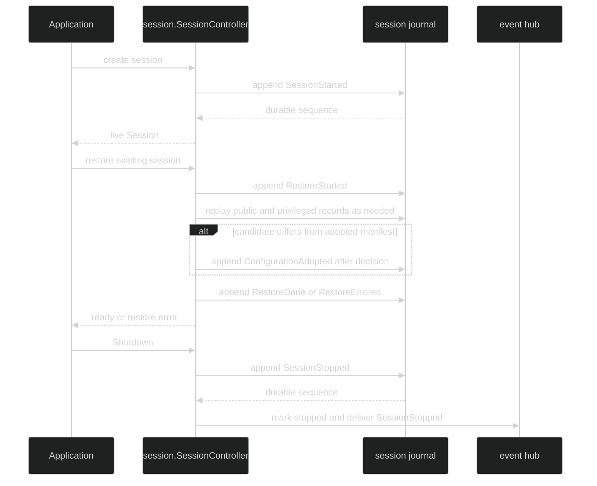

# Session lifecycle events

Session lifecycle events describe the durable boundary around one live
`session.Session`. They are all session-scoped and Enduring, except that the
hub's `SessionActive` and `SessionIdle` values are derived from activity
transitions. They are state transitions, not process notifications: a consumer
can reconstruct the session phase from the journal without observing every live
delta.

## The lifecycle values

```go
type SessionStarted struct {
	enduring
	sessionScoped
	Header
	Config   ConfigFingerprint `json:"config,omitzero"`
	Manifest ConfigManifest   `json:"manifest,omitzero"`
}

type SessionActive struct {
	enduring
	sessionScoped
	Header
}

type SessionIdle struct {
	enduring
	sessionScoped
	Header
}

type SessionStopped struct {
	enduring
	sessionScoped
	Header
}

type RestoreStarted struct {
	enduring
	sessionScoped
	Header
}

type RestoreDone struct {
	enduring
	sessionScoped
	Header
}

type RestoreErrored struct {
	enduring
	sessionScoped
	Header
	Err error `json:"-"`
}
```

The mixins are unexported source members, so consumers observe the methods on
`Event`, not the mixin names. Every value requires `Header.SessionID` and
requires `LoopID`, `TurnID`, and `StepID` to be zero. `EventID` is required on
every durable event. `SessionStarted.Config` is the legacy fingerprint and
`Manifest` is the richer additive configuration identity; both are populated
during the compatibility window when the runtime has both forms.

| Event | When it is authoritative | Ends turn | Visibility |
| --- | --- | --- | --- |
| `SessionStarted` | Primary loop actor starts the session | No | Public |
| `SessionActive` | Outstanding loop, hand-back, or blocking hustle changes the session from empty to non-empty | No | Public |
| `SessionIdle` | The active set becomes empty and the durable idle boundary commits | No | Public |
| `RestoreStarted` | Restore begins reading the session journal | No | Public |
| `ConfigurationAdopted` | A validated restore decision adopts a candidate manifest | No | Public |
| `RestoreDone` | Session topology and state are reconstructed and ready to resume | No | Public |
| `RestoreErrored` | Restore cannot complete | No | Public; the in-memory `Err` is projected when encoded |
| `WorkspaceCheckpointed`, `WorkspaceRestored` | Workspace pointer changes become durable | No | Public |
| `ActiveLoopChanged` | The session's selected loop changes | No | Public |
| `SessionStopped` | `SessionController.Shutdown` commits the stop transition | No | Public |

`SessionActive` and `SessionIdle` are derived by the hub, not by a loop
publisher. `SessionActive` is durable after the first activity insertion.
`SessionIdle` is durable before `WaitIdle` is woken. If the derived append
fails, the hub reports a `*hub.SessionPersistenceFault` and does not claim the
session is idle.

## Create, restore, and stop



The stop ordering matters. `Hub.StopSession` mints and appends
`SessionStopped` before changing in-memory phase to `SessionStopped`, waking
`WaitIdle`, or delivering the event. If the append fails, the phase is not
silently flipped. A concurrent stop is idempotent at the phase boundary; a
second durable record is absorbed by event identity deduplication when needed.

`SessionStopped` does not close ordinary subscriptions. Consumers decide when
to stop reading and call `Close`; a hub-forced stream loss remains observable
through `Subscription.Err`.

## Observe a session from the public contract

```go
func watchLifecycle(ctx context.Context, live session.Session) error {
	sub, err := live.SubscribeEvents(event.EventFilter{})
	if err != nil {
		return fmt.Errorf("subscribe lifecycle: %w", err)
	}
	defer sub.Close()

	for {
		select {
		case <-ctx.Done():
			return ctx.Err()
		case delivery, ok := <-sub.Events():
			if !ok {
				return sub.Err()
			}
			switch e := delivery.Event.(type) {
			case event.SessionStarted:
				log.Printf("session %s started at %d", e.SessionID, delivery.JournalSeq)
			case event.RestoreStarted:
				log.Printf("restore started")
			case event.ConfigurationAdopted:
				log.Printf("configuration epoch %d adopted by %s", e.Epoch, e.Source)
			case event.RestoreDone:
				log.Printf("restore done")
			case event.RestoreErrored:
				return fmt.Errorf("restore failed: %w", e.Err)
			case event.SessionStopped:
				return nil // the event is terminal for the session, not the channel
			}
		}
	}
}
```

The zero `EventFilter` still receives session-scoped Public events. It does
not receive loop-scoped lifecycle events such as `LoopStarted`; add an
Enduring `LoopScope` if the consumer needs those too. `SessionActive` and
`SessionIdle` carry only the session coordinates, and their `JournalSeq` values
are the sequence of the derived event itself.

## Restore, drift, and safe error projection

Restore replays the durable ledger in sequence order. The public event replayer
filters commands, fences, private gate-prepared records, and Internal event
visibility. Restore and catalog repair can use the privileged replayer to fold
the internal audit stream. A loop-narrowed event replay still includes all
session-scoped events plus the selected loop's events, so a loop's state does
not accidentally absorb another loop's history.

`ConfigurationAdopted` records the accepted epoch, the adopted fingerprint,
the manifest, bounded drift changes, source, actor, app version, and an
optional user message. `event.AssessDrift` classifies changes as `DriftInfo` or
`DriftWarn`; an opaque security-relevant change is Warn when direction is
unknown. The adoption event is appended under the restore lease after the
decision validates and before `RestoreDone`. It becomes the next restore
baseline.

`RestoreErrored.Err` is an in-memory typed cause and is tagged `json:"-"`.
When a durable failure event is encoded, the event codec projects it to a
stable kind and message. A decoded ordinary failure carries
`*event.RestoredError`; it does not become model-facing merely because its text
looks safe. Inspect the live error with `errors.As` before the event crosses a
presentation boundary.

## Source and proofs

- [`Session` and `SessionController`](https://github.com/looprig/harness/blob/main/pkg/session/session.go)
- [`SessionStarted` through workspace and loop lifecycle types](https://github.com/looprig/harness/blob/main/pkg/event/event.go)
- [`Hub.StopSession`, derived activity edges, and `WaitIdle`](https://github.com/looprig/harness/blob/main/pkg/hub/hub.go)
- [`session state edge derivation`](https://github.com/looprig/harness/blob/main/pkg/hub/state.go)
- [`configuration drift assessment`](https://github.com/looprig/harness/blob/main/pkg/event/drift.go) and [`restore error projection`](https://github.com/looprig/harness/blob/main/pkg/event/restored_error.go)
- [`header and lifecycle tests`](https://github.com/looprig/harness/blob/main/pkg/event/header_test.go), [`durable tap tests`](https://github.com/looprig/harness/blob/main/pkg/hub/durable_tap_test.go), and [`restore replay tests`](https://github.com/looprig/harness/blob/main/pkg/sessionstore/replay_test.go)

After the session boundary is clear, use [turn and Step events](/docs/guides/harness/events/turn-and-step) for work outcomes and [delegation events](/docs/guides/harness/events/delegation) for child-loop restore.
