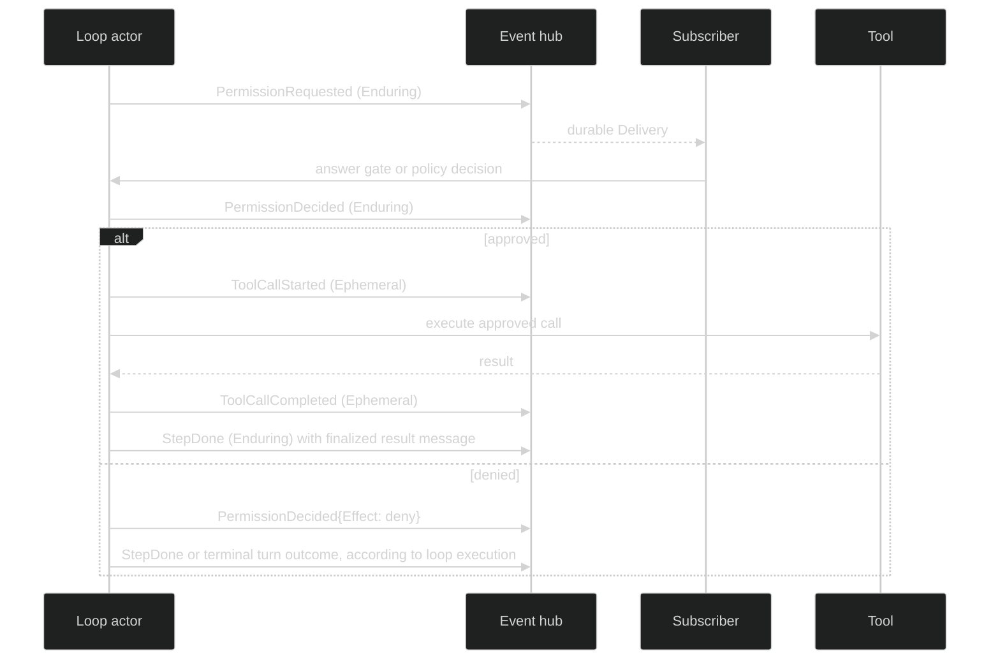

# Tool events

Tool events expose the boundary between a model Step and a tool execution. The
durable values describe approval requests and user-input requests; the live
Ephemeral values describe the start and finish of an approved call. The
authoritative Step record remains `StepDone`, which contains the finalized AI
message and tool results.

## Event shapes

```go
type PermissionDecisionEffect string
const (
	PermissionEffectApprove PermissionDecisionEffect = "approve"
	PermissionEffectDeny    PermissionDecisionEffect = "deny"
)

type PermissionRequested struct {
	enduring
	loopScoped
	Header
	ToolExecutionID uuid.UUID `json:"tool_execution_id,omitzero"`
	Request tool.Request `json:"-"`
	Preview *tool.MutationPreview `json:"-"` // live only; nil means no preview
}

type PermissionDecided struct {
	enduring
	loopScoped
	Header
	ToolExecutionID uuid.UUID `json:"tool_execution_id,omitzero"`
	Effect PermissionDecisionEffect `json:"effect,omitempty"`
	Reason string `json:"reason,omitempty"`
	Subject string `json:"subject,omitempty"`
	Audit string `json:"audit,omitempty"`
}

type UserInputRequested struct {
	enduring
	loopScoped
	Header
	ToolExecutionID uuid.UUID `json:"tool_execution_id,omitzero"`
	Question string `json:"question,omitempty"`
	Choices []string `json:"choices,omitempty"`
}

type ToolCallStarted struct {
	ephemeral
	loopScoped
	Header
	ToolExecutionID uuid.UUID `json:"tool_execution_id,omitzero"`
	ToolName string `json:"tool_name,omitempty"`
	Summary string `json:"summary,omitempty"`
}

type ToolCallCompleted struct {
	ephemeral
	loopScoped
	Header
	ToolExecutionID uuid.UUID `json:"tool_execution_id,omitzero"`
	IsError bool `json:"is_error,omitzero"`
	ResultPreview string `json:"result_preview,omitempty"`
}
```

All five values are loop-scoped and require the full Session, Loop, Turn, and
Step coordinate quartet. Each also requires a non-zero `ToolExecutionID`, the
stable join key for one call across approval, execution, and result displays.

| Event | Class | Durable | Payload purpose |
| --- | --- | --- | --- |
| `PermissionRequested` | Enduring | Yes | Typed prepared request for an interactive approval |
| `PermissionDecided` | Enduring | Yes | Redacted approve/deny outcome and audit summary |
| `UserInputRequested` | Enduring | Yes | Question and choices for a tool that needs free-form input |
| `ToolCallStarted` | Ephemeral | No | Capped name and summary when execution begins |
| `ToolCallCompleted` | Ephemeral | No | Capped result preview and error bit |

`PermissionRequested` is not a gate-open event. A gated permission is rendered
by `GateOpened` and closed by `GateResolved`; this event is the typed prepared
request delivered on the loop's per-turn stream. `PermissionDecided` excludes
the `ask` effect because a gated ask is represented by the gate lifecycle.

`Preview` shows a reviewer the pending file change. When the prepared call
implements `tool.MutationPreviewer`, the loop asks it for a
`tool.MutationPreview` (`Path`, `Creates`, and an opaque `UnifiedDiff`) while
opening the gate. The preview is never journaled, never sent to the model, and
never encoded, so a restored or replayed `PermissionRequested` has a nil
`Preview`. A nil value is normal for a non-mutating tool or a failed preview
attempt and is not an error.

## Approval and execution sequence



Only the Enduring values have journal sequences. A reconnecting UI may miss
the start or completion preview, then rebuild the durable state from
`PermissionRequested`, `PermissionDecided`, and `StepDone`. It must not infer
that a tool is still running merely because no Ephemeral completion arrived.

## Safety and validation

The durable request wire uses `tool.ValidateRequest` and a strict request
decoder. It carries the typed requirement and candidate descriptions, never
grant tokens or raw tool arguments. `PermissionDecided.Subject` and `Audit`
are summaries. `ToolCallStarted.Summary` and
`ToolCallCompleted.ResultPreview` are capped at construction and are for
presentation, not for replaying the call. When a loop retains a large result
durably, `StepDone.Captures` locates the full bytes; see
[tool-result capture](/docs/guides/harness/loop/tool-result-capture).

`event.ValidateEvent` rejects any of these events with missing
`ToolExecutionID`, missing step coordinates, invalid visibility, or malformed
body fields. `MarshalEvent` returns `*event.EventEncodeError` when the typed
request codec rejects a request. A malformed restored request fails closed; a
consumer must not fall back to untyped JSON or execute it.

## Observe tool activity

```go
func watchTools(ctx context.Context, live session.Session, loopID uuid.UUID) error {
	sub, err := live.SubscribeEvents(event.EventFilter{
		Ephemeral: event.LoopScope{
			Loops: map[uuid.UUID]struct{}{loopID: struct{}{}},
		},
		Enduring: event.LoopScope{
			Loops: map[uuid.UUID]struct{}{loopID: struct{}{}},
		},
	})
	if err != nil {
		return err
	}
	defer sub.Close()

	for delivery := range sub.Events() {
		switch e := delivery.Event.(type) {
		case event.PermissionRequested:
			log.Printf("approval requested for %s: %v", e.ToolExecutionID, e.Request)
		case event.PermissionDecided:
			log.Printf("tool %s decision %s at journal %d", e.ToolExecutionID, e.Effect, delivery.JournalSeq)
		case event.UserInputRequested:
			log.Printf("input requested for %s: %s (%d choices)", e.ToolExecutionID, e.Question, len(e.Choices))
		case event.ToolCallStarted:
			log.Printf("tool %s started: %s", e.ToolExecutionID, e.ToolName)
		case event.ToolCallCompleted:
			log.Printf("tool %s completed, error=%t: %s", e.ToolExecutionID, e.IsError, e.ResultPreview)
		}
	}
	if err := sub.Err(); err != nil {
		return err
	}
	return nil
}
```

The loop ID is part of the event header, while the tool execution ID is part of
the event body. Use both when a UI has more than one loop or when tool IDs may
be generated by different loop actors.

## Source and proofs

- [`PermissionRequested`, decision, user input, and tool lifecycle types`](https://github.com/looprig/harness/blob/main/pkg/event/tool.go)
- [`EventFilter` and public visibility filtering`](https://github.com/looprig/harness/blob/main/pkg/event/filter.go)
- [`Tool event identity/body validation`](https://github.com/looprig/harness/blob/main/pkg/event/validate.go)
- [`tool event codec and request projection`](https://github.com/looprig/harness/blob/main/pkg/event/marshal.go)
- [`tool event tests`](https://github.com/looprig/harness/blob/main/pkg/event/tool_test.go), [`permission/gate wire tests`](https://github.com/looprig/harness/blob/main/pkg/event/gate_wire_test.go), and [`hub subscription tests`](https://github.com/looprig/harness/blob/main/pkg/hub/hub_test.go)

For the approval boundary and the public answer path, continue to [gate and review events](/docs/guides/harness/events/gate-and-review). For the enclosing model work, see [turn and Step events](/docs/guides/harness/events/turn-and-step).
