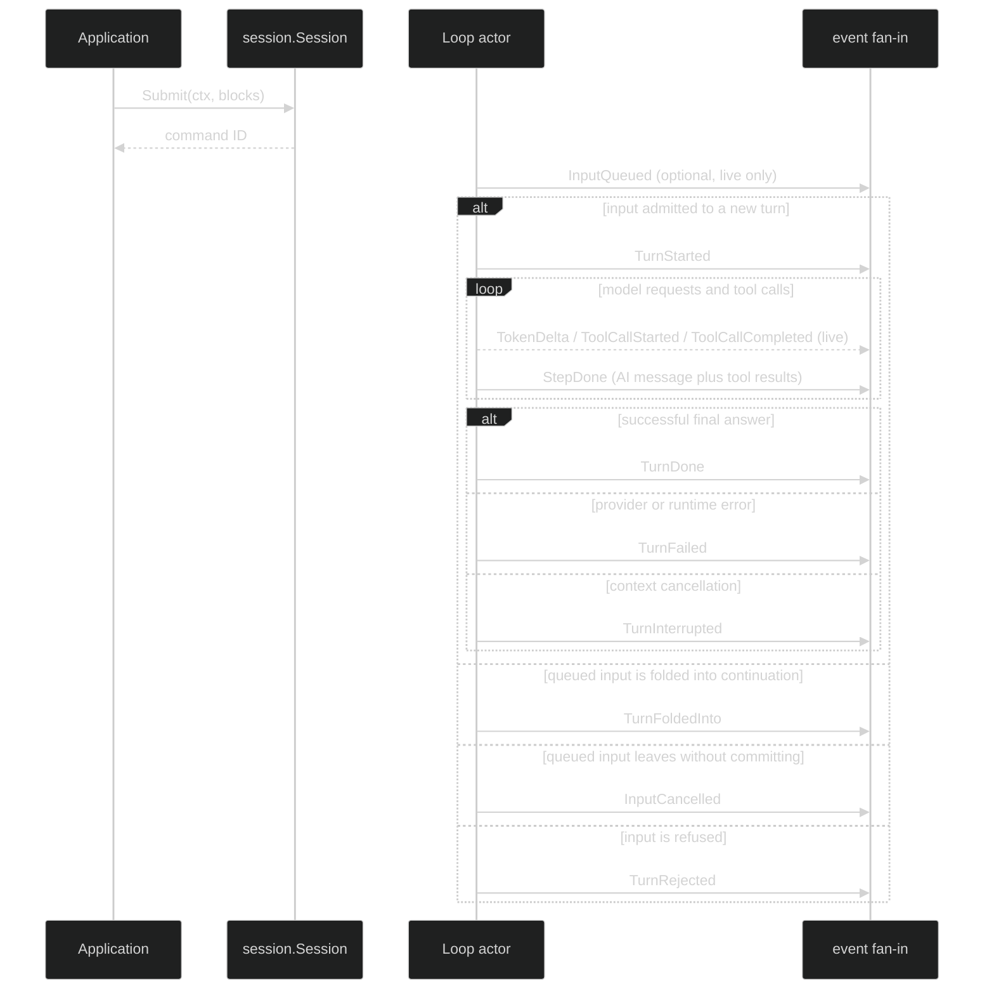

# Turn and Step events

Harness does not export a `Turn` or `Step` runtime object. The event stream is
the observation boundary. A Turn starts from one admitted input, may commit
one or more Steps, and ends at one exact terminal value. A Step is the model
request and tool-interaction unit inside that Turn.

## Exact event shapes

```go
type TurnStarted struct {
	enduring
	loopScoped
	Header
	TurnIndex TurnIndex            `json:"turn_index,omitzero"`
	Message   *content.UserMessage `json:"message,omitzero"`
}

type StepDone struct {
	enduring
	loopScoped
	Header
	Messages content.AgenticMessages `json:"messages,omitempty"`
}

type TurnFoldedInto struct {
	enduring
	loopScoped
	Header
	TurnIndex TurnIndex            `json:"turn_index,omitzero"`
	Message   *content.UserMessage `json:"message,omitzero"`
}

type InputCancelled struct {
	enduring
	loopScoped
	Header
	TurnIndex TurnIndex            `json:"turn_index,omitzero"`
	Reason    CancelReason         `json:"reason,omitzero"`
	Message   *content.UserMessage `json:"message,omitzero"`
}

type InputQueued struct {
	ephemeral
	loopScoped
	Header
}

type TurnRejected struct {
	enduring
	loopScoped
	Header
	Reason RejectReason `json:"reason,omitzero"`
}

type TokenDelta struct {
	ephemeral
	loopScoped
	Header
	TurnIndex TurnIndex
	Chunk content.Chunk `json:"-"`
}

type TurnDone struct {
	terminal
	loopScoped
	Header
	TurnIndex TurnIndex        `json:"turn_index,omitzero"`
	Message   *content.AIMessage `json:"message,omitzero"`
	Usage     content.Usage     `json:"usage,omitzero"`
}

type TurnFailed struct {
	terminal
	loopScoped
	Header
	TurnIndex TurnIndex `json:"turn_index,omitzero"`
	Err error `json:"-"`
}

type TurnInterrupted struct {
	terminal
	loopScoped
	Header
	TurnIndex TurnIndex `json:"turn_index,omitzero"`
}
```

The source has no `StepStarted`, `StepFailed`, `TurnCompleted`, or
`TurnCanceled` event. Do not synthesize those names in a consumer. A model or
tool failure is represented by the terminal `TurnFailed`; cancellation of the
turn context is `TurnInterrupted`. A completed step is represented by the
authoritative `StepDone` group, not by a pair of start/end guesses.

| Value | Class | Scope | Visibility | `EndsTurn()` | Durable? |
| --- | --- | --- | --- | --- | --- |
| `InputQueued` | Ephemeral | Loop | Public | false | No |
| `TurnStarted` | Enduring | Loop | Public | false | Yes |
| `StepDone` | Enduring | Loop | Public | false | Yes |
| `TokenDelta` | Ephemeral | Loop | Public | false | No |
| `TurnFoldedInto` | Enduring | Loop | Public | false | Yes |
| `InputCancelled` | Enduring | Loop | Public | false | Yes |
| `TurnRejected` | Enduring | Loop | Public | false | Yes |
| `TurnDone` | Enduring via `terminal` | Loop | Public | true | Yes |
| `TurnFailed` | Enduring via `terminal` | Loop | Public | true | Yes |
| `TurnInterrupted` | Enduring via `terminal` | Loop | Public | true | Yes |

## Turn and Step sequence



`StepDone` is emitted only when the finalized group is committed. Its
`Messages` contains the step's single AI message followed by its tool-result
messages. The step's `Header` carries all four coordinates, so a consumer can
group multiple `StepDone` values under one `TurnID` without relying on timing.
`TokenDelta` and tool lifecycle events carry the same Step identity while live,
but their absence after reconnect is normal.

## Admission replies and command correlation

The submit command ID is carried in `Header.Cause.CommandID` on the input
resolution events. All five of these satisfy `event.Reply`:

| Reply event | Class | Meaning |
| --- | --- | --- |
| `InputQueued` | Ephemeral | Input reached the loop inbox and awaits turn assignment |
| `TurnStarted` | Enduring | Input became the first message of a new turn |
| `TurnFoldedInto` | Enduring | Input became a mandatory tool-continuation message |
| `InputCancelled` | Enduring | Input left the queue without committing |
| `TurnRejected` | Enduring | Input was refused because the queue is full, shutdown is in progress, or a transient internal failure occurred |

`event.ReplyTo()` returns exactly that command ID. `TurnStarted` and
`TurnFoldedInto` carry the submitted `UserMessage`; `InputCancelled` carries
the returned message and a `CancelReason` (`CancelClientRetracted`,
`CancelTurnInterrupted`, or `CancelTurnFailed`). `TurnRejected.Reason` is one
of `RejectQueueFull`, `RejectShuttingDown`, or `RejectInternal`; the zero
`RejectUnspecified` value is a sentinel, not a produced decision.

## Observe one submitted input

Subscribe before submitting when the caller must see the earliest live reply.
The durable terminal is still recoverable from the journal if a subscriber
connects later.

```go
func runTurn(ctx context.Context, live session.Session, blocks []content.Block) error {
	sub, err := live.SubscribeEvents(event.EventFilter{
		Enduring: event.LoopScope{All: true},
		Ephemeral: event.LoopScope{All: true},
	})
	if err != nil {
		return err
	}
	defer sub.Close()

	commandID, err := live.Submit(ctx, blocks)
	if err != nil {
		return fmt.Errorf("submit: %w", err)
	}
	for {
		select {
		case <-ctx.Done():
			return ctx.Err()
		case delivery, ok := <-sub.Events():
			if !ok {
				return sub.Err()
			}
			ev := delivery.Event
			if reply, ok := ev.(event.Reply); ok && reply.ReplyTo() == commandID {
				switch reply.(type) {
				case event.TurnRejected, event.InputCancelled:
					return fmt.Errorf("input did not start a turn: %T", reply)
				}
			}
			switch e := ev.(type) {
			case event.TurnDone:
				return nil
			case event.TurnFailed:
				return fmt.Errorf("turn failed: %w", e.Err)
			case event.TurnInterrupted:
				return context.Canceled
			}
		}
	}
}
```

The example watches every loop because `Session.Submit` targets the active
loop, which can change independently. A loop-specific observer can set
`Enduring.Loops` and `Ephemeral.Loops` to the selected loop ID.

## Validation and failure semantics

`event.ValidateEvent` rejects a turn event with missing coordinates or a Step
event whose `StepID` is zero. `TurnDone.Usage` must pass the content usage
validator. `TurnFailed.Err` is available to the live caller for `errors.As`; it
does not serialize as a Go error value. On durable replay the codec returns a
typed `*event.RestoredError` with stable `Kind` values such as
`empty_response`, `tool_limit`, `turn_panic`, or `unknown`.

`TurnDone`, `TurnFailed`, and `TurnInterrupted` are Enduring, so the hub appends
them before delivery and gives them a non-zero `JournalSeq`. An Ephemeral
stream gap never changes the authoritative outcome. An Enduring append or
subscription loss must be handled as a persistence/resynchronization error.

## Source and proofs

- [`Turn`, Step, admission, and terminal structs](https://github.com/looprig/harness/blob/main/pkg/event/turn.go)
- [`Event`, Reply, classes, and header](https://github.com/looprig/harness/blob/main/pkg/event/event.go)
- [`Turn identity validation`](https://github.com/looprig/harness/blob/main/pkg/event/validate.go) and [`restore error types`](https://github.com/looprig/harness/blob/main/pkg/event/restored_error.go)
- [`Turn event and header tests`](https://github.com/looprig/harness/blob/main/pkg/event/header_test.go), [`codec tests`](https://github.com/looprig/harness/blob/main/pkg/event/marshal_test.go), and [`turn-start hub tests`](https://github.com/looprig/harness/blob/main/pkg/hub/turn_start_test.go)

Pair this sequence with [tool events](/docs/guides/harness/events/tool-events), [gate and review events](/docs/guides/harness/events/gate-and-review), and the [event envelope](/docs/guides/harness/events/event-envelope).
