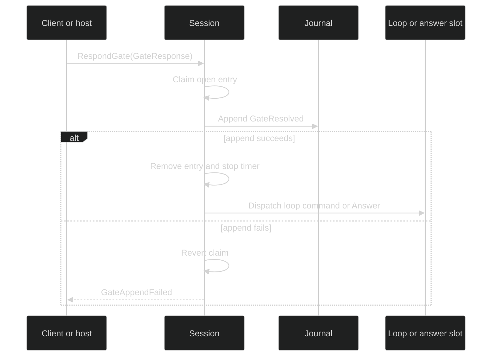

# Approval gates

## Responses

`gate.ResponseRequest` is `{Action string; Values map[string]json.RawMessage}`. `gate.GateResponse` adds `{GateID gate.ID; Action string; Values map[string]json.RawMessage; Source gate.ResponseSource}`. `ResponseSource` is `{Kind ResponseSourceKind; Reason string}`, where the exact `ResponseSourceKind` values are `ResponseFromUser`, `ResponseFromPolicy`, `ResponseFromModel`, and `ResponseFromClassifier`.

`gate.Answer` is the live-only host result: `{GateID gate.ID; Action string; Values map[string]string; Source ResponseSource}`. It has no JSON codec. Form values are present only in this live answer and in the bounded durable form audit; they are not returned as an unvalidated prompt projection.

## Actions

Permission approval actions are exact, case-sensitive strings:

| Constant | String |
| --- | --- |
| `ApprovalApprove` | `"Approve"` |
| `ApprovalApproveAlwaysWorkspace` | `"Approve always for this workspace"` |
| `ApprovalDeny` | `"Deny"` |

`ParseApprovalAction` accepts only those values. `DecodeApprovalAction` strictly rejects null, unknown fields, duplicate keys, trailing JSON, and unknown actions with `*gate.ApprovalActionDecodeError`. `ApprovalControls` returns exactly those three controls. There is no session-global approval, persistent deny action, or second prompt for the same prepared request.

## Loop routing

`Session.RespondGate(ctx, response)` is the public response path. Permission and ask-user gates are loop-owned: the session validates the action against the gate's controls, builds the corresponding command for the private `gate.Route.LoopID`, and delivers it only after the durable resolve has committed. A response with `Source.Kind == gate.ResponseFromClassifier` is rejected before locking; classifier responses can be produced only by the private review adapter and can only carry `ApprovalApprove`.

```go
package main

import (
    "context"

    "github.com/looprig/harness/pkg/gate"
    "github.com/looprig/harness/pkg/session"
)

func answerPermission(ctx context.Context, controller session.SessionController, id gate.ID) error {
    return controller.RespondGate(ctx, gate.GateResponse{
        GateID: id,
        Action: string(gate.ApprovalApprove),
        Source: gate.ResponseSource{Kind: gate.ResponseFromUser, Reason: "operator approved"},
    })
}
```

The route is owned by the session. A client supplies only the gate ID, action, values, and source; it cannot supply a loop route or grant token.

## Host routing

`session.GateHost` is the host-owned contract:

```go
type GateHost interface {
    OpenHostGate(context.Context, uuid.UUID, gate.Gate, gate.Payload) (gate.ID, error)
    AwaitGateAnswer(context.Context, gate.ID) (gate.Answer, error)
    CloseGate(context.Context, gate.ID, gate.CloseReason) error
}
```

Only `KindForm` and `KindOpenURL` with `ResolverSession` qualify. `OpenHostGate` validates the kind/payload pair, derives the trusted schema or origin onto `Gate.Prompt`, prepares and activates the gate, and returns a public ID. The opener must then await or close it. A canceled await frees the live slot but does not close durable state; the opener must call `CloseGate` if it gives up.

## Admitted gate responses

A Host that receives answers through a durable command inbox applies each one as a runtime command of kind `runtimecommand.KindGateResponse` instead of calling `RespondGate` directly. `runtimecommand.Admitted.GateResponse` carries the answer and is required for this kind, as is a non-empty `AttemptID`. The answer goes through the same path as `RespondGate`, so every refusal applies, including the rejection of classifier provenance. The admitted `RuntimeCommandID` is used as the translated command ID and stamped on `GateResolved.Cause.CommandID`, so a successor can find an answer that became durable before its disposition was written.

| Result of the answer | Recorded disposition |
| --- | --- |
| Resolved | `DispositionApplied` |
| Gate absent or not ready (`GateNotFound`, `GateNotReady`) | `DispositionNoOp` |
| Any other refusal or append failure | `DispositionRefused` |

Once a journal holds any `gate_response` application, harness v0.34.0 and older refuse to replay it, so do not roll a runtime back below v0.35.0.

## Mutation previews

A tool whose prepared artifact implements `tool.MutationPreviewer` can show the pending change at a permission gate. `MutationPreview() (tool.MutationPreview, bool)` returns `{Path string; Creates bool; UnifiedDiff string}` and is called once, when the gate is about to open, never during `PrepareCall`. A false result means no preview and must not change the request, result, or error the model sees. Harness treats `UnifiedDiff` as opaque, so bounding it is the tool's responsibility.

The preview reaches renderers as `event.PermissionRequested.Preview`, which is live only: it is never journaled, never sent on a wire, and never shown to the model. A nil preview is normal, and a restored session never carries one. When permission review is configured, the same diff is added to the classifier's review context as a `tool_preview` entry; see [Permission review](/docs/guides/harness/gates/permission-review).

## Durable-first



`GateNotFound` means no directory entry exists; `GateNotReady` means it is preparing, claiming, or already closed; `GateActionInvalid` means the action or source is not legal for the envelope; `GateKindMismatch` means the payload/owner contract does not match; `GateAppendFailed` wraps the durable failure. These are `*session.GateError` values and should be classified with `errors.As`.

See [`pkg/gate/response.go`](https://github.com/looprig/harness/blob/main/pkg/gate/response.go), [`pkg/session/session.go`](https://github.com/looprig/harness/blob/main/pkg/session/session.go), and the route proofs in [`internal/sessionruntime/gates_route_e2e_test.go`](https://github.com/looprig/harness/blob/main/internal/sessionruntime/gates_route_e2e_test.go).

## Source and proof

- [`gate` response types](https://github.com/looprig/harness/blob/main/pkg/gate/response.go)
- [`Session.RespondGate`](https://github.com/looprig/harness/blob/main/pkg/session/session.go)
- [`durable-first route tests`](https://github.com/looprig/harness/blob/main/internal/sessionruntime/gates_route_e2e_test.go)
