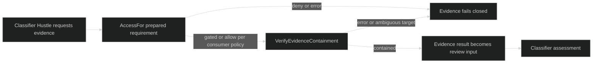
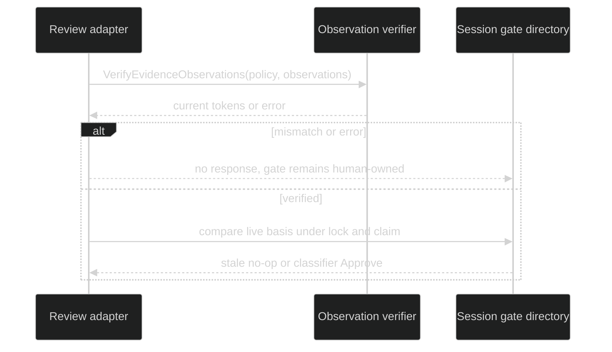

# Evidence gates

Evidence is a read-only input to permission review, not an alternate approval path. Harness asks the consumer to supply the access and containment seams because the consumer owns the effective access profile, canonical workspace root, and security posture. The evidence runtime receives no session controller, gate response method, mutation capability, grant issuer, stored-rule writer, or loop-control handle.

## Access boundary

`gate.EvidenceAccessEvaluator` is:

```go
type EvidenceAccessEvaluator interface {
    AccessFor(tool.Requirement) (uint8, error)
}
```

The returned value must use the access ABI `AccessDeny`, `AccessGated`, or `AccessAllow`. This seam evaluates a prepared evidence requirement without opening a human gate. `gate.AccessBindings` satisfies it, but a consumer may implement it directly. A missing or failing access decision is fail closed.

## Containment boundary

`gate.EvidenceContainmentPolicy` is `{ReadRoot string; SecurityCeiling string}`. `gate.EvidenceContainmentVerifier` is:

```go
type EvidenceContainmentVerifier interface {
    VerifyEvidenceContainment(context.Context, EvidenceContainmentPolicy, tool.Request) error
}
```

The verifier must independently resolve every prepared evidence target, including symlinks and ambiguous scopes, under the canonical read root and the review's own security ceiling. It receives a defensive clone of the normalized request. A verifier error prevents the evidence operation and therefore prevents a classifier result from becoming eligible. Harness does not canonicalize paths or infer the consumer's access profile.



## Observations

Target-sensitive evidence can record `gate.ObservationRequirement{Target string; Token string}`. `Target` is the verifier-defined canonical identity and `Token` is an opaque proof of observed state. Harness does not interpret either value. `Valid()` requires non-empty valid UTF-8, no NUL, and limits of 4 KiB per target and token. An assessment can carry at most 256 requirements.

`gate.EvidenceObservationVerifier` is the pre-approval TOCTOU seam:

```go
type EvidenceObservationVerifier interface {
    VerifyEvidenceObservations(context.Context, EvidenceContainmentPolicy, []ObservationRequirement) error
}
```

It receives the same read root and security ceiling and must independently re-derive each current token. A mismatch, ambiguous target, verifier error, or nil verifier when observations exist makes the classifier response stale and leaves the human gate open. No observation check grants authority or changes the durable rule store.

## Recheck

The session runs observation verification synchronously outside its gate mutex because consumer verification may perform I/O. It then compares the trusted tool execution, context revision, security ceiling, and gate policy revision under the gate mutex while claiming the gate. This leaves only the small gap between I/O completion and the claim; normal containment and enforcement checks remain mandatory.



## Configuration

`rig.WithPermissionReviewEvidence(access, containment, allowedKinds)` requires non-nil access and containment collaborators and a non-empty kind allowlist. A classifier definition that requires evidence must have this option; supplying it without a classifier that needs evidence is rejected. `rig.WithPermissionReviewSecurityCeiling(ceiling)` is also required whenever permission classifiers are configured and rejects an empty ceiling. `rig.WithPermissionReviewObservations(verifier)` is optional, but supplying it without classifiers is rejected. These options are singleton definition options and return typed `*rig.DefinitionError` values on invalid, missing, or unused configuration.

The public seams are in [`pkg/gate/evidence.go`](https://github.com/looprig/harness/blob/main/pkg/gate/evidence.go) and [`pkg/gate/observation.go`](https://github.com/looprig/harness/blob/main/pkg/gate/observation.go). The live boundary is exercised by [`internal/hustleruntime/evidence_boundary_test.go`](https://github.com/looprig/harness/blob/main/internal/hustleruntime/evidence_boundary_test.go), [`internal/hustleruntime/evidence_runner_test.go`](https://github.com/looprig/harness/blob/main/internal/hustleruntime/evidence_runner_test.go), and the observation TOCTOU proof in [`internal/hustleruntime/observation_collector_test.go`](https://github.com/looprig/harness/blob/main/internal/hustleruntime/observation_collector_test.go).

## Source and proof

- [`EvidenceAccessEvaluator`](https://github.com/looprig/harness/blob/main/pkg/gate/evidence.go)
- [`evidence runner boundary tests`](https://github.com/looprig/harness/blob/main/internal/hustleruntime/evidence_boundary_test.go)
- [`observation recheck tests`](https://github.com/looprig/harness/blob/main/internal/hustleruntime/observation_collector_test.go)
