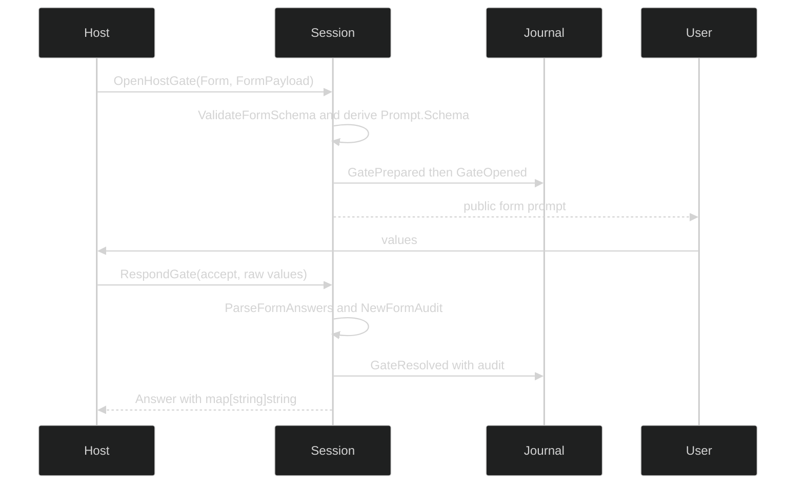

# Form gates

## Schema

The form schema uses the public prompt types:

| Type | Fields |
| --- | --- |
| `PromptSchema` | `Fields []Field` |
| `Field` | `Name`, `Label string`; `Kind FieldKind`; `Required bool`; `Options []Option`; `Default json.RawMessage` |
| `Option` | `Value`, `Label string` |
| `FieldKind` | `FieldText`, `FieldSelect`, `FieldMultiSelect`, `FieldConfirm` |
| `FormPayload` | `Title`, `Body string`; `Schema PromptSchema` |

`ValidateFormSchema` accepts a non-empty schema with at most 32 fields, names at most 128 bytes, unique names, and valid answerable kinds. `FieldSelect` needs 1 to 64 options with non-empty values and no other field kind may carry options. `FieldMultiSelect` is a valid generic prompt field but is rejected for `FormPayload`: the live answer type is `map[string]string`, so silently inventing a separator would be ambiguous.

Form actions are exact lower-case constants: `FormActionAccept = "accept"`, `FormActionDecline = "decline"`, and `FormActionCancel = "cancel"`.

## Answers

`ParseFormAnswers(schema, values)` is strict in both directions. Every submitted key must name a schema field; every required field must be present; text and select values must be JSON strings; confirm values must be JSON booleans; values are capped at 4096 bytes; and select values must be declared options. Confirm values normalize to the strings `"true"` and `"false"`. Decline and cancel carry no answer values.

```go
package main

import (
    "encoding/json"

    "github.com/looprig/harness/pkg/gate"
)

func parse(values map[string]json.RawMessage) (map[string]string, error) {
    schema := gate.PromptSchema{Fields: []gate.Field{
        {Name: "environment", Kind: gate.FieldSelect, Required: true,
            Options: []gate.Option{{Value: "staging", Label: "Staging"}}},
        {Name: "confirm", Kind: gate.FieldConfirm, Required: true},
    }}
    return gate.ParseFormAnswers(schema, values)
}
```

`*gate.FormSchemaError` kinds are `FormSchemaEmpty`, `FormSchemaTooManyFields`, `FormSchemaFieldNameEmpty`, `FormSchemaFieldNameTooLong`, `FormSchemaFieldNameDuplicate`, `FormSchemaFieldKindUnsupported`, and `FormSchemaFieldOptionsInvalid`. `*gate.FormAnswerError` kinds are `FormAnswerUnknownField`, `FormAnswerMissingRequired`, `FormAnswerTypeInvalid`, `FormAnswerTooLong`, and `FormAnswerOptionNotAllowed`.

## Audit

`gate.FormAudit` is the durable answer projection. `NewFormAudit(schema, answers)` walks the schema, not an arbitrary answers map, so undeclared keys cannot enter an audit. `ValidateFormAuditBounds` repeats the limits at the record boundary: at most 32 values, names at most 128 bytes, and values at most 4096 bytes. Its typed kinds are `FormAuditTooManyValues`, `FormAuditFieldNameTooLong`, and `FormAuditValueTooLong`.

The schema is authoritative for validation; `Gate.Prompt.Schema` is a renderer projection. `OpenHostGate` derives that projection from the validated `FormPayload`, so a host cannot show one schema and validate another. `GateResolved` carries the bounded audit, while the live `gate.Answer.Values` gives the opener the parsed strings.

## Host flow



If a host times out, it can use a policy response template with `FormActionDecline` or `FormActionCancel`; a `PolicyRespond` template must include a positive timeout and action. A canceled await does not close durable state, so the host must call `CloseGate` when it abandons the form.

## Failures

Malformed schemas and answers return the typed errors above. A payload kind mismatch, failed schema validation, or a form gate with `ResolverLoop` is a `*session.GateError{Kind: GateKindMismatch}` before a prompt is made public. A failed `GateResolved` append returns `GateAppendFailed` and leaves the gate answerable. Use `errors.As` to distinguish schema, answer, audit, and session failures.

See [`pkg/gate/form.go`](https://github.com/looprig/harness/blob/main/pkg/gate/form.go), [`pkg/gate/response_audit.go`](https://github.com/looprig/harness/blob/main/pkg/gate/response_audit.go), and form routing tests [`internal/sessionruntime/gates_form_test.go`](https://github.com/looprig/harness/blob/main/internal/sessionruntime/gates_form_test.go).

## Source and proof

- [`Form` schema and validation](https://github.com/looprig/harness/blob/main/pkg/gate/form.go)
- [`form response audit`](https://github.com/looprig/harness/blob/main/pkg/gate/response_audit.go)
- [`form gate routing tests`](https://github.com/looprig/harness/blob/main/internal/sessionruntime/gates_form_test.go)
