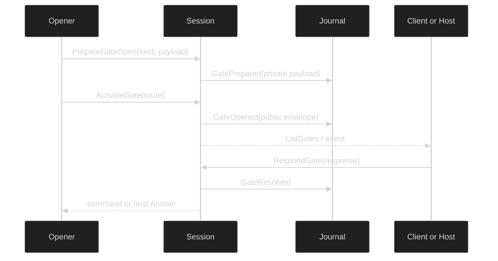

# Overview

A gate is a durable, typed pause at an effect boundary. The public `gate.Gate` envelope tells a renderer what is waiting and where its answer belongs. The private `gate.Payload` records the authoritative request used for validation. The session owns the gate directory and durable transitions; an opener owns only the capability explicitly given to it.

## Envelope

`gate.Gate` has these exact fields:

| Field | Type | Meaning |
| --- | --- | --- |
| `ID` | `gate.ID` alias of `uuid.UUID` | Session-minted identity. |
| `Kind` | `gate.Kind` | `KindPermission`, `KindAskUser`, `KindForm`, or `KindOpenURL`. |
| `Resolver` | `gate.ResolverKind` | `ResolverLoop` or `ResolverSession`. |
| `Blocks` | `gate.Blocks` | `BlocksToolCall` or `BlocksSession`. |
| `Effect` | `gate.Effect` | `EffectResume`, `EffectInitiate`, or `EffectControl`. |
| `Criticality` | `gate.Criticality` | `GateCritical` or `GateNonCritical`. |
| `Subject` | `gate.Subject` | `ToolExecutionID`, `ToolUseID`, `TurnID`, `StepID`, and `InputID` identities. |
| `Prompt` | `gate.Prompt` | Title, body, trusted origin/schema projection, and controls. |
| `ResponsePolicy` | `gate.ResponsePolicy` | Timeout behavior and response template. |
| `Restorable` | `bool` | Whether the gate is eligible for restore. Open-URL gates must be false. |

`gate.Route` carries `GateID`, `LoopID`, and `ToolExecutionID` for response delivery. A route is session-private. `Subject` identifies what the gate is about; it is not permission authority and does not authorize a caller to invent a route.

## Payload union

`gate.Payload` is a sealed interface. `MarshalPayload` and `UnmarshalPayload` use a strict `{kind,data}` wrapper with these variants:

| Variant | Fields | Durable rule |
| --- | --- | --- |
| `OpenPayload` | `GateID`, nested `Payload` | Private prepare record wrapper. |
| `PermissionPayload` | `Request tool.Request` | Request is validated at both codec boundaries and contains no grant token. |
| `AskUserPayload` | `Question string`, `Choices []string` | Explicit question and optional fixed choices. |
| `ResumeInputPayload` | `InputID uuid.UUID`, `Preview string` | Resume input identity and bounded preview. |
| `FormPayload` | `Title`, `Body string`; `Schema PromptSchema` | Schema is validated by `ValidateFormSchema`; answer audit is bounded. |
| `OpenURLPayload` | `DisplayOrigin`, `URL`, `RequiresCompletion` | `URL` is `json:"-"` and omitted by a separate durable encoder; decoded URLs are always empty. |

Unknown kinds, nil payloads, malformed wrappers, duplicate JSON keys, trailing JSON, and payload invariant failures return typed errors such as `*UnknownPayloadKindError`, `*NilPayloadError`, `*PayloadEncodeError`, `*PayloadDecodeError`, and `*RequestDecodeError`. The payload, not a caller-supplied prompt projection, is the source for form schemas and open-URL origins.

## Ownership

| Gate family | Normal owner | How it resolves | Authority deliberately absent |
| --- | --- | --- | --- |
| Permission | Loop | `Session.RespondGate` translates the exact approval action to the parked loop. | A host cannot mint an approval against another loop. |
| Ask-user | Loop | `Session.RespondGate` translates the answer to loop input. | No host opening API. |
| Form | Session host | `session.GateHost.OpenHostGate`, then `AwaitGateAnswer` or `CloseGate`. | No tool grant or loop route. |
| Open URL | Session host | Host receives a live completion answer; action URL never becomes durable. | Cannot be restorable or exposed in `Prompt.Origin`. |

`session.GateHost` is separate from `session.SessionController`. Its opener must call `AwaitGateAnswer` or `CloseGate`; abandoning both leaks the live answer slot. A public `GateResponse` may identify its source as user, policy, model, or classifier, but `ResponseFromClassifier` is rejected by `Session.RespondGate`; only the private permission-review path can construct that provenance.

## Lifecycle

Loop-owned gates use two durable phases so the loop can install its blocker before the prompt becomes visible. The session first appends a private `GatePreparedRecord`, then `ActivateGate` appends public `GateOpened` and makes the gate listable. A host-owned open combines those phases because `OpenHostGate` installs the answer slot before activation.

`RespondGate` is durable-first: it claims the open entry, appends `GateResolved`, removes the entry, then delivers a loop command or host answer. If the append fails, the claim is reverted and the gate remains answerable. `CloseGate` follows the same durable-first rule for public gates; a still-preparing entry is removed without a public close event.

## Limits and errors

`sessionruntime.GateCaps` has `MaxOpen int` and `MaxTimeout time.Duration`; `rig.WithGateCaps(caps)` installs the option. `MaxOpen` counts preparing, open, and claiming entries, and zero means unlimited. A timeout above `MaxTimeout` or a full directory returns `*session.GateError{Kind: session.GateCapacity}`.

`session.GateError` has `GateID gate.ID`, `Kind session.GateErrorKind`, and `Cause error`. Its kinds are `GateNotFound`, `GateNotReady`, `GateKindMismatch`, `GateActionInvalid`, `GateCapacity`, and `GateAppendFailed`. Gate validation adds `*gate.GateValidationError` for `GateRestorableNotAllowed` and `GateOriginInvalid`. Use `errors.As` rather than string matching.

The public envelope and payload codecs live in [`pkg/gate`](https://github.com/looprig/harness/tree/main/pkg/gate); session ownership is implemented in [`internal/sessionruntime/gates.go`](https://github.com/looprig/harness/blob/main/internal/sessionruntime/gates.go) and exposed through [`pkg/session/session.go`](https://github.com/looprig/harness/blob/main/pkg/session/session.go).

## Source and proof

- [`gate` envelope and payload package](https://github.com/looprig/harness/tree/main/pkg/gate)
- [`session gate ownership`](https://github.com/looprig/harness/blob/main/internal/sessionruntime/gates.go)
- [`policy` runnable fixture](https://github.com/looprig/harness/blob/main/examples/policy/example_test.go)
