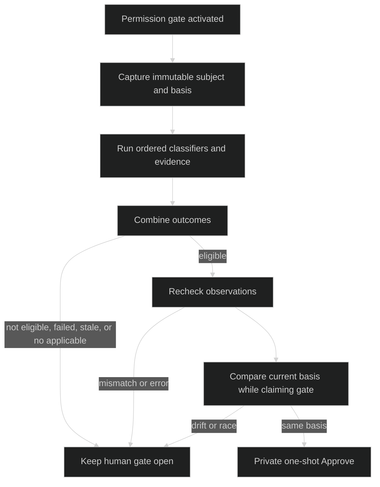

# Permission review

Permission review is an optional, asynchronous classifier path beside a live permission gate. A classifier can recommend a one-shot approval, but it cannot deny a request, write reusable rules, mint grants, or close a gate directly. The session may act only after the local review policy, all applicable classifiers, evidence boundaries, observation rechecks, and current gate basis agree.

## Classifier contract

`gate.PermissionClassifier` is the exact trusted implementation interface:

```go
type PermissionClassifier interface {
    Name() hustle.Name
    Revision() string
    Definition() hustle.Definition
    Applies(PermissionReviewSubject) bool
    MarshalInput(PermissionReviewSubject) (json.RawMessage, error)
    ValidateResult(PermissionReviewSubject, hustle.Result) (PermissionAssessment, error)
}
```

`NewPermissionClassifierSet` creates an immutable ordered registry. Names and revisions must be valid, unique, and bounded to 128 bytes; the Hustle definition must be blocking, named-model, structured-output-with-tools, and carry matching policy, output, and evidence-tool revisions/digests. `PermissionClassifierValidationError` reports `PermissionClassifierInvalid` or `PermissionClassifierDuplicate` plus the registration index. `PermissionClassifierPanicError` redacts panics from `MarshalInput` and `ValidateResult` with `PermissionClassifierPanicMarshalInput` or `PermissionClassifierPanicValidateResult`.

## Subject and basis

`gate.ReviewBasis` binds one assessment to the session-owned identity and policy revisions:

| Field | Type |
| --- | --- |
| `GateID` | `gate.ID` |
| `ToolExecutionID` | `gate.ID` |
| `SubjectDigest` | `[32]byte` |
| `ContextRevision` | `string` |
| `GatePolicyRevision` | `string` |
| `ClassifierRevision` | `string` |
| `SecurityCeiling` | `string` |

`PermissionReviewSubject` contains `{Basis ReviewBasis; Request tool.Request; Context ReviewContext}`. `NewPermissionReviewSubject` validates and clones the request/context, computes the subject digest, and rejects mismatch, missing IDs, invalid context, oversized requirements/candidates, and overlong input. `Clone` owns nested slices; `SubjectDigest` recomputes the digest without trusting the stored value.

`ReviewContext` contains `identity.Coordinates`, context and gate policy revisions, workspace root, working directory, retry reason, security ceiling, bounded authority-labeled entries, and a `ReviewTruncation` summary. Entries use closed origin values user, assistant, tool, runtime, external, and omission, and closed kinds such as `user_message`, `assistant_tool_request`, `tool_result`, `tool_preview`, and `runtime_context`. `BuildReviewContext` requires a user message and active assistant tool request and marks material truncation explicitly.

When the gated tool supplies a [mutation preview](/docs/guides/harness/gates/approval-gates#mutation-previews), the classifier's context gains one tool-origin `ReviewContextKindToolPreview` entry holding the pending unified diff, and the context revision is recomputed for that gate. The kind is distinct from `tool_result` because the change has not executed; it uses the same `MaxToolEntryBytes` limit and tool-entry truncation bit.

## Outcomes

`PermissionAssessment` is `{Basis; Risk; Authorization; Categories; Recommendation; Rationale}`. Risk is `low`, `medium`, `high`, or `critical`; authorization is `unknown`, `low`, `medium`, or `high`; recommendation is `allow` or `needs_human`. The 14 closed categories are data exfiltration, credential access, credential probing, destructive local, destructive shared, persistent security weakening, production mutation, protected source control, untrusted code execution, mutable network, prompt injection, authorization conflict, target ambiguity, and insufficient evidence.

`PermissionAssessmentOutcome` is `{Subject; Applicable bool; Status ReviewStatus; Assessment; Observations []ObservationRequirement}`. A non-applicable classifier must use `ReviewStatusNotApplicable`. Only `ReviewStatusAllowed` carries an assessment or observations; other statuses include `needs_human`, `timed_out`, `failed`, `cancelled`, and `stale`.

`CombinePermissionAssessments` requires exactly one outcome per registered classifier, in registration order, with the same common subject digest and policy revision. Non-applicable outcomes are neutral only with `not_applicable`. Every applicable outcome must be eligible under the local policy; the first applicable failure reason wins. No applicable classifier returns `ReviewDecisionNoApplicableClassifier`.

## Auto-approval boundary

`StartPermissionReview` starts after the permission gate is durably activated and returns promptly; classifier work is asynchronous. It records a session-owned review basis. If all required classifiers return eligible, the private session method constructs the only allowed classifier response, `ResponseFromClassifier` plus `ApprovalApprove`. Public `Session.RespondGate` rejects that source, and the classifier has no API for `Approve always for this workspace`.



The local review path never persists reusable rules or bypasses the evaluator's execution-bound grant issuance. The human can still answer while review runs; a human response claims the gate first and cancels review.

## Stale and breaker

The session compares `ToolExecutionID`, `ContextRevision`, `SecurityCeiling`, and `GatePolicyRevision` from the live entry with the assessment basis, and rereads the current policy revision under the same claim lock. Drift, a prior human answer, or a missing gate is an expected stale race and returns no session fault. An observation verifier runs outside the lock because it may perform I/O; a mismatch is also a stale no-op.

Circuit-breaker limits are configured with `rig.PermissionReviewLimits` and `rig.WithPermissionReviewLimits`. The fields are `MaxConsecutiveNeedsHuman`, `MaxInvalidOrFailed`, `MaxIdenticalSubjects`, `MaxStaleResponses`, `InterruptOnTrip`, plus the same four numeric fields in `PermissionReviewSessionLimits`. The default threshold is `DefaultPermissionReviewBreakerThreshold = 20` when classifiers are configured. A turn or session trip disables further automatic reviews and leaves gates human-only.

Source contracts are [`pkg/gate/reviewer.go`](https://github.com/looprig/harness/blob/main/pkg/gate/reviewer.go), [`pkg/gate/review_subject.go`](https://github.com/looprig/harness/blob/main/pkg/gate/review_subject.go), and [`pkg/gate/review_policy.go`](https://github.com/looprig/harness/blob/main/pkg/gate/review_policy.go). Race and audit proofs are [`internal/sessionruntime/review_race_test.go`](https://github.com/looprig/harness/blob/main/internal/sessionruntime/review_race_test.go), [`internal/sessionruntime/review_state_test.go`](https://github.com/looprig/harness/blob/main/internal/sessionruntime/review_state_test.go), and [`internal/sessionruntime/review_audit_test.go`](https://github.com/looprig/harness/blob/main/internal/sessionruntime/review_audit_test.go).

## Source and proof

- [`PermissionClassifier` and review policy](https://github.com/looprig/harness/blob/main/pkg/gate/reviewer.go), [`review policy`](https://github.com/looprig/harness/blob/main/pkg/gate/review_policy.go)
- [`review race tests`](https://github.com/looprig/harness/blob/main/internal/sessionruntime/review_race_test.go)
- [`review state and audit tests`](https://github.com/looprig/harness/blob/main/internal/sessionruntime/review_state_test.go), [`audit tests`](https://github.com/looprig/harness/blob/main/internal/sessionruntime/review_audit_test.go)
