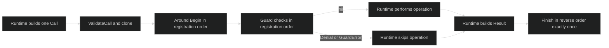

# Overview

Hooks are an in-process boundary around a fixed set of Harness runtime operations. An `Around` callback observes an operation and may return a derived context; a `Guard` callback can synchronously stop only the four guardable operations. The compiled `hook.Runner` owns copied registrations and is safe to dispatch concurrently.

## Declarations

The public declaration is `hook.Set`:

| Field | Type | Contract |
| --- | --- | --- |
| `PolicyRevision` | `string` | Required when `Guards` is non-empty; forbidden when there are no guards. It is bounded to 128 bytes, valid UTF-8, and free of control characters. |
| `Guards` | `[]hook.Guard` | Ordered synchronous checks. Every operation must be valid and guardable, and every `Check` must be non-nil. |
| `Around` | `[]hook.Around` | Ordered begin/finish observers. Every operation must be valid and every `Begin` must be non-nil. |

`hook.ValidateSet` returns `*hook.ConfigError`. `hook.Compile` validates the set and copies both slices, so the caller must treat the installed set as immutable and make callbacks concurrency-safe. `rig.WithHooks(set)` is the definition option that validates and compiles this runner once.

```go
package main

import (
	"context"

	"github.com/looprig/harness/pkg/hook"
	"github.com/looprig/harness/pkg/rig"
)

func installHooks() rig.Option {
	return rig.WithHooks(hook.Set{
		PolicyRevision: "turn-policy-v1",
		Guards: []hook.Guard{{
			Operation: hook.OperationTurn,
			Check: func(context.Context, hook.Call) error {
				return nil // return hook.Deny("reason", "human-readable reason") to block
			},
		}},
		Around: []hook.Around{{
			Operation: hook.OperationTurn,
			Begin: func(ctx context.Context, call hook.Call) (context.Context, hook.FinishFunc) {
				return ctx, func(result hook.Result) {}
			},
		}},
	})
}
```

See [`hook.Set`, `hook.Compile`, and `rig.WithHooks`](https://github.com/looprig/harness/blob/main/pkg/hook/hook.go) and the [definition option](https://github.com/looprig/harness/blob/main/pkg/rig/options.go).

## Operation boundary

The closed `hook.Operation` domain is `Turn`, `Step`, `Inference`, `Compaction`, `ToolCall`, `GateWait`, `ToolExecution`, and `JournalAppend`. `Operation.Valid` accepts exactly those values. `Operation.Guardable` returns true only for `Turn`, `Inference`, `Compaction`, and `ToolCall`; guards on a step, wait, execution, or journal append are rejected during compilation. Around observers can target all eight.

Each dispatch carries a `hook.Call` with exactly one matching payload pointer. The runtime supplies immutable snapshots rather than live mutable runtime objects. A call for `OperationToolCall`, for example, has `ToolCall != nil` and all other operation payload pointers nil. `hook.ValidateCall` rejects unknown operations, zero or multiple payloads, and mismatches before any callback runs.

## Execution model

The boundary has three phases: matching around observers begin in registration order, matching guards then run in registration order, and completed around observers finish in reverse order. A guard failure still receives the finish path, allowing metrics and resource cleanup to see `OutcomeDenied`.



An observer panic or nil context is logged and skipped. A guard panic fails closed as `*hook.GuardError`. A validated `*hook.Denial` is an intentional refusal. The runner never turns a hook into a durable policy rule; only the `PolicyRevision` identifies the configured guard policy for the rig manifest.

## Authority boundary

Hooks receive a context, a typed snapshot, and an error/result observation. They do not receive session controllers, gate response authority, workspace leases, grant issuers, or journal writers. A guard can stop the operation through its returned error, but it cannot approve a permission gate or mint an execution grant. Around callbacks are observers and context decorators; they do not replace the runtime's lifecycle ownership.

The integration proof exercises native turn, step, inference, permission, gate wait, tool execution, and journal append nesting in [`pkg/rig/hooks_integration_test.go`](https://github.com/looprig/harness/blob/main/pkg/rig/hooks_integration_test.go). Historical journal replay does not re-run historical operations through a new runner; restoration emits only new append observations and a restore fence.

## Related contracts

- [Hook operations](/docs/guides/harness/hooks/operations) lists every payload.
- [Lifecycle hooks](/docs/guides/harness/hooks/lifecycle) explains nesting and causal identity.
- [Before, around, and after](/docs/guides/harness/hooks/before-around-after) explains context and finish ownership.
- [Failure behavior](/docs/guides/harness/hooks/failures) gives the typed error and panic matrix.

## Source and proof

- [`hook` declarations](https://github.com/looprig/harness/blob/main/pkg/hook/hook.go)
- [`hook runner`](https://github.com/looprig/harness/blob/main/pkg/hook/runner.go)
- [`native hook integration tests`](https://github.com/looprig/harness/blob/main/pkg/rig/hooks_integration_test.go)
- [`policy` runnable fixture (hook ordering)](https://github.com/looprig/harness/blob/main/examples/policy/example_test.go)
