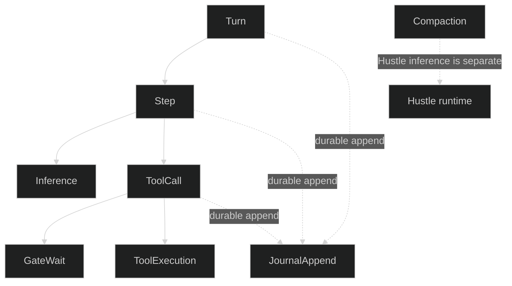
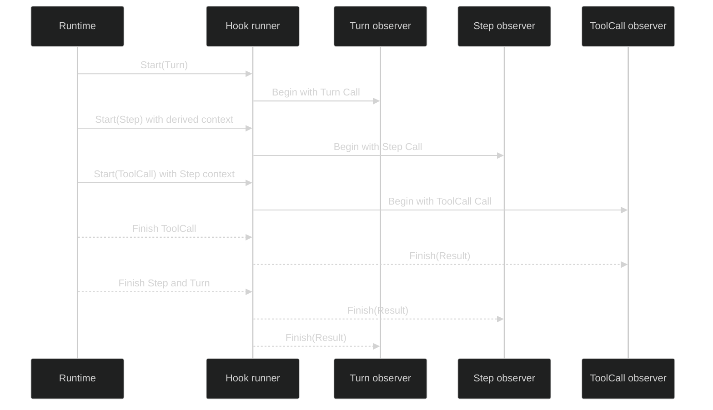

# Lifecycle hooks

## Nesting

Hooks describe runtime boundaries, not every public object method. In the native loop runtime the observed hierarchy is:

| Parent | Child boundaries that may appear inside it |
| --- | --- |
| `OperationTurn` | `OperationStep` and journal appends |
| `OperationStep` | `OperationInference`, `OperationToolCall`, and journal appends |
| `OperationToolCall` | `OperationGateWait`, `OperationToolExecution`, and journal appends |
| any active boundary | A `JournalAppend` for an event, command, prepared gate record, or fence |
| compaction | `OperationCompaction`; its Hustle inference is not a native `OperationInference` |

The `Step` callback is therefore the step boundary, while the inference and semantic tool call callbacks give finer-grained children. A foreign engine can use the rig hook runner for its own supported integration surface, but the native operation hooks are not fabricated for a foreign backend; the integration test proves that a foreign turn does not increment the native `OperationTurn` observer.

## Causal context

Every `Call` carries `identity.Coordinates` plus an `identity.Cause`. Around observers can derive a value stack from the incoming context. The runtime passes that context to child boundaries, so a child sees the parent operation in the observer's own context value when the observer chose to add it. The direct causal edge remains in `Call.Cause`; context values are an observer convenience and are not a substitute for runtime identity.

The test observer in [`pkg/rig/hooks_integration_test.go`](https://github.com/looprig/harness/blob/main/pkg/rig/hooks_integration_test.go) appends each operation to a context stack and asserts `Step` inherits `Turn`, `Inference` and `ToolCall` inherit `Step`, and `GateWait` and `ToolExecution` inherit `ToolCall`. This is the ownership flow:

## Journal boundary

`OperationJournalAppend` is an around-only observation point. Its `JournalAppendData.Family` is one of `RecordEvent`, `RecordCommand`, `RecordGatePrepared`, or `RecordFence`, and `RecordID` identifies the bounded record. It does not expose encoded journal bytes or give the observer append authority. An append created inside a turn or tool call receives that active operation context; an opening fence remains a single fence append.

`pkg/journal/hooked.go` is the journal adapter proof for the callback shape, and the integration test checks both ordinary nested appends and the restore fence. Historical events are replayed as state, not re-executed through the new hook runner. Restore can therefore produce a new `JournalAppend` for its fence and subsequent work without replaying old `Turn` or `ToolCall` callbacks.

## Restore boundary

`rig.RestoreSession` constructs a runner for new work under the restored definition. A changed guard `PolicyRevision` is surfaced as configuration drift by the restore path; it does not re-run the old operations. Around observers begin only for operations performed after restoration, and a finish callback still belongs to the operation that began it. Use the [session restore contract](/docs/guides/harness/session-runtime/create-and-restore) for journal and manifest drift; use this page for hook dispatch semantics.

Source: [`internal/loopruntime/runner.go`](https://github.com/looprig/harness/blob/main/internal/loopruntime/runner.go), [`internal/loopruntime/turn.go`](https://github.com/looprig/harness/blob/main/internal/loopruntime/turn.go), [`internal/loopruntime/step.go`](https://github.com/looprig/harness/blob/main/internal/loopruntime/step.go), and [`internal/loopruntime/hook_runtime.go`](https://github.com/looprig/harness/blob/main/internal/loopruntime/hook_runtime.go).

## Source and proof

- [`hook runtime nesting`](https://github.com/looprig/harness/blob/main/internal/loopruntime/runner.go)
- [`turn, step, and tool hook boundaries`](https://github.com/looprig/harness/blob/main/internal/loopruntime/turn.go)
- [`hook integration tests`](https://github.com/looprig/harness/blob/main/pkg/rig/hooks_integration_test.go)
